# Nachos Architecture Diagrams

Visual diagrams for the Nachos architecture. Render these using any
Mermaid-compatible viewer.

---

## 1. System Overview

```mermaid
%%{init: {'theme': 'base', 'themeVariables': { 'primaryColor': '#ffd700', 'primaryTextColor': '#000', 'primaryBorderColor': '#b8860b', 'lineColor': '#666', 'secondaryColor': '#fff5e6', 'tertiaryColor': '#f0f0f0'}}}%%

flowchart TB
    subgraph User["👤 Users"]
        WebUser["Web Browser"]
        SlackUser["Slack App"]
        DiscordUser["Discord Bot"]
        TelegramUser["Telegram Bot"]
    end

    subgraph Nachos["🧀 Nachos Stack"]
        subgraph Channels["Channels Layer"]
            WebChat["WebChat<br/>:8080"]
            Slack["Slack Adapter"]
            Discord["Discord Adapter"]
            Telegram["Telegram Adapter"]
        end

        subgraph Core["Core Layer"]
            Gateway["🔲 Gateway<br/>Sessions & Routing"]
            Bus["🧀 Message Bus<br/>(NATS)"]
            Salsa["🌶️ Salsa<br/>Policy Engine"]
        end

        subgraph Protein["LLM Layer"]
            LLMProxy["🥩 LLM Proxy"]
        end

        subgraph Tools["Tools Layer"]
            Browser["🌐 Browser"]
            FileSystem["📁 Filesystem"]
            CodeRunner["💻 Code Runner"]
        end
    end

    subgraph External["☁️ External Services"]
        Anthropic["Anthropic API"]
        OpenAI["OpenAI API"]
        Ollama["Ollama (Local)"]
    end

    WebUser <--> WebChat
    SlackUser <--> Slack
    DiscordUser <--> Discord
    TelegramUser <--> Telegram

    Channels <--> Bus
    Bus <--> Gateway
    Gateway <--> Salsa
    Gateway <--> LLMProxy
    Gateway <--> Tools

    LLMProxy <--> Anthropic
    LLMProxy <--> OpenAI
    LLMProxy <--> Ollama
```



---

## 2. Message Flow

```mermaid
sequenceDiagram
    autonumber
    participant U as 👤 User
    participant C as 📱 Channel
    participant B as 🧀 Bus
    participant S as 🌶️ Salsa
    participant G as 🔲 Gateway
    participant L as 🥩 LLM Proxy
    participant T as 🔧 Tool

    U->>C: Send message
    C->>B: Publish normalized message
    B->>S: Policy check (DM allowed?)
    S-->>B: ✓ Approved
    B->>G: Route to gateway

    G->>G: Load/create session
    G->>B: Request LLM completion
    B->>L: Forward request
    L->>L: Call LLM API
    L-->>B: Response (with tool call)
    B-->>G: Forward response

    G->>B: Request tool execution
    B->>S: Policy check (tool allowed?)
    S-->>B: ✓ Approved
    B->>T: Execute tool
    T-->>B: Tool result
    B-->>G: Forward result

    G->>B: Final LLM request
    B->>L: Forward
    L-->>B: Final response
    B-->>G: Forward

    G->>B: Outbound message
    B->>C: Deliver to channel
    C->>U: Display response
```



---

## 3. Container Architecture

```mermaid
%%{init: {'theme': 'base'}}%%

flowchart TB
    subgraph compose["🍽️ Docker Compose"]
        subgraph internal["nachos-internal (isolated network)"]
            gateway["gateway<br/>───────<br/>📦 node:22-alpine<br/>🔒 non-root<br/>💾 512MB"]
            bus["bus<br/>───────<br/>📦 nats:alpine<br/>🔒 non-root<br/>💾 256MB"]
            salsa["salsa<br/>───────<br/>📦 node:22-alpine<br/>🔒 non-root<br/>💾 256MB"]
            filesystem["filesystem<br/>───────<br/>📦 node:22-alpine<br/>🔒 non-root<br/>💾 128MB"]
            coderunner["code-runner<br/>───────<br/>📦 node:22-alpine<br/>🔒 sandboxed<br/>💾 512MB"]
        end

        subgraph egress["nachos-egress (controlled external)"]
            llmproxy["llm-proxy<br/>───────<br/>📦 node:22-alpine<br/>🌐 LLM APIs only<br/>💾 256MB"]
            webchat["webchat<br/>───────<br/>📦 node:22-alpine<br/>🌐 port 8080<br/>💾 256MB"]
            slack["slack<br/>───────<br/>📦 node:22-alpine<br/>🌐 slack.com<br/>💾 256MB"]
            browser["browser<br/>───────<br/>📦 playwright<br/>🌐 configured domains<br/>💾 1GB"]
        end
    end

    subgraph volumes["📁 Volumes"]
        state["nachos-state"]
        workspace["./workspace"]
        policies["./policies"]
    end

    gateway --- state
    filesystem --- workspace
    salsa --- policies

    internal ~~~ egress
```



---

## 4. Security Layers

```mermaid
%%{init: {'theme': 'base'}}%%

flowchart TD
    subgraph Request["Incoming Request"]
        req["🔵 Request"]
    end

    subgraph Salsa["🌶️ Salsa Security Layer"]
        dlp["DLP Scanner<br/>───────<br/>Detect sensitive data"]
        rate["Rate Limiter<br/>───────<br/>Throttle abuse"]
        policy["Policy Engine<br/>───────<br/>Evaluate rules"]
        audit["Audit Logger<br/>───────<br/>Record everything"]
    end

    subgraph Outcomes["Outcomes"]
        allow["✅ Allow"]
        deny["❌ Deny"]
        throttle["⏳ Throttle"]
        block["🚫 Block"]
    end

    req --> dlp
    dlp -->|Clean| rate
    dlp -->|Sensitive| block

    rate -->|Under limit| policy
    rate -->|Over limit| throttle

    policy -->|Allowed| allow
    policy -->|Denied| deny

    allow --> audit
    deny --> audit
    throttle --> audit
    block --> audit
```



---

## 5. Configuration Flow


---

## 6. Module Manifest Structure


---

## 7. Session Lifecycle


---

## 8. Tool Execution Flow


---

## 9. Network Topology

```mermaid
%%{init: {'theme': 'base'}}%%

flowchart TB
    subgraph Internet["🌐 Internet"]
        anthropic["api.anthropic.com"]
        openai["api.openai.com"]
        slackapi["api.slack.com"]
        discordapi["discord.com"]
        websites["Other websites"]
    end

    subgraph Egress["nachos-egress<br/>(controlled external access)"]
        llm["LLM Proxy<br/>→ anthropic, openai"]
        slack["Slack<br/>→ slack.com"]
        discord["Discord<br/>→ discord.com"]
        browser["Browser<br/>→ configured domains"]
    end

    subgraph Internal["nachos-internal<br/>(no external access)"]
        gateway["Gateway"]
        bus["Bus"]
        salsa["Salsa"]
        fs["Filesystem"]
        code["Code Runner"]
    end

    subgraph Host["🖥️ Host Machine"]
        workspace["./workspace"]
        state["./state"]
    end

    llm <--> anthropic
    llm <--> openai
    slack <--> slackapi
    discord <--> discordapi
    browser <--> websites

    llm --- Internal
    slack --- Internal
    discord --- Internal
    browser --- Internal

    fs --- workspace
    gateway --- state
```



---

## 10. CLI Command Tree


---

## Rendering Instructions

These diagrams use Mermaid syntax. To render:

1. **GitHub**: Mermaid renders automatically in `.md` files
2. **VS Code**: Install "Mermaid Preview" extension
3. **Online**: Use [mermaid.live](https://mermaid.live)
4. **CLI**: Use `mmdc` (mermaid-cli) to generate images

```bash
# Install mermaid CLI
npm install -g @mermaid-js/mermaid-cli

# Generate PNG
mmdc -i diagrams.md -o diagram.png

# Generate SVG
mmdc -i diagrams.md -o diagram.svg -f svg
```
