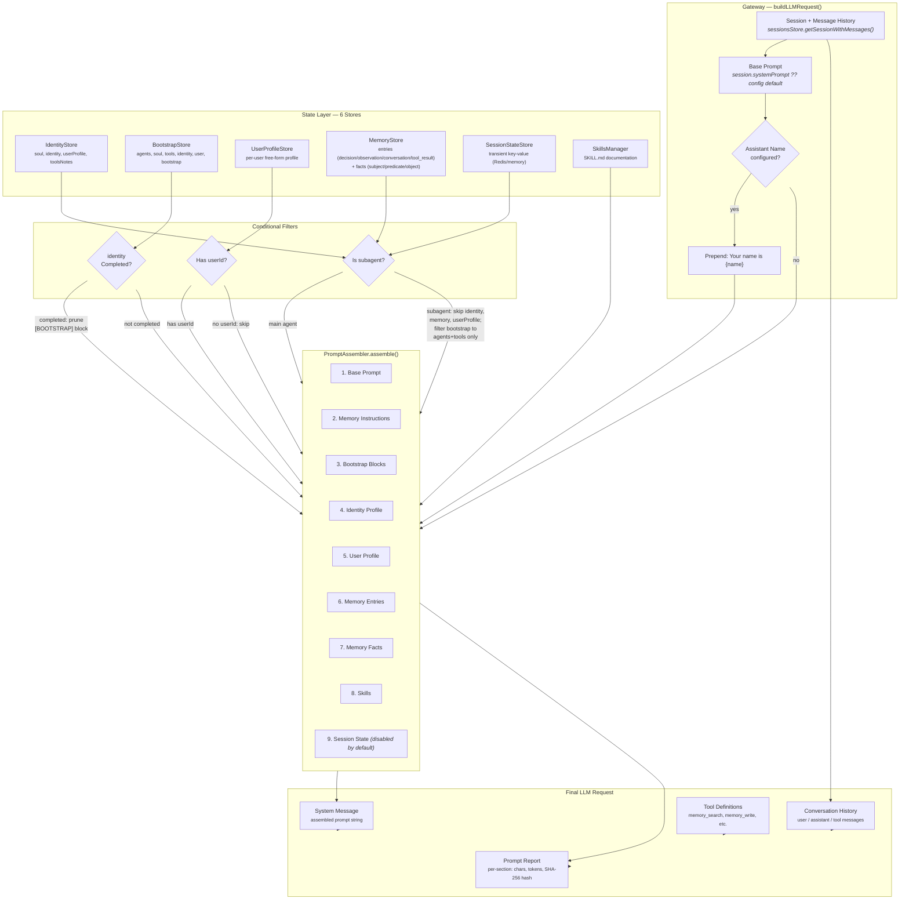
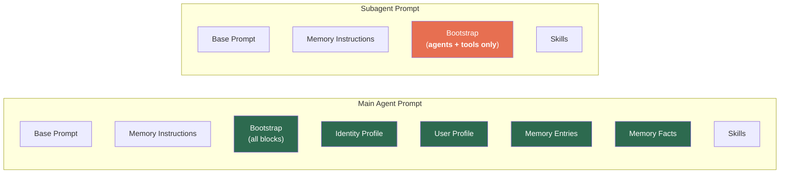
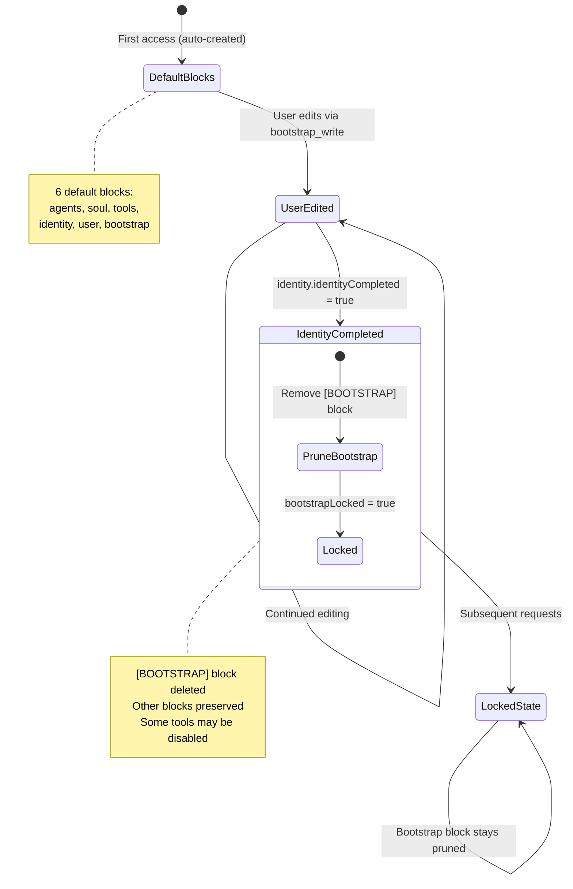

# Bootstrap & Prompt Assembly Layer

How Nachos builds the system prompt sent to the LLM on every request.

## Architecture Overview



## Prompt Section Order

The `PromptAssembler` concatenates sections in this exact order, separated by
`\n\n`:

| #   | Section                 | Source                                                   | Condition                                           |
| --- | ----------------------- | -------------------------------------------------------- | --------------------------------------------------- |
| 1   | **Base Prompt**         | `assistant.system_prompt` or env `GATEWAY_SYSTEM_PROMPT` | Always (if non-empty)                               |
| 2   | **Memory Instructions** | Hardcoded in `prompt-assembler.ts`                       | Always (`includeMemoryInstructions: true`)          |
| 3   | **Bootstrap Blocks**    | `BootstrapStore` (filesystem or Postgres)                | Has content after pruning/filtering                 |
| 4   | **Identity Profile**    | `IdentityStore`                                          | At least one field non-empty; skipped for subagents |
| 5   | **User Profile**        | `UserProfileStore`                                       | Session has `userId`; skipped for subagents         |
| 6   | **Memory Entries**      | `MemoryStore` (filesystem, Postgres, or SQLite)          | Query returns entries; capped at 50                 |
| 7   | **Memory Facts**        | `MemoryStore`                                            | Query returns facts; capped at 50                   |
| 8   | **Skills**              | `SkillsManager.getSkillsPrompt()`                        | Skills loaded from `SKILL.md` files                 |
| 9   | **Session State**       | `SessionStateStore` (Redis or memory)                    | Disabled by default (`includeSessionState: false`)  |

## What Each Section Contains

### 1. Base Prompt

The raw system prompt, optionally prefixed with
`"Your name is {assistantName}.\n\n"`.

Priority chain: `GATEWAY_SYSTEM_PROMPT` env var >
`nachos.toml [assistant].system_prompt` > empty.

### 2. Memory Instructions

Static guidance block teaching the LLM when and how to use `memory_search` and
`memory_delete`. Includes usage examples, anti-patterns ("don't search just in
case"), and the 1-2 searches per response limit.

### 3. Bootstrap Blocks

Rendered with a guaranteed ordering of 6 priority keys, then remaining custom
keys alphabetically:

```
Bootstrap Blocks:

[AGENTS]
You are the assistant operating in this workspace...

[SOUL]
Be clear, helpful, and direct...

[TOOLS]
Add notes about local tools...

[IDENTITY]
- Name:
- Role or vibe:
...

[USER]
- Name:
- Preferred address:
...

[BOOTSTRAP]
This is the first-run setup...
```

**Lifecycle:**

- Created with default templates on first access
- Users edit blocks via `bootstrap_write` tool
- Content sanitized for prompt injection (audit-only, not blocking)
- `[BOOTSTRAP]` block **deleted** once `identity.identityCompleted = true`
- Subagents only see `[AGENTS]` and `[TOOLS]`

### 4. Identity Profile

```
Identity Profile:
Soul: <core persona/philosophy>
Identity: <name, role, vibe>
User Profile: <user context from identity>
Tools Notes: <local tool guidance>
```

Only non-empty fields are included. Once `identityCompleted` is set, the
bootstrap `[BOOTSTRAP]` block is pruned (the identity itself remains).

### 5. User Profile

```
User Profile:
<free-form per-user context>
```

Keyed by `(agentId, userId)`. Only loaded when the session has a `userId`.

### 6. Memory Entries

```
Memory Entries:
- [decision] Chose PostgreSQL for the session store (architecture, database)
- [observation] User prefers concise responses (preferences)
- [conversation] Discussed migration strategy for v2 API
```

Gateway queries up to 200 entries; assembler caps at 50 for the prompt. Each
entry shows `[kind]`, content, and tags.

### 7. Memory Facts

```
Memory Facts:
- User prefers dark-mode
- Project uses pnpm workspaces
- Database is PostgreSQL 16
```

Structured as subject-predicate-object triplets. Capped at 50.

### 8. Skills

Pre-formatted documentation from `SKILL.md` files loaded by the `SkillsManager`.
Contains usage instructions for CLI-backed tools like `goplaces`, `gifgrep`,
`summarize`, `gog`.

### 9. Session State

```
Session State:
{
  "key": "value",
  ...
}
```

Transient key-value pairs stored in Redis or in-memory. **Disabled by default**
for security and size reasons.

## Subagent vs Main Agent



Subagents receive a stripped-down prompt: no identity, no user profile, no
memories. Bootstrap is filtered to only `agents` and `tools` blocks. This
prevents subagents from confusing their role with the main agent's identity.

## Bootstrap Lifecycle



## Prompt Report

Every assembled prompt generates an audit report stored in session metadata:

```json
{
  "totalChars": 4832,
  "totalTokens": 1208,
  "sections": [
    {
      "name": "base",
      "sizeChars": 150,
      "sizeTokens": 38,
      "hash": "a1b2c3...",
      "source": "assistant.system_prompt"
    },
    {
      "name": "memory_instructions",
      "sizeChars": 1024,
      "sizeTokens": 256,
      "hash": "d4e5f6...",
      "source": "prompt-assembler"
    },
    {
      "name": "bootstrap",
      "sizeChars": 2048,
      "sizeTokens": 512,
      "hash": "g7h8i9...",
      "source": "bootstrap-store"
    },
    {
      "name": "identity",
      "sizeChars": 256,
      "sizeTokens": 64,
      "hash": "j0k1l2...",
      "source": "identity-store"
    },
    {
      "name": "memory",
      "sizeChars": 800,
      "sizeTokens": 200,
      "hash": "m3n4o5...",
      "source": "memory-store"
    },
    {
      "name": "skills",
      "sizeChars": 554,
      "sizeTokens": 138,
      "hash": "p6q7r8...",
      "source": "skill-loader"
    }
  ],
  "generatedAt": "2026-03-04T12:00:00.000Z"
}
```

Each section is independently hashed (SHA-256) for change detection and
auditing.

## Data Storage

| Store          | Filesystem Path                              | Postgres Table          |
| -------------- | -------------------------------------------- | ----------------------- |
| Identity       | `<stateDir>/<agentId>.json`                  | `identity_profiles`     |
| Bootstrap      | `<stateDir>/<agentId>.json`                  | `bootstrap_profiles`    |
| User Profile   | `<stateDir>/<agentId>/<base64(userId)>.json` | `user_profiles`         |
| Memory Entries | `<stateDir>/<agentId>/entries.jsonl`         | `memory_entries`        |
| Memory Facts   | `<stateDir>/<agentId>/facts.jsonl`           | `memory_facts`          |
| Session State  | N/A (Redis or in-memory)                     | N/A                     |
| Sessions       | SQLite `admin-chat.db` / `sessions.db`       | `sessions` + `messages` |

## Security Controls

- **Policy enforcement**: All state reads pass through `ensureAllowed()` /
  Cheese policy engine
- **Audit trail**: Every state access logged with action, resource, outcome,
  rule ID
- **Bootstrap sanitization**: Content scanned for prompt injection patterns
  (HTML comment wrapping, audit logging)
- **Subagent isolation**: Stripped prompt prevents identity confusion
- **Graceful degradation**: If state layer fails, falls back to base prompt only
  (logs warning)
- **Session state disabled by default**: Prevents accidental data leakage into
  prompts

## Key Files

| File                                                   | Role                                                 |
| ------------------------------------------------------ | ---------------------------------------------------- |
| `packages/shared/state/src/prompt/prompt-assembler.ts` | Section ordering, formatting, report generation      |
| `packages/core/gateway/src/gateway.ts` (L1248-1325)    | Orchestrates data fetching + assembly                |
| `packages/shared/state/src/state-layer.ts`             | Store coordination, policy checks, bootstrap seeding |
| `packages/shared/state/src/bootstrap/`                 | Bootstrap store (filesystem + Postgres)              |
| `packages/shared/state/src/identity/`                  | Identity store (filesystem + Postgres)               |
| `packages/shared/state/src/memory/`                    | Memory stores (filesystem, Postgres, SQLite)         |
| `packages/shared/state/src/user-profiles/`             | User profile store (filesystem + Postgres)           |
| `packages/core/gateway/src/skills/skills-manager.ts`   | SKILL.md loading and prompt formatting               |
| `packages/core/gateway/src/config.ts`                  | Resolves `[assistant]` config from nachos.toml       |
