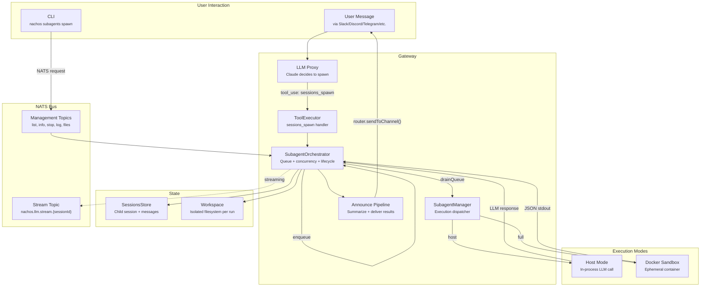
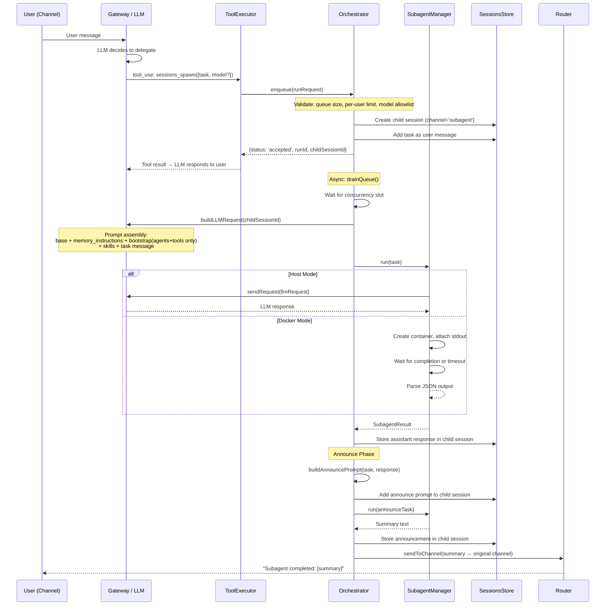
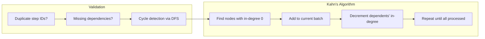
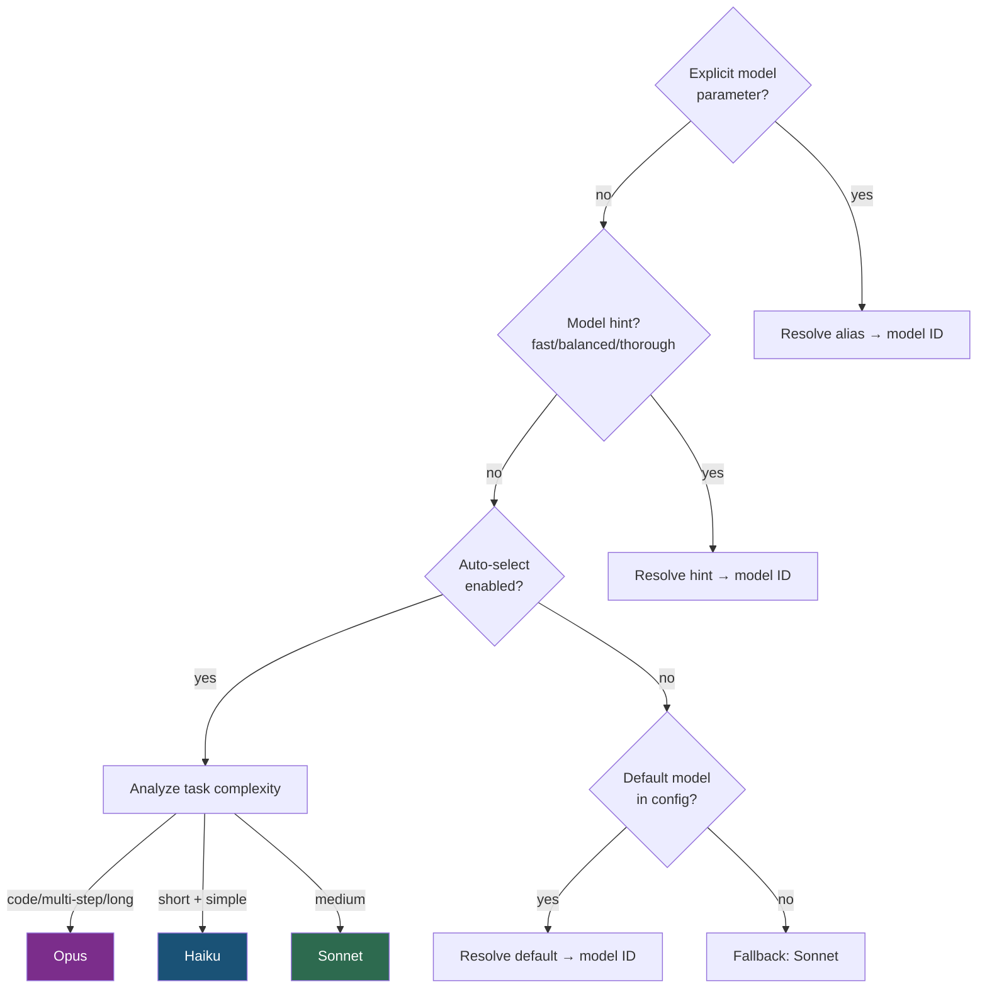
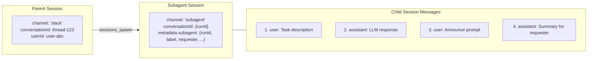
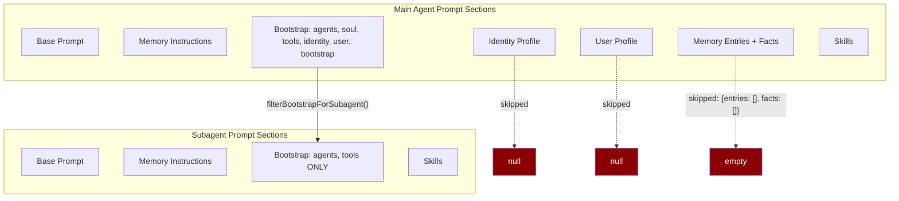

# Subagent Orchestration

How Nachos spawns, manages, and orchestrates isolated AI subagent sessions.

## Architecture Overview



## Lifecycle: Single Subagent Spawn



## Lifecycle: Workflow Orchestration

```mermaid
sequenceDiagram
    participant G as Gateway / LLM
    participant TE as ToolExecutor
    participant O as Orchestrator
    participant DG as DependencyGraph

    G->>TE: tool_use: sessions_orchestrate({steps})
    TE->>DG: validateWorkflow(steps)
    DG-->>TE: {valid: true}
    TE->>DG: computeExecutionPlan(steps)
    DG-->>TE: {batches: [[A,B], [C], [D]]}
    TE->>O: enqueueWorkflow(workflow, requester)
    O-->>TE: {workflowId, totalBatches: 3}

    Note over O: Async: executeWorkflow()

    rect rgb(40, 60, 40)
        Note over O: Batch 0 (parallel)
        O->>O: enqueue(step A)
        O->>O: enqueue(step B)
        O->>O: await Promise.all([A, B])
    end

    rect rgb(40, 40, 60)
        Note over O: Batch 1 (depends on A, B)
        O->>O: Inject results from A, B into C's task
        O->>O: enqueue(step C)
        O->>O: await C completion
    end

    rect rgb(60, 40, 40)
        Note over O: Batch 2 (depends on C)
        O->>O: Inject result from C into D's task
        O->>O: enqueue(step D)
        O->>O: await D completion
    end

    O->>O: workflow.status = 'completed'
```



## Component Details

### SubagentOrchestrator (742 lines)

Central coordination engine. Manages the full lifecycle: enqueue → queue →
execute → announce.

**Key state:**

| Field                | Default    | Purpose                          |
| -------------------- | ---------- | -------------------------------- |
| `maxConcurrent`      | 1          | Max parallel subagent executions |
| `maxQueueSize`       | 100        | Max pending queue depth          |
| `maxPerUser`         | 10         | Per-user concurrent run limit    |
| `maxStreamChunks`    | 1000       | OOM protection for streaming     |
| `maxProgressUpdates` | 100        | Progress update spam limit       |
| `allowedModels`      | none (all) | Model whitelist                  |

**Methods:**

| Method                                 | Purpose                                                 |
| -------------------------------------- | ------------------------------------------------------- |
| `enqueue(request)`                     | Validate, create session, queue, return immediately     |
| `drainQueue()`                         | Process queue items honoring concurrency                |
| `executeRun(entry)`                    | Build LLM request, call manager, store result, announce |
| `enqueueWorkflow(workflow, requester)` | Validate DAG, compute batches, execute async            |
| `stopRun(runId)`                       | Cancel queued run (cannot stop running)                 |
| `steerRun(runId, message)`             | Inject user message into running subagent's session     |
| `reportProgress(runId, status, %)`     | Record progress update from within subagent             |
| `shutdown()`                           | Stop accepting, clear queue                             |

### SubagentManager (65 lines)

Thin execution dispatcher. Routes tasks to host mode or Docker sandbox.

```
Host mode:  sendRequest(llmRequest) → LLM API → response
Full mode:  docker.createContainer() → attach stdout → parse JSON
```

### DockerSubagentSandbox (124 lines)

Container-based isolation for `full` sandbox mode.

- **Image**: Configurable (`nachos/subagent-sandbox:latest`)
- **Mounts**: `/workspace` (RW), `/config` (RO), `/state` (RW)
- **Network**: `none` | `egress` | `full`
- **Timeout**: Enforced with `container.kill()` on expiry
- **Cleanup**: `AutoRemove: true` — containers are ephemeral
- **Output**: Last valid JSON line from stdout parsed as LLM response

### DependencyGraph (219 lines)

DAG validation and topological sort for multi-step workflows.



**Result passing**: When step C depends on steps A and B, the orchestrator
prepends:

```
**Result from step "A":**
<A's output>

**Result from step "B":**
<B's output>

**Your task:**
<C's original task>
```

### ModelSelection (264 lines)

Intelligent model routing with 5-level priority:



**Auto-selection heuristics:**

- **Opus** ← keywords: analyze, review, audit, codebase, vulnerabilities,
  refactor; OR multi-step indicators; OR >40 words
- **Haiku** ← <8 words, no complexity indicators
- **Sonnet** ← everything else

**Default aliases:**

| Alias                           | Model ID                                   |
| ------------------------------- | ------------------------------------------ |
| `haiku`, `fast`, `cheap`        | `anthropic.claude-haiku-4-5-20251001-v1:0` |
| `sonnet`, `balanced`, `default` | `anthropic.claude-sonnet-4-6`              |
| `opus`, `thorough`              | `anthropic.claude-opus-4-6-v1`             |

### Announce (80 lines)

Generates summaries and delivers results back to the requester's channel.

**Template variables:** `{{task}}`, `{{response}}`, `{{error}}`, `{{status}}`,
`{{runId}}`, `{{durationMs}}`, `{{sandboxed}}`

**Flow:** Subagent result → build prompt → LLM summarize →
`router.sendToChannel()` → user sees result

Can be disabled: `gateway.subagent.announce.enabled = false`

### Workspace Utils (130 lines)

Isolated filesystem per subagent run with path traversal protection.

```
workspace/subagents/{runId}/
  └── <subagent files>
```

- `resolveWithinRoot()` validates all paths stay inside workspace root
- `listSubagentWorkspaceEntries()` supports recursive listing with pagination
  (default 500 limit)
- `readSubagentWorkspaceFile()` reads files with size cap (default 65KB)

## LLM Tools

Three tools exposed to the LLM:

### `sessions_spawn`

Spawn a single subagent. Returns immediately with `{status: 'accepted', runId}`.

| Parameter           | Type                       | Required | Description              |
| ------------------- | -------------------------- | -------- | ------------------------ |
| `task`              | string                     | yes      | Task description         |
| `label`             | string                     | no       | Human-friendly label     |
| `model`             | string                     | no       | Explicit model or alias  |
| `modelHint`         | `fast\|balanced\|thorough` | no       | Model selection hint     |
| `thinking`          | string                     | no       | Extended thinking level  |
| `stream`            | boolean                    | no       | Enable streaming chunks  |
| `profile`           | string                     | no       | Security tool profile    |
| `runTimeoutSeconds` | number                     | no       | Max execution time       |
| `cleanup`           | `delete\|keep`             | no       | Workspace cleanup policy |

### `sessions_orchestrate`

Multi-step workflow with dependency DAG.

| Parameter           | Type     | Required | Description               |
| ------------------- | -------- | -------- | ------------------------- |
| `steps`             | array    | yes      | Array of workflow steps   |
| `steps[].id`        | string   | yes      | Unique step identifier    |
| `steps[].task`      | string   | yes      | Step task description     |
| `steps[].dependsOn` | string[] | no       | Step IDs this depends on  |
| `steps[].model`     | string   | no       | Model for this step       |
| `steps[].modelHint` | string   | no       | Model hint for this step  |
| `steps[].stream`    | boolean  | no       | Enable streaming for step |

### `subagent_progress`

Report progress from within a running subagent session. Only available when the
session has subagent metadata.

| Parameter    | Type   | Required | Description          |
| ------------ | ------ | -------- | -------------------- |
| `status`     | string | yes      | Progress status text |
| `percentage` | number | no       | 0-100 completion     |
| `metadata`   | object | no       | Arbitrary metadata   |

## NATS Management API

CLI and admin UI access subagents via NATS request/reply:

| Topic                                 | CLI Command                           | Purpose             |
| ------------------------------------- | ------------------------------------- | ------------------- |
| `nachos.gateway.subagents.list`       | `nachos subagents list`               | List all runs       |
| `nachos.gateway.subagents.spawn`      | `nachos subagents spawn <task>`       | Spawn from CLI      |
| `nachos.gateway.subagents.info`       | `nachos subagents info <runId>`       | Run details         |
| `nachos.gateway.subagents.stop`       | `nachos subagents stop <runId>`       | Cancel queued run   |
| `nachos.gateway.subagents.log`        | `nachos subagents log <runId>`        | Conversation log    |
| `nachos.gateway.subagents.files.list` | `nachos subagents files list <runId>` | Workspace files     |
| `nachos.gateway.subagents.files.get`  | `nachos subagents files get <runId>`  | Read workspace file |

## Session Architecture



**Subagent sessions get a stripped-down prompt:**

- Base prompt (with assistant name if configured)
- Memory instructions
- Bootstrap: **only `[AGENTS]` and `[TOOLS]` blocks** (no soul, identity, user,
  bootstrap)
- Skills documentation
- No identity profile, user profile, or memory entries

## Prompt Filtering for Subagents



## Security Controls

### Resource Limits

| Control          | Default | Config Key                                 |
| ---------------- | ------- | ------------------------------------------ |
| Queue depth      | 100     | `gateway.subagent.maxQueueSize`            |
| Concurrent runs  | 1       | `gateway.subagent.max_concurrent`          |
| Per-user limit   | 10      | `gateway.subagent.maxPerUser`              |
| Stream chunks    | 1000    | `gateway.subagent.maxStreamChunks`         |
| Progress updates | 100     | `gateway.subagent.maxProgressUpdates`      |
| Default timeout  | 300s    | `gateway.subagent.default_timeout_seconds` |

### Model Access Control

- **Allowed models whitelist**: If `gateway.subagent.models.allowed_models` is
  set, only listed models can be used
- **Double validation**: Both the requested model AND the final selected model
  are checked against the allowlist

### Sandbox Isolation

| Mode   | Network                | Filesystem     | Process              |
| ------ | ---------------------- | -------------- | -------------------- |
| `host` | Shared                 | Shared         | In-process           |
| `tool` | Shared                 | Shared         | Tool-level isolation |
| `full` | `none`/`egress`/`full` | Docker volumes | Ephemeral container  |

### Path Traversal Protection

All workspace file operations validate that resolved paths stay within the
workspace root:

```typescript
const rel = path.relative(root, target);
if (rel.startsWith('..') || path.isAbsolute(rel)) {
  throw createPermissionDeniedError('Path escapes subagent workspace');
}
```

### Error Sanitization

Error messages are sanitized before returning to prevent information disclosure:

```typescript
private sanitizeErrorMessage(error: unknown): string {
  if (error instanceof Error) return error.message;  // No stack traces
  return String(error);
}
```

### NATS Topic Injection Prevention

Child session IDs are validated as UUIDs before being used in NATS topic
subscriptions:

```typescript
if (!/^[0-9a-f]{8}-...$/i.test(childSessionId)) {
  throw createValidationError('Invalid session ID format');
}
```

## Configuration

```toml
[gateway.subagent]
enabled = true
mode = "host"                          # "host" | "tool" | "full"
max_concurrent = 2
default_timeout_seconds = 300

[gateway.subagent.announce]
enabled = true
prompt = "Custom template with {{task}} and {{response}}"

[gateway.subagent.models]
auto_select = true
default_model = "sonnet"
allowed_models = ["anthropic.claude-sonnet-4-6", "anthropic.claude-opus-4-6-v1"]

[gateway.subagent.models.aliases]
my-model = "anthropic.claude-sonnet-4-6"

[gateway.subagent.sandbox.docker]
image = "nachos/subagent-sandbox:latest"
network = "none"
workspace_dir = "/tmp/subagents"
timeout_ms = 300000

[gateway.subagent.tools.profiles.restricted]
deny = ["filesystem", "shell"]
```

## Test Coverage

| Test File                       | Tests                                     | Coverage                                |
| ------------------------------- | ----------------------------------------- | --------------------------------------- |
| `subagent-orchestrator.test.ts` | 46                                        | Core lifecycle, queue, announce, errors |
| `dependency-graph.test.ts`      | DAG validation, cycles, topological sort  |
| `model-selection.test.ts`       | Alias resolution, auto-select, hints      |
| `workspace-utils.test.ts`       | Path traversal, listing, reading          |
| `streaming-results.test.ts`     | Chunk accumulation, OOM limits            |
| `progress-updates.test.ts`      | Progress reporting, spam limits           |
| `security-hardening.test.ts`    | Concurrency, queue depth, per-user limits |

## Known Limitations

1. **Running subagents can't be stopped** — Only queued runs can be cancelled.
   Running subagents complete naturally or timeout.
2. **Workflow steps fail-fast** — A failed step stops the entire workflow. No
   `continueOnFailure` option yet.
3. **Streaming is accumulate-only** — Chunks are stored in memory during
   execution. No real-time delivery to requester yet.
4. **In-memory state** — All run records, queues, and workflow state are
   in-memory. Lost on gateway restart.
5. **Announce always uses LLM** — The announce phase makes an additional LLM
   call to summarize. Can be disabled but not made template-only without LLM.
6. **Workflow polling** — `executeWorkflow` polls step completion every 100ms
   (up to 5 min). Not event-driven.

## Key Files

| File                                             | Lines | Purpose                                                                |
| ------------------------------------------------ | ----- | ---------------------------------------------------------------------- |
| `gateway/src/subagents/subagent-orchestrator.ts` | 742   | Queue, lifecycle, announce, workflow                                   |
| `gateway/src/subagents/subagent-manager.ts`      | 65    | Execution mode dispatch                                                |
| `gateway/src/subagents/docker-sandbox.ts`        | 124   | Container isolation                                                    |
| `gateway/src/subagents/dependency-graph.ts`      | 219   | DAG validation + Kahn's toposort                                       |
| `gateway/src/subagents/model-selection.ts`       | 264   | Model routing + auto-select                                            |
| `gateway/src/subagents/workspace-utils.ts`       | 130   | Filesystem isolation                                                   |
| `gateway/src/subagents/announce.ts`              | 80    | Result summarization                                                   |
| `gateway/src/subagents/types.ts`                 | 139   | Type definitions                                                       |
| `gateway/src/tools/tool-executor.ts`             | 1956  | `sessions_spawn`, `sessions_orchestrate`, `subagent_progress` handlers |
| `gateway/src/management/management-handlers.ts`  | 291   | NATS management API                                                    |
| `cli/src/commands/subagents.ts`                  | 372   | CLI commands                                                           |
| `bus/src/topics.ts`                              | —     | NATS topic definitions                                                 |
