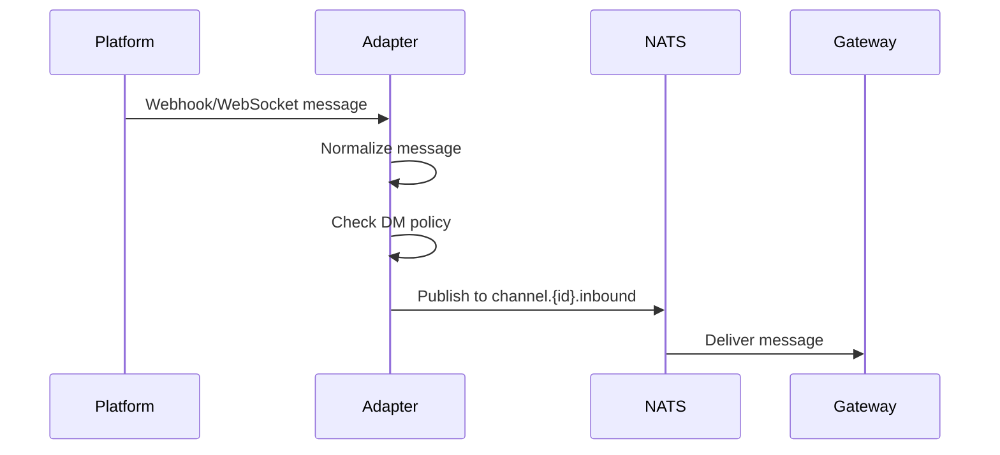
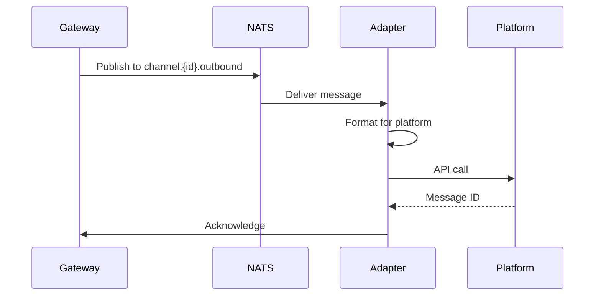

# Channel Interface API

**Status**: Draft  
**Version**: 1.0.0-alpha

## Overview

The Channel Interface defines the contract that all channel adapters must implement to integrate messaging platforms with Nachos.

**Defaults and policy constraints:**

- Registry is config-driven and loaded at startup (restart-to-reload)
- Configuration is strictly validated; unknown keys fail startup
- Group contexts require mention-gating by default
- DMs require explicit allowlist; pairing supported; DM config optional
- Server/guild contexts require explicit allowlist + channel ID allowlist

## Channel Adapter Interface

```typescript
/**
 * Base interface that all channel adapters must implement
 */
export interface ChannelAdapter {
  /**
   * Unique identifier for this channel type
   */
  readonly channelId: string;

  /**
   * Display name for this channel
   */
  readonly name: string;

  /**
   * Initialize the channel adapter
   * Called once during startup
   */
  initialize(config: ChannelAdapterConfig): Promise<void>;

  /**
   * Start listening for messages from the platform
   * Should publish to NATS when messages are received
   */
  start(): Promise<void>;

  /**
   * Stop listening and cleanup resources
   */
  stop(): Promise<void>;

  /**
   * Send a message to the platform
   * Called when gateway publishes to channel.outbound topic
   */
  sendMessage(message: OutboundMessage): Promise<SendResult>;

  /**
   * Check if this adapter is healthy
   */
  healthCheck(): Promise<HealthStatus>;
}
```

## Type Definitions

### ChannelAdapterConfig

Configuration passed to the adapter during initialization.

```typescript
interface ChannelAdapterConfig {
  /**
   * Configuration from nachos.toml
   */
  config: Record<string, unknown>;

  /**
   * Environment variables (secrets)
   */
  secrets: Record<string, string>;

  /**
  * Message bus connection for publishing messages
   */
  bus: ChannelBus;

  /**
   * Security mode
   */
  securityMode: 'strict' | 'standard' | 'permissive';

  /**
   * DM policy configuration
   */
  dmPolicy?: {
    userAllowlist: string[];
    pairing?: boolean;
  };

  /**
   * Group policy configuration
   */
  groupPolicy?: {
    mentionGating: boolean;
    channelIds: string[];
    userAllowlist: string[];
  };
}
```

### ChannelBus

Minimal bus interface used by channel adapters.

```typescript
interface ChannelBus {
  publish<T>(topic: string, payload: T): void | Promise<void>;
  subscribe<T>(topic: string, handler: (payload: T) => void | Promise<void>): Promise<unknown>;
}
```

### Minimal Per-Platform Configuration

All platforms share a minimal, explicit structure. One token can serve multiple servers/guilds:

```toml
[channels.discord]
token = "${DISCORD_BOT_TOKEN}"

[[channels.discord.servers]]
id = "1234567890"
channel_ids = ["111", "222"]
user_allowlist = ["user_a", "user_b"]
```

Slack supports Socket Mode and HTTP Events API:

```toml
[channels.slack]
mode = "socket" # or "http"
app_token = "${SLACK_APP_TOKEN}"
bot_token = "${SLACK_BOT_TOKEN}"
signing_secret = "${SLACK_SIGNING_SECRET}" # required for http mode
webhook_path = "/slack/events"             # required for http mode

[[channels.slack.servers]]
id = "T123456"
channel_ids = ["C111", "C222"]
user_allowlist = ["U123", "U456"]
```

WhatsApp Cloud API requires a webhook for inbound messages:

```toml
[channels.whatsapp]
token = "${WHATSAPP_TOKEN}"
phone_number_id = "${WHATSAPP_PHONE_NUMBER_ID}"
verify_token = "${WHATSAPP_VERIFY_TOKEN}"
webhook_path = "/whatsapp/webhook"
api_version = "v20.0"

[channels.whatsapp.dm]
user_allowlist = ["15551234567"]
```

### OutboundMessage

Message to send to the platform.

```typescript
interface OutboundMessage {
  /**
   * Platform conversation ID
   */
  conversationId: string;

  /**
   * Optional message to reply to
   */
  replyToMessageId?: string;

  /**
   * Message content
   */
  content: {
    text: string;
    format?: 'plain' | 'markdown';
    attachments?: Attachment[];
  };

  /**
   * Delivery options
   */
  options?: {
    ephemeral?: boolean;
    threadReply?: boolean;
  };
}

interface Attachment {
  type: 'image' | 'file' | 'audio' | 'video';
  data: string; // URL or base64
  name?: string;
  mimeType?: string;
}
```

### SendResult

Result of sending a message.

```typescript
interface SendResult {
  success: boolean;
  messageId?: string; // Platform's message ID
  error?: {
    code: string;
    message: string;
    retryable: boolean;
  };
}
```

### HealthStatus

Health check result.

```typescript
interface HealthStatus {
  healthy: boolean;
  details?: {
    connected: boolean;
    authenticated: boolean;
    lastMessageAt?: string;
  };
  error?: string;
}
```

## Message Flow

### Inbound Messages (Platform → Nachos)



```typescript
// Example: Receiving a message
async function handlePlatformMessage(platformMessage: any) {
  // 1. Normalize to Nachos format
  const normalized: ChannelInboundPayload = {
    channel: this.channelId,
    channelMessageId: platformMessage.id,
    sender: {
      id: platformMessage.user.id,
      name: platformMessage.user.name,
      isAllowed: await this.checkDMPolicy(platformMessage.user.id),
    },
    conversation: {
      id: platformMessage.channel.id,
      type: platformMessage.channel.type === 'dm' ? 'dm' : 'channel',
    },
    content: {
      text: platformMessage.text,
      attachments: platformMessage.attachments?.map(normalizeAttachment),
    },
  };

  // 2. Publish to NATS
  await this.publishInbound(normalized);
}
```

### Outbound Messages (Nachos → Platform)



```typescript
// Example: Sending a message
async sendMessage(message: OutboundMessage): Promise<SendResult> {
  try {
    // 1. Format for platform
    const platformMessage = this.formatOutbound(message);

    // 2. Send via platform API
    const response = await this.platformClient.chat.postMessage(
      platformMessage
    );

    // 3. Return result
    return {
      success: true,
      messageId: response.ts,
    };
  } catch (error) {
    return {
      success: false,
      error: {
        code: error.code,
        message: error.message,
        retryable: this.isRetryableError(error),
      },
    };
  }
}
```

## DM Policy

Channels must implement DM policy checking:

```typescript
async function checkDMPolicy(userId: string): Promise<boolean> {
  const policy = this.config.dmPolicy;

  if (!policy) {
    return false; // No DM policy = do not allow DMs
  }

  if (policy.userAllowlist.includes(userId)) {
    return true;
  }

  if (policy.pairing) {
    return await this.isPaired(userId);
  }

  return false;
}
```

### Pairing Command

When pairing is enabled, adapters should support a simple DM command:

```
pair
```

If a token is configured, require:

```
pair <token>
```

## Example Implementation

### Minimal Slack Adapter

```typescript
import { WebClient } from '@slack/web-api';
import { createEventAdapter } from '@slack/events-api';
import type { ChannelAdapter, ChannelAdapterConfig, OutboundMessage } from '@nachos/types';

export class SlackAdapter implements ChannelAdapter {
  readonly channelId = 'slack';
  readonly name = 'Slack';

  private client!: WebClient;
  private events!: SlackEventAdapter;
  private bus!: ChannelBus;

  async initialize(config: ChannelAdapterConfig): Promise<void> {
    this.bus = config.bus;
    
    const token = config.secrets.SLACK_BOT_TOKEN;
    this.client = new WebClient(token);

    this.events = createEventAdapter(config.secrets.SLACK_SIGNING_SECRET);
    
    this.events.on('message', (event) => this.handleMessage(event));
  }

  async start(): Promise<void> {
    await this.events.start(3000);
    console.log('Slack adapter started on port 3000');
  }

  async stop(): Promise<void> {
    await this.events.stop();
  }

  private async handleMessage(event: any): Promise<void> {
    // Normalize and publish to NATS
    const message = {
      channel: 'slack',
      channelMessageId: event.ts,
      sender: {
        id: event.user,
        isAllowed: true, // Simplified
      },
      conversation: {
        id: event.channel,
        type: event.channel_type === 'im' ? 'dm' : 'channel',
      },
      content: {
        text: event.text,
      },
    };

    await this.bus.publish(
      'nachos.channel.slack.inbound',
      JSON.stringify(message)
    );
  }

  async sendMessage(message: OutboundMessage): Promise<SendResult> {
    try {
      const result = await this.client.chat.postMessage({
        channel: message.conversationId,
        text: message.content.text,
        thread_ts: message.replyToMessageId,
      });

      return {
        success: true,
        messageId: result.ts,
      };
    } catch (error) {
      return {
        success: false,
        error: {
          code: error.code,
          message: error.message,
          retryable: true,
        },
      };
    }
  }

  async healthCheck(): Promise<HealthStatus> {
    try {
      await this.client.auth.test();
      return { healthy: true };
    } catch (error) {
      return { healthy: false, error: error.message };
    }
  }
}
```

## Testing

### Unit Tests

```typescript
import { describe, it, expect, vi } from 'vitest';
import { SlackAdapter } from './slack-adapter';

describe('SlackAdapter', () => {
  it('should normalize inbound messages', async () => {
    const adapter = new SlackAdapter();
    const mockNats = { publish: vi.fn() };
    
    await adapter.initialize({
      config: {},
      secrets: { SLACK_BOT_TOKEN: 'test' },
      nats: mockNats as any,
      securityMode: 'standard',
    });

    // Test message handling
    await adapter.handleMessage({
      type: 'message',
      user: 'U123',
      text: 'Hello',
      channel: 'C123',
      ts: '1234.5678',
    });

    expect(mockNats.publish).toHaveBeenCalledWith(
      'nachos.channel.slack.inbound',
      expect.stringContaining('Hello')
    );
  });
});
```

### Integration Tests

```typescript
import { SlackAdapter } from './slack-adapter';
import { NatsContainer } from '@testcontainers/nats';

describe('SlackAdapter Integration', () => {
  it('should publish messages to NATS', async () => {
    const container = await new NatsContainer().start();
    const nc = await connect({ servers: container.getConnectionUrl() });

    const adapter = new SlackAdapter();
    await adapter.initialize({
      config: {},
      secrets: { SLACK_BOT_TOKEN: process.env.SLACK_TOKEN },
      nats: nc,
      securityMode: 'standard',
    });

    // Subscribe to verify message is published
    const sub = nc.subscribe('nachos.channel.slack.inbound');
    
    // Trigger message handling
    // ... test logic ...
    
    await container.stop();
  });
});
```

## Best Practices

1. **Always normalize messages** to the common format
2. **Implement reconnection logic** for platform connections
3. **Handle rate limits** from the platform
4. **Validate all secrets** during initialization
5. **Log all errors** with context
6. **Support graceful shutdown** (implement stop() properly)
7. **Test with mock platform APIs** in unit tests
8. **Use real APIs** in integration tests (if safe)

## Security Considerations

1. **Never log secrets** or tokens
2. **Validate webhook signatures** if applicable
3. **Implement DM policy** correctly
4. **Sanitize user input** before publishing
5. **Handle file attachments** securely
6. **Respect platform rate limits**
7. **Use HTTPS** for all platform communication

## References

- [NATS Client Documentation](https://docs.nats.io/using-nats/developer)
- Platform-specific docs:
  - [Slack Bolt SDK](https://slack.dev/bolt-js/)
  - [Discord.js](https://discord.js.org/)
  - [Telegraf (Telegram)](https://telegraf.js.org/)
