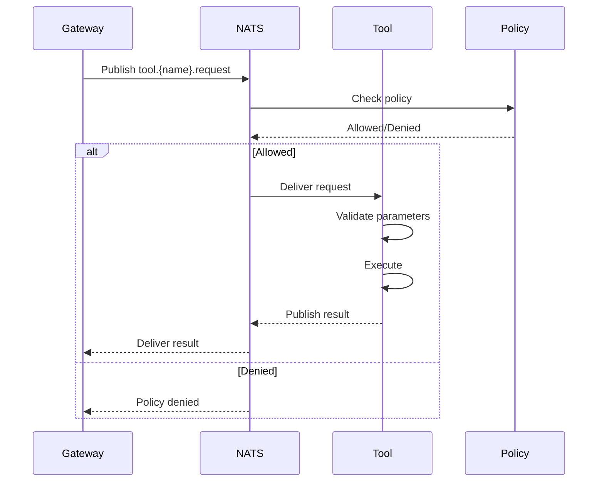

# Tool Interface API

**Status**: Draft  
**Version**: 1.0.0-alpha

## Overview

The Tool Interface defines the contract for implementing tools that extend Nachos capabilities. Tools are isolated containers that execute specific functions.

## Tool Interface

```typescript
/**
 * Base interface that all tools must implement
 */
export interface Tool {
  /**
   * Unique identifier for this tool
   */
  readonly toolId: string;

  /**
   * Display name for this tool
   */
  readonly name: string;

  /**
   * Tool description for LLM
   */
  readonly description: string;

  /**
   * Security tier (0-4)
   */
  readonly securityTier: SecurityTier;

  /**
   * Parameter schema (JSON Schema)
   */
  readonly parameters: ParameterSchema;

  /**
   * Initialize the tool
   */
  initialize(config: ToolConfig): Promise<void>;

  /**
   * Execute the tool
   */
  execute(params: ToolParameters): Promise<ToolResult>;

  /**
   * Validate parameters before execution
   */
  validate(params: ToolParameters): ValidationResult;

  /**
   * Health check
   */
  healthCheck(): Promise<HealthStatus>;
}
```

## Type Definitions

### SecurityTier

```typescript
enum SecurityTier {
  /** Safe operations, no side effects */
  SAFE = 0,
  /** Standard operations with limited access */
  STANDARD = 1,
  /** Elevated operations with write access */
  ELEVATED = 2,
  /** Restricted operations requiring explicit approval */
  RESTRICTED = 3,
  /** Dangerous operations (typically blocked) */
  DANGEROUS = 4,
}
```

### ToolConfig

```typescript
interface ToolConfig {
  /**
   * Configuration from nachos.toml
   */
  config: Record<string, unknown>;

  /**
   * Environment variables (secrets)
   */
  secrets: Record<string, string>;

  /**
   * NATS connection
   */
  nats: NatsConnection;

  /**
   * Security mode
   */
  securityMode: 'strict' | 'standard' | 'permissive';

  /**
   * Tool-specific limits
   */
  limits?: {
    timeout?: number;
    maxMemory?: number;
    maxConcurrent?: number;
  };
}
```

### ToolParameters

```typescript
interface ToolParameters {
  /**
   * Session ID for context
   */
  sessionId: string;

  /**
   * Unique call ID for this execution
   */
  callId: string;

  /**
   * Tool-specific parameters
   */
  [key: string]: unknown;
}
```

### ToolResult

```typescript
interface ToolResult {
  /**
   * Whether execution succeeded
   */
  success: boolean;

  /**
   * Result data (if successful)
   */
  result?: unknown;

  /**
   * Error information (if failed)
   */
  error?: {
    code: string;
    message: string;
    details?: unknown;
  };

  /**
   * Execution metadata
   */
  metadata?: {
    duration: number;
    cached?: boolean;
    warnings?: string[];
  };
}
```

### ParameterSchema

JSON Schema format:

```typescript
interface ParameterSchema {
  type: 'object';
  properties: Record<string, JSONSchema>;
  required?: string[];
  additionalProperties?: boolean;
}

// Example
const browserToolSchema: ParameterSchema = {
  type: 'object',
  properties: {
    url: {
      type: 'string',
      format: 'uri',
      description: 'URL to navigate to',
    },
    action: {
      type: 'string',
      enum: ['navigate', 'screenshot', 'extract'],
      description: 'Action to perform',
    },
    selector: {
      type: 'string',
      description: 'CSS selector (for extract action)',
    },
  },
  required: ['url', 'action'],
};
```

## Tool Execution Flow



## Example Implementations

### Simple Calculator Tool

```typescript
export class CalculatorTool implements Tool {
  readonly toolId = 'calculator';
  readonly name = 'Calculator';
  readonly description = 'Perform arithmetic calculations';
  readonly securityTier = SecurityTier.SAFE;

  readonly parameters: ParameterSchema = {
    type: 'object',
    properties: {
      expression: {
        type: 'string',
        description: 'Mathematical expression to evaluate',
        examples: ['2 + 2', '10 * (5 + 3)'],
      },
    },
    required: ['expression'],
  };

  async initialize(config: ToolConfig): Promise<void> {
    // No initialization needed
  }

  validate(params: ToolParameters): ValidationResult {
    if (!params.expression || typeof params.expression !== 'string') {
      return {
        valid: false,
        errors: ['expression must be a string'],
      };
    }

    // Check for dangerous patterns
    if (/[a-zA-Z]/.test(params.expression)) {
      return {
        valid: false,
        errors: ['expression must contain only numbers and operators'],
      };
    }

    return { valid: true };
  }

  async execute(params: ToolParameters): Promise<ToolResult> {
    const startTime = Date.now();

    try {
      // Validate first
      const validation = this.validate(params);
      if (!validation.valid) {
        return {
          success: false,
          error: {
            code: 'VALIDATION_ERROR',
            message: validation.errors!.join(', '),
          },
        };
      }

      // Safe evaluation using mathjs or similar
      const result = evaluateExpression(params.expression);

      return {
        success: true,
        result: {
          expression: params.expression,
          answer: result,
        },
        metadata: {
          duration: Date.now() - startTime,
        },
      };
    } catch (error) {
      return {
        success: false,
        error: {
          code: 'EXECUTION_ERROR',
          message: error.message,
        },
        metadata: {
          duration: Date.now() - startTime,
        },
      };
    }
  }

  async healthCheck(): Promise<HealthStatus> {
    return { healthy: true };
  }
}
```

### Filesystem Tool (Elevated)

```typescript
export class FilesystemTool implements Tool {
  readonly toolId = 'filesystem';
  readonly name = 'Filesystem';
  readonly description = 'Read and write files';
  readonly securityTier = SecurityTier.ELEVATED;

  readonly parameters: ParameterSchema = {
    type: 'object',
    properties: {
      action: {
        type: 'string',
        enum: ['read', 'write', 'list', 'delete'],
      },
      path: {
        type: 'string',
        description: 'File or directory path',
      },
      content: {
        type: 'string',
        description: 'Content to write (for write action)',
      },
    },
    required: ['action', 'path'],
  };

  private allowedPaths: string[] = [];

  async initialize(config: ToolConfig): Promise<void> {
    this.allowedPaths = config.config.allowedPaths as string[] || ['./workspace'];
  }

  validate(params: ToolParameters): ValidationResult {
    // Check path is within allowed directories
    const isAllowed = this.allowedPaths.some((allowed) =>
      params.path.startsWith(allowed)
    );

    if (!isAllowed) {
      return {
        valid: false,
        errors: [`Path ${params.path} is not in allowed directories`],
      };
    }

    // Additional validation based on action
    if (params.action === 'write' && !params.content) {
      return {
        valid: false,
        errors: ['content is required for write action'],
      };
    }

    return { valid: true };
  }

  async execute(params: ToolParameters): Promise<ToolResult> {
    const startTime = Date.now();

    try {
      const validation = this.validate(params);
      if (!validation.valid) {
        return {
          success: false,
          error: {
            code: 'VALIDATION_ERROR',
            message: validation.errors!.join(', '),
          },
        };
      }

      let result;
      switch (params.action) {
        case 'read':
          result = await fs.readFile(params.path, 'utf-8');
          break;
        case 'write':
          await fs.writeFile(params.path, params.content);
          result = { written: true };
          break;
        case 'list':
          result = await fs.readdir(params.path);
          break;
        case 'delete':
          await fs.unlink(params.path);
          result = { deleted: true };
          break;
      }

      return {
        success: true,
        result,
        metadata: {
          duration: Date.now() - startTime,
        },
      };
    } catch (error) {
      return {
        success: false,
        error: {
          code: 'EXECUTION_ERROR',
          message: error.message,
        },
      };
    }
  }

  async healthCheck(): Promise<HealthStatus> {
    // Check if workspace is accessible
    try {
      await fs.access('./workspace');
      return { healthy: true };
    } catch {
      return { healthy: false, error: 'Workspace not accessible' };
    }
  }
}
```

## Tool Registration

Tools register themselves by subscribing to their request topic:

```typescript
export class ToolRunner {
  constructor(private tool: Tool, private nats: NatsConnection) {}

  async start(): Promise<void> {
    const topic = `nachos.tool.${this.tool.toolId}.request`;

    const sub = this.nats.subscribe(topic);
    console.log(`Tool ${this.tool.name} listening on ${topic}`);

    for await (const msg of sub) {
      try {
        const request = JSON.parse(msg.data.toString());
        const result = await this.tool.execute(request.payload);

        const response = {
          id: crypto.randomUUID(),
          timestamp: new Date().toISOString(),
          source: this.tool.toolId,
          type: 'tool.response',
          correlationId: request.id,
          payload: result,
        };

        msg.respond(JSON.stringify(response));
      } catch (error) {
        console.error('Tool execution failed:', error);
        msg.respond(
          JSON.stringify({
            success: false,
            error: {
              code: 'INTERNAL_ERROR',
              message: error.message,
            },
          })
        );
      }
    }
  }
}
```

## Testing

### Unit Tests

```typescript
import { describe, it, expect } from 'vitest';
import { CalculatorTool } from './calculator-tool';

describe('CalculatorTool', () => {
  const tool = new CalculatorTool();

  it('should validate parameters', () => {
    const valid = tool.validate({
      sessionId: 'test',
      callId: 'test',
      expression: '2 + 2',
    });
    expect(valid.valid).toBe(true);

    const invalid = tool.validate({
      sessionId: 'test',
      callId: 'test',
      expression: 'evil()',
    });
    expect(invalid.valid).toBe(false);
  });

  it('should execute calculations', async () => {
    const result = await tool.execute({
      sessionId: 'test',
      callId: 'test',
      expression: '10 * 5',
    });

    expect(result.success).toBe(true);
    expect(result.result.answer).toBe(50);
  });
});
```

## Security Best Practices

1. **Always validate parameters** before execution
2. **Implement timeouts** for long-running operations
3. **Sandbox execution** when possible
4. **Limit resource usage** (memory, CPU, disk)
5. **Sanitize file paths** to prevent traversal
6. **Never execute arbitrary code** without sandboxing
7. **Log all executions** for audit trail
8. **Handle errors gracefully** without exposing internals

## Tool Manifest

Every tool must include a manifest:

```json
{
  "name": "nachos-tool-browser",
  "version": "1.0.0",
  "type": "tool",
  "capabilities": {
    "network": {
      "egress": ["*"]
    },
    "resources": {
      "memory": "1GB",
      "cpus": 1.0
    }
  },
  "provides": {
    "tool": "browser",
    "securityTier": 1
  }
}
```

## References

- [JSON Schema](https://json-schema.org/)
- [Tool Security Guidelines](../security.md)
- [Testing Tools Guide](../testing.md)
