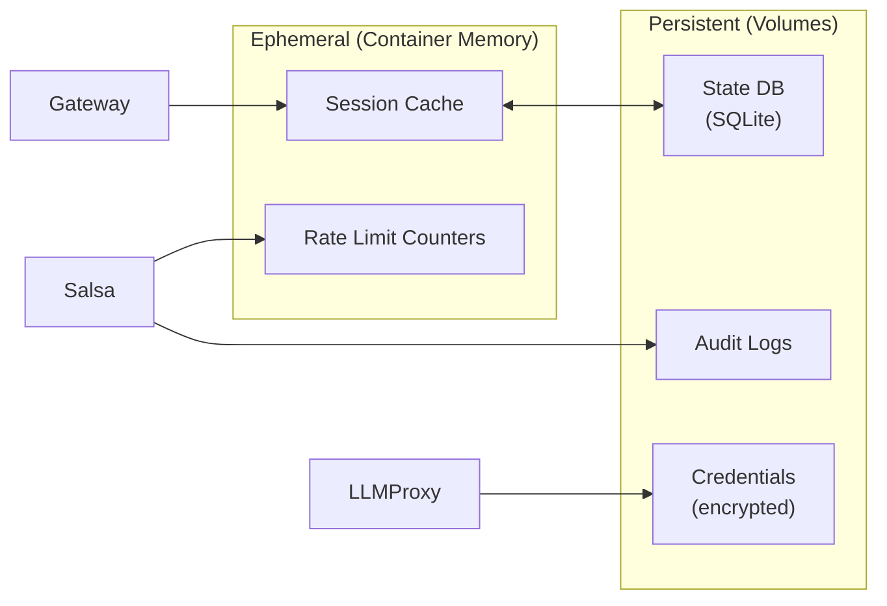

# Nachos Architecture

This document provides a comprehensive overview of the Nachos architecture.

## System Overview

Nachos is a Docker-native AI assistant framework built on four principles:

1. **Container-per-component**: Every module runs in isolation
2. **Secure by default**: Deny-all, then explicitly grant
3. **Single config file**: One `nachos.toml` rules everything
4. **Composable**: Add/remove toppings without rebuilding

## High-Level Architecture

```mermaid
flowchart TB
    subgraph External["External World"]
        User["👤 User"]
        LLM["🤖 LLM APIs"]
        ExtAPI["🌐 External APIs"]
    end

    subgraph DockerCompose["🍽️ Docker Compose (The Plate)"]
        subgraph Salsa["🌶️ Salsa Layer"]
            Policy["Policy Engine"]
            DLP["DLP Scanner"]
            Audit["Audit Logger"]
            RateLimit["Rate Limiter"]
        end

        subgraph Core["🔲 Core (Chips)"]
            Gateway["Gateway"]
            Bus["Message Bus<br/>(NATS)"]
        end

        subgraph Protein["🥩 Protein"]
            LLMProxy["LLM Proxy"]
        end

        subgraph Toppings["🫑 Toppings"]
            subgraph Channels["Channels"]
                Slack["Slack"]
                Discord["Discord"]
                Telegram["Telegram"]
                WebChat["WebChat"]
            end
            subgraph Tools["Tools"]
                Browser["Browser"]
                FileSystem["Filesystem"]
                CodeRunner["Code Runner"]
            end
        end

        subgraph Networks["Networks"]
            Internal["nachos-internal<br/>(isolated)"]
            Egress["nachos-egress<br/>(controlled)"]
        end
    end

    User <--> Channels
    Channels <--> Bus
    Bus <--> Gateway
    Gateway <--> Salsa
    Gateway <--> LLMProxy
    Gateway <--> Tools
    LLMProxy <--> LLM
    Browser <--> ExtAPI

    Core --- Internal
    Toppings --- Internal
    LLMProxy --- Egress
    Browser --- Egress
```



## Component Details

### Core Components (The Chips)

These are always present in any Nachos deployment.

#### Gateway

The central orchestrator that:

- Manages user sessions
- Routes messages between components
- Maintains conversation state
- Coordinates tool execution


#### Message Bus (NATS)

Lightweight message passing that:

- Decouples components
- Enables pub/sub patterns
- Handles request/reply
- Provides message persistence

**Topic Structure:**

```
nachos.channel.{channel_name}.inbound    # Messages from users
nachos.channel.{channel_name}.outbound   # Messages to users
nachos.tool.{tool_name}.request          # Tool invocations
nachos.tool.{tool_name}.response         # Tool results
nachos.llm.request                       # LLM completions
nachos.llm.response                      # LLM responses
nachos.policy.check                      # Policy validation
nachos.audit.log                         # Audit events
```

### Security Layer (Salsa)

All requests pass through Salsa before execution.


#### Policy Engine

Evaluates requests against rules:

```yaml
# Example policy rule
- name: 'tool-filesystem-write'
  match:
    tool: 'filesystem'
    action: 'write'
  conditions:
    - security_mode: ['standard', 'permissive']
    - path_allowed: true
  effect: 'allow'
```

### LLM Proxy (Protein)

Abstracts LLM provider differences:


**Responsibilities:**

- Unified API across providers
- Automatic retry with exponential backoff
- Fallback to secondary model
- Token counting and limits
- Response streaming

### Channels (Toppings)

Each channel is a standalone container:


**Channel Contract:**

- Receive platform-specific messages
- Normalize to common format
- Publish to bus
- Subscribe to responses
- Format for platform delivery

### Tools (Toppings)

Tools execute capabilities in isolation:


**Tool Security Tiers:**

| Tier           | Examples      | Sandbox | Network |
| -------------- | ------------- | ------- | ------- |
| 0 - Safe       | Read calendar | No      | None    |
| 1 - Standard   | Browse web    | Yes     | Limited |
| 2 - Elevated   | Write files   | Yes     | None    |
| 3 - Restricted | Execute code  | Strict  | None    |
| 4 - Dangerous  | Shell access  | N/A     | Blocked |

## Network Architecture


**Key Points:**

- Internal network has NO external access
- Egress network is explicitly granted
- Each container only joins necessary networks
- Manifest declares network requirements

## Message Flow

### User Message → Response


## Data Flow

### State Management



## Module System

### Manifest Structure

Every module declares its requirements:

```json
{
  "name": "nachos-channel-slack",
  "version": "1.0.0",
  "type": "channel",

  "requires": {
    "gateway": "^1.0",
    "bus": "^1.0"
  },

  "capabilities": {
    "network": {
      "egress": ["slack.com", "api.slack.com", "files.slack.com"]
    },
    "secrets": ["SLACK_BOT_TOKEN", "SLACK_APP_TOKEN"],
    "volumes": []
  },

  "provides": {
    "channel": "slack",
    "features": ["dm", "channels", "threads", "reactions", "files"]
  },

  "container": {
    "image": "nachoclaw/channel-slack",
    "resources": {
      "memory": "256MB",
      "cpus": 0.25
    }
  }
}
```

### Compose Generation

The CLI reads `nachos.toml` + manifests to generate `docker-compose.yml`:


## Deployment Patterns

### Minimal (Development)

```yaml
services:
  gateway: ...
  bus: ...
  llm-proxy: ...
  webchat: ...
```

### Standard (Personal Use)

```yaml
services:
  gateway: ...
  bus: ...
  salsa: ...
  llm-proxy: ...
  webchat: ...
  slack: ...
  filesystem: ...
  browser: ...
```

### Full (Power User)

All available channels and tools enabled.

## Extension Points

### Custom Channels

1. Implement channel interface
2. Create manifest
3. Build container
4. Register with CLI

### Custom Tools

1. Implement tool interface
2. Define schema
3. Assign security tier
4. Create manifest
5. Build container

### Custom Policies

1. Create policy YAML
2. Place in `policies/`
3. Policies hot-reload

## Performance Considerations

- **Message Bus**: NATS handles 10M+ msg/sec
- **Gateway**: Stateless, horizontally scalable
- **LLM Proxy**: Connection pooling, streaming
- **Tools**: Parallel execution where safe
- **Containers**: Resource limits prevent runaway

## Security Summary

| Layer      | Protection                            |
| ---------- | ------------------------------------- |
| Container  | Non-root, read-only, dropped caps     |
| Network    | Internal isolation, controlled egress |
| Policy     | Deny-default, explicit allow          |
| DLP        | Pattern matching, configurable action |
| Audit      | Full logging, tamper-evident          |
| Rate Limit | Per-user, per-operation limits        |
