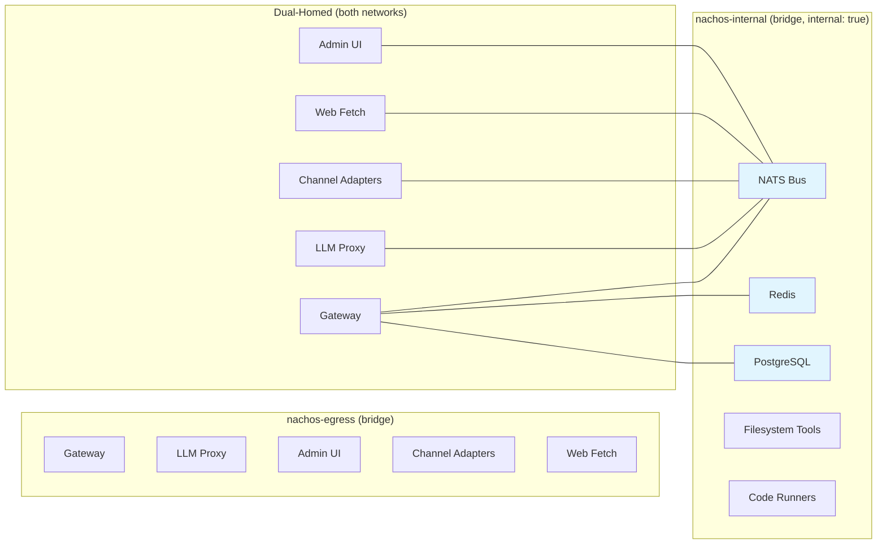
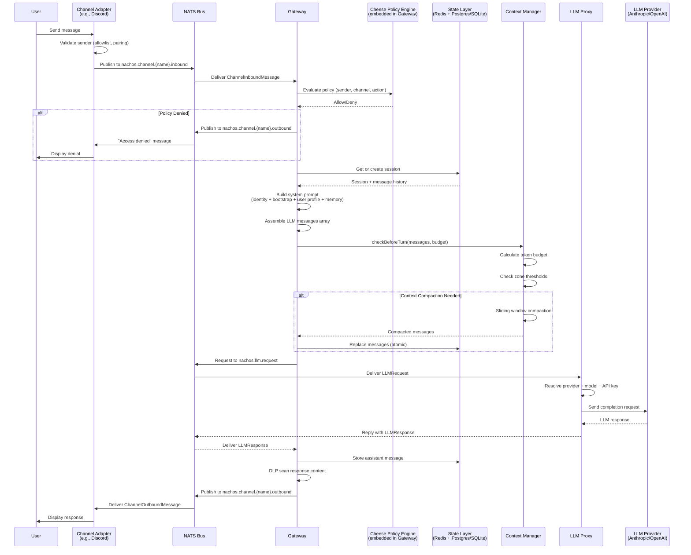
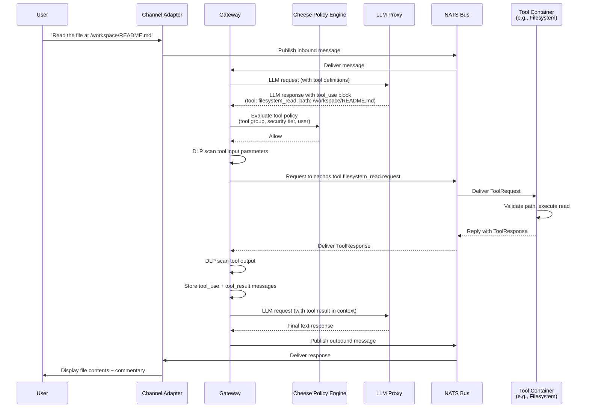
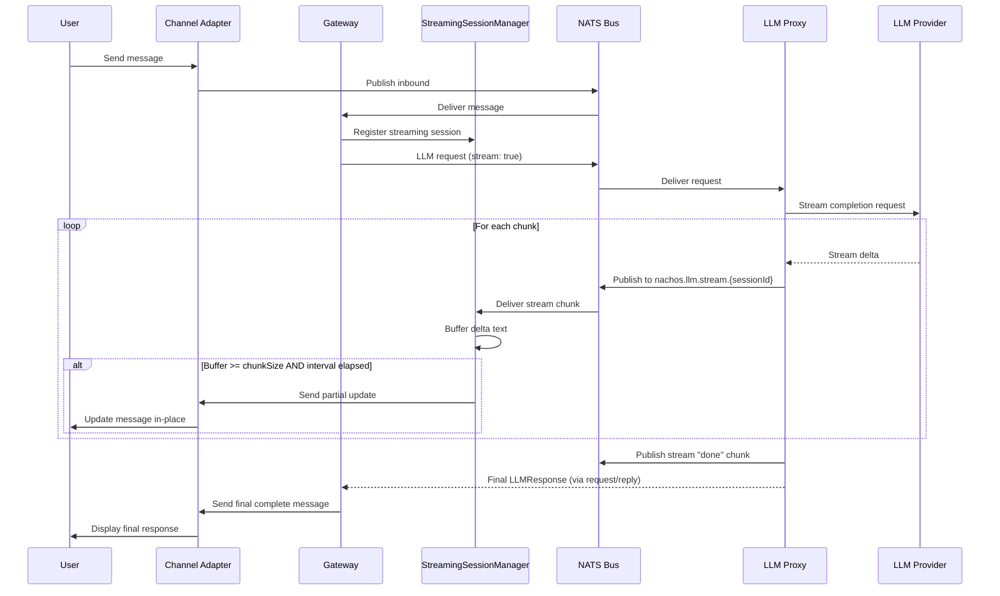
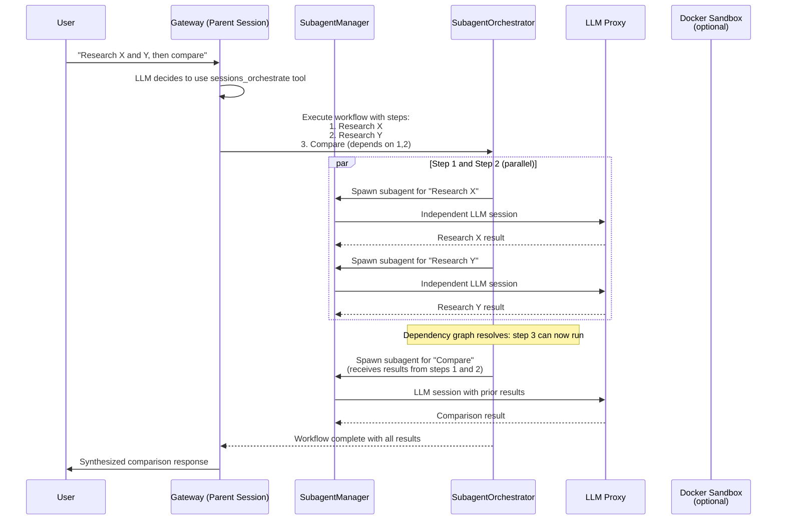
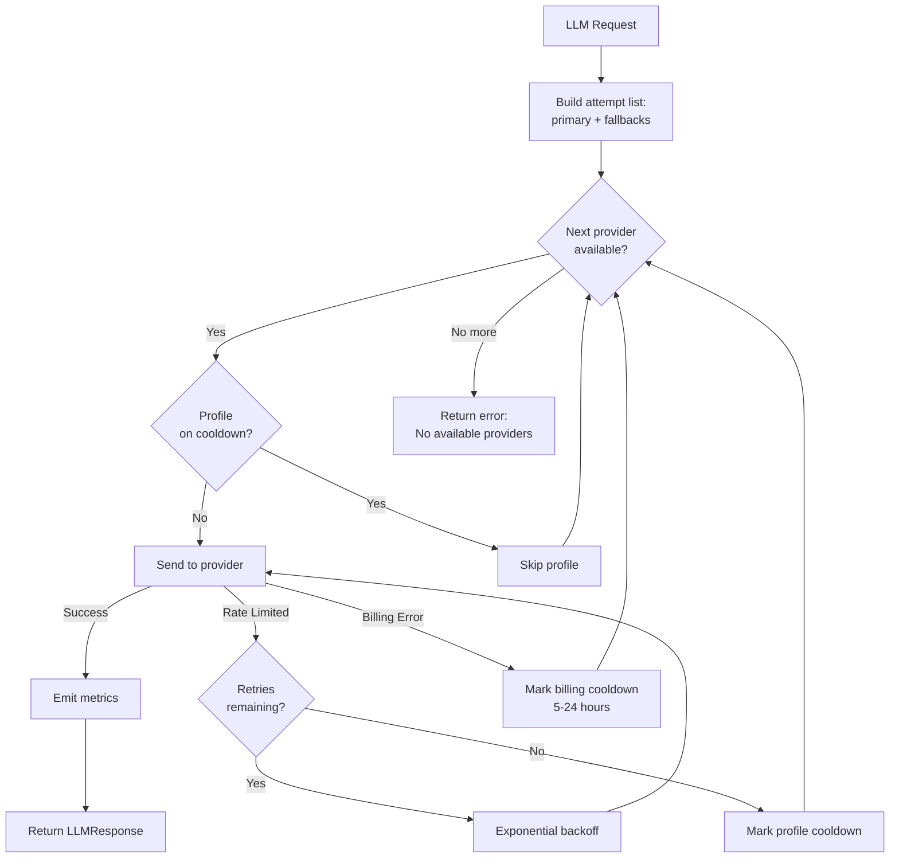
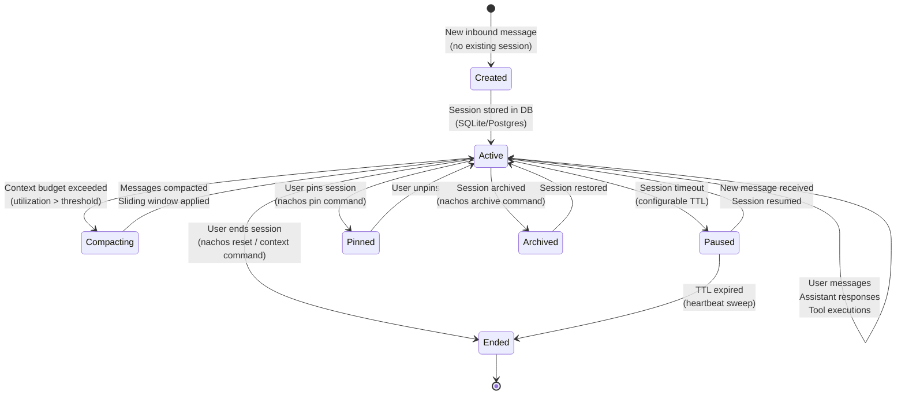
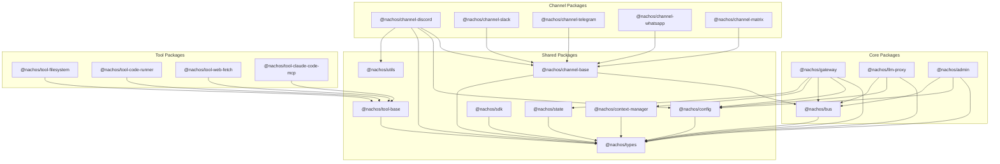

# Nachos Architecture Specification

> Version 1.0 | Generated 2026-03-14

---

## Table of Contents

1. [System Overview](#1-system-overview)
2. [Architecture Diagram](#2-architecture-diagram)
3. [Message Flow](#3-message-flow)
4. [Component Deep Dive](#4-component-deep-dive)
5. [Data Flow Diagrams](#5-data-flow-diagrams)

---

## 1. System Overview

### What is Nachos?

Nachos is a **Docker-native, security-first, modular AI assistant framework**. It enables users to run personal AI agents that connect to messaging platforms (Slack, Discord, Telegram, WhatsApp, Matrix) while maintaining strong security defaults and easy customization.

Every component in the system -- channels, tools, security policies, state stores -- runs as an isolated Docker container. Users compose their desired configuration through a single `nachos.toml` file, and the CLI generates the appropriate `docker-compose.yml` to bring the stack up.

### Key Differentiators

**Composability over monoliths.** Unlike single-process AI assistants, Nachos uses a "build your own plate" model. Each concern (message routing, LLM communication, tool execution, policy enforcement) is a separate container with a well-defined interface. Users add or remove channels and tools without touching core infrastructure.

**Security by default.** The embedded Cheese policy engine enforces deny-by-default access control with sub-millisecond evaluation. Containers run as non-root with read-only filesystems, dropped capabilities, and network isolation. Three security presets (strict, standard, permissive) let operators choose their posture without writing custom rules.

**Network isolation.** Two Docker networks enforce a hard boundary between internal communication (`nachos-internal`, no external access) and controlled external access (`nachos-egress`). Only containers that genuinely need internet access (LLM Proxy, channel adapters, web-fetch tool) are attached to the egress network.

**Provider-agnostic LLM layer.** The LLM Proxy abstracts over Anthropic, OpenAI, AWS Bedrock, and Ollama with automatic failover, cooldown management, and per-profile API key rotation. The Gateway never communicates with LLM providers directly.

### The "Build Your Own Plate" Model

```
nachos.toml  -->  CLI (nachos up)  -->  docker-compose.yml  -->  Running Stack
     |                                        |
     |-- channels: [discord, slack]           |-- nachos-bus
     |-- tools: [filesystem, code-runner]     |-- nachos-gateway
     |-- security: standard                   |-- nachos-llm-proxy
     |-- llm: anthropic/claude-sonnet         |-- nachos-channel-discord
     |                                        |-- nachos-channel-slack
     |                                        |-- nachos-tool-filesystem-read
     |                                        |-- nachos-tool-code-python
```

Users declare what they want in `nachos.toml`. The CLI scaffolds the infrastructure. Adding a new channel or tool means adding a line to the config and running `nachos up` -- no code changes to the core.

---

## 2. Architecture Diagram

### Full System Topology

```mermaid
graph TB
    subgraph "External Services"
        LLM_API["LLM APIs<br/>(Anthropic, OpenAI, Bedrock, Ollama)"]
        DISCORD_API["Discord API"]
        SLACK_API["Slack API"]
        TELEGRAM_API["Telegram API"]
        WHATSAPP_API["WhatsApp API"]
        WEB["Public Internet"]
    end

    subgraph "Docker Compose Stack"
        subgraph "nachos-egress network (172.29.0.0/16)"
            GATEWAY["Gateway<br/>:3000<br/>(+ embedded Cheese)"]
            LLM_PROXY["LLM Proxy<br/>:3001"]
            ADMIN["Admin UI<br/>:8082<br/>(Hono + Vue)"]
            DISCORD["Discord Channel"]
            SLACK["Slack Channel"]
            TELEGRAM["Telegram Channel"]
            WHATSAPP["WhatsApp Channel"]
            WEB_FETCH["Web Fetch Tool"]
        end

        subgraph "nachos-internal network (172.28.0.0/16)"
            BUS["NATS Bus<br/>(Message Broker)"]
            REDIS["Redis 7<br/>(Session State)"]
            POSTGRES["PostgreSQL 16<br/>(Persistent State)"]
            FS_READ["Filesystem Read<br/>(SecurityTier 0)"]
            FS_RW["Filesystem ReadWrite<br/>(SecurityTier 2)"]
            CODE_PY["Code Runner Python"]
            CODE_JS["Code Runner JavaScript"]
        end
    end

    %% External connections
    LLM_PROXY --> LLM_API
    DISCORD --> DISCORD_API
    SLACK --> SLACK_API
    TELEGRAM --> TELEGRAM_API
    WHATSAPP --> WHATSAPP_API
    WEB_FETCH --> WEB

    %% Internal bus connections
    GATEWAY <--> BUS
    LLM_PROXY <--> BUS
    DISCORD <--> BUS
    SLACK <--> BUS
    TELEGRAM <--> BUS
    WHATSAPP <--> BUS
    ADMIN <--> BUS
    FS_READ <--> BUS
    FS_RW <--> BUS
    CODE_PY <--> BUS
    CODE_JS <--> BUS
    WEB_FETCH <--> BUS

    %% State connections
    GATEWAY --> REDIS
    GATEWAY --> POSTGRES
    ADMIN --> REDIS

    %% Dual-network components (also on nachos-internal)
    GATEWAY -.-> BUS
    LLM_PROXY -.-> BUS
    ADMIN -.-> BUS
    DISCORD -.-> BUS
    WEB_FETCH -.-> BUS
```



### Network Topology



**Key principle:** The `nachos-internal` network is marked `internal: true`, meaning containers on it have no route to the internet. Only containers that also attach to `nachos-egress` can reach external services. Tools like `filesystem-read` and `code-runner` are isolated to the internal network only.

### Container Security Properties

| Container | Network | User | Read-Only FS | Memory Limit | PID Limit |
|-----------|---------|------|-------------|-------------|-----------|
| Gateway | internal + egress | default | No | 2 GB | 200 |
| LLM Proxy | internal + egress | default | No | 1 GB | 100 |
| Admin UI | internal + egress | default | No | 512 MB | 100 |
| Bus (NATS) | internal only | default | No | -- | -- |
| Redis | internal only | default | No | -- | -- |
| PostgreSQL | internal only | default | No | -- | -- |
| Channels | internal + egress | default | No | -- | -- |
| Filesystem Tools | internal only | 1001:1001 | Yes | -- | -- |
| Code Runners | internal only | 1001:1001 | Yes | 512 MB | 100 |
| Web Fetch | internal + egress | 1001:1001 | Yes | -- | -- |

---

## 3. Message Flow

### 3.1 Standard Message Flow (User Message to Response)



### 3.2 Tool Execution Flow



### 3.3 Streaming Response Flow



### 3.4 Subagent / Orchestration Flow



---

## 4. Component Deep Dive

### 4.1 Gateway

**Purpose:** The Gateway is the central orchestrator of the Nachos system. It receives inbound messages from channels, manages sessions, builds prompts, coordinates tool execution, enforces security policies, and sends responses back through channels.

**Key responsibilities:**
- Session lifecycle management (create, resume, end, archive, pin)
- System prompt assembly (identity, bootstrap, user profile, memory injection)
- LLM request/response orchestration with tool-use loop
- Context management (budget checking, compaction, snapshot/restore)
- Policy enforcement via embedded Cheese engine
- DLP (Data Loss Prevention) scanning on inputs and outputs
- Rate limiting (per-user, per-action)
- Streaming passthrough to channels
- Subagent spawning and workflow orchestration
- Scheduler for cron-based autonomous actions
- Skill-backed CLI tool execution (shell tools)

**Key interfaces and types:**

```typescript
// GatewayOptions - Configuration for the Gateway
interface GatewayOptions {
  dbPath?: string;                    // SQLite database path
  healthPort?: number;                // Health endpoint port (default 3000)
  bus?: MessageBus;                   // NATS or in-memory bus
  defaultSystemPrompt?: string;       // Default system prompt
  assistantName?: string;             // Prepended to system prompt
  channels?: string[];                // Channel subscriptions
  policyConfig?: PolicyEngineConfig;  // Cheese configuration
  auditConfig?: AuditConfig;          // Audit logging config
  dlpConfig?: DLPConfig;              // DLP scanning config
  rateLimiterConfig?: RateLimiterConfig;
  contextManager?: ContextManager;
  stateLayer?: StateLayer;
  memoryPipeline?: MemoryPipeline;
  subagentConfig?: SubagentManagerConfig;
  schedulerConfig?: SchedulerConfig;
  // ... additional options
}
```

**Configuration:** Configured via `nachos.toml` under the `[gateway]` section plus environment variables. Key environment variables: `NATS_URL`, `REDIS_URL`, `NACHOS_CONFIG_PATH`, `GATEWAY_CHANNELS`.

**Extracted subcomponents (from the original monolithic Gateway):**
- `SkillsManager` -- Loads SKILL.md files, manages shell tool definitions
- `StreamingSessionManager` -- Tracks streaming sessions, buffers, and sweep
- `ToolExecutor` -- Tool definition building, call execution, DLP scanning
- `HookRegistry` -- Pre/post hooks for extensibility

**Connections:**
- Subscribes to `nachos.channel.{name}.inbound` for each configured channel
- Publishes to `nachos.channel.{name}.outbound` for responses
- Uses request/reply on `nachos.llm.request` for LLM completions
- Uses request/reply on `nachos.tool.{name}.request` for tool execution
- Publishes status events on `nachos.status.{sessionId}.*`
- Publishes context events on `nachos.context.*`
- Connects directly to Redis for session state and PostgreSQL/SQLite for persistence

---

### 4.2 Bus (NATS)

**Purpose:** The message bus provides asynchronous inter-component communication. All Nachos components communicate exclusively through the bus -- there are no direct HTTP calls between containers (except health checks and the LLM Proxy to external APIs).

**Key responsibilities:**
- Publish/subscribe messaging between all components
- Request/reply pattern for synchronous operations (LLM requests, tool calls)
- Connection management with automatic reconnection
- Health monitoring

**Key interfaces and types:**

```typescript
// NachosBusClient - TypeScript wrapper around NATS
class NachosBusClient {
  connect(): Promise<void>;
  disconnect(): Promise<void>;
  publish<T>(topic: string, payload: T, options?: PublishOptions): void;
  subscribe<T>(topic: string, handler: MessageHandler<T>): Promise<BusSubscription>;
  request<TReq, TRes>(topic: string, payload: TReq, options?: RequestOptions): Promise<MessageEnvelope<TRes>>;
  getHealth(): Promise<BusHealthStatus>;
}

// MessageEnvelope - Standard envelope for all messages
interface MessageEnvelope<T = unknown> {
  id: string;           // UUID
  timestamp: string;     // ISO 8601
  source: string;        // Component name
  type: string;          // Message type identifier
  correlationId?: string; // For request/reply correlation
  payload: T;            // Message-specific data
}
```

**Topic structure:** All topics follow the convention `nachos.<domain>.<component>.<action>`:

| Topic Pattern | Publisher | Subscriber | Purpose |
|---------------|----------|------------|---------|
| `nachos.channel.{name}.inbound` | Channel adapters | Gateway | User messages |
| `nachos.channel.{name}.outbound` | Gateway | Channel adapters | Bot responses |
| `nachos.llm.request` | Gateway | LLM Proxy | LLM completion requests |
| `nachos.llm.response` | LLM Proxy | Gateway | LLM completion responses |
| `nachos.llm.stream.{sessionId}` | LLM Proxy | Gateway | Streaming chunks |
| `nachos.tool.{name}.request` | Gateway | Tool containers | Tool execution |
| `nachos.tool.{name}.response` | Tool containers | Gateway | Tool results |
| `nachos.status.{sessionId}.*` | Gateway | Channel adapters | Thinking/tool/done/error |
| `nachos.context.*` | Gateway | Monitoring | Context budget/compaction events |
| `nachos.audit.log` | Any component | Audit processors | Audit trail |
| `nachos.config.update` | Channels/Admin | Gateway | Runtime config changes |
| `nachos.scheduler.*` | Gateway | Monitoring | Cron job events |
| `nachos.gateway.subagents.*` | Gateway | Admin UI | Subagent management |
| `nachos.gateway.channel.announce` | Channels | Gateway | Channel presence |

**Configuration:** NATS server runs inside the bus container with a configuration file. Authentication is via a shared token (`NATS_TOKEN`). The bus is only accessible on `nachos-internal` -- it has no host-exposed ports by default.

---

### 4.3 LLM Proxy

**Purpose:** The LLM Proxy abstracts over multiple LLM providers, providing a single interface for the Gateway. It handles provider selection, failover, retry logic, cooldown management, and streaming.

**Key responsibilities:**
- Multi-provider support (Anthropic, OpenAI, AWS Bedrock, Ollama)
- Automatic failover through a configurable fallback chain
- Per-profile API key rotation with cooldown on rate limits or billing errors
- Retry with exponential backoff for transient errors
- Streaming support with chunk-by-chunk publication
- Metrics emission via audit events

**Key interfaces and types:**

```typescript
// LLMProviderAdapter - Interface each provider implements
interface LLMProviderAdapter {
  readonly name: string;
  readonly type: 'anthropic' | 'openai' | 'ollama' | 'custom';
  send(request: LLMRequestType, options: AdapterSendOptions): Promise<AdapterResponse>;
  stream?(request: LLMRequestType, options: AdapterStreamOptions, onChunk: StreamChunkHandler): Promise<AdapterResponse>;
}

// LLMRequestType - Incoming request from Gateway
interface LLMRequestType {
  sessionId: string;
  messages: LLMMessageType[];     // Conversation history
  tools?: LLMToolDefinitionType[];  // Available tool schemas
  options?: {
    model?: string;
    maxTokens?: number;
    temperature?: number;
    stream?: boolean;
  };
}

// LLMResponseType - Response back to Gateway
interface LLMResponseType {
  sessionId: string;
  success: boolean;
  message?: LLMMessageType;
  toolCalls?: LLMToolCallType[];
  usage?: LLMUsageType;
  provider?: string;
  model?: string;
  finishReason?: string;
  error?: LLMErrorType;
}
```

**Failover flow:**



**Configuration:** Configured via `nachos.toml` under `[llm]`. Key settings: `provider`, `model`, `max_tokens`, `temperature`, `fallback_order`, `profiles` (array of named API key configurations), `cooldowns`, `retry`.

---

### 4.4 Channels

**Purpose:** Channel adapters bridge between messaging platforms and the Nachos bus. Each channel runs in its own container, translates platform-specific events into the Nachos message format, and delivers outbound messages back to users.

**Supported channels:** Discord, Slack, Telegram, WhatsApp, Matrix

**Key responsibilities:**
- Platform SDK connection and event handling
- Message translation (platform format to/from `ChannelInboundMessage`/`ChannelOutboundMessage`)
- User validation (allowlists, DM policies, pairing)
- Status reaction display (typing indicators, emoji reactions for tool use)
- Thread management

**Key interfaces and types:**

```typescript
// ChannelAdapter - Interface each channel implements
interface ChannelAdapter {
  readonly channelId: string;      // e.g., "discord", "slack"
  readonly name: string;           // Display name
  initialize(config: ChannelAdapterConfig): Promise<void>;
  start(): Promise<void>;
  stop(): Promise<void>;
  send(message: OutboundMessage): Promise<SendResult>;
  healthCheck(): Promise<HealthStatusType>;
}

// ChannelInboundMessage - User message entering the system
interface ChannelInboundMessage {
  channel: string;
  channelMessageId: string;
  sessionId?: string;             // For session resumption
  sender: { id: string; name?: string; isAllowed: boolean };
  conversation: { id: string; type: 'dm' | 'channel' | 'thread' };
  content: { text?: string; attachments?: Attachment[] };
  metadata?: Record<string, unknown>;
}

// ChannelOutboundMessage - Response sent to user
interface ChannelOutboundMessage {
  channel: string;
  conversationId: string;
  sessionId?: string;
  replyToMessageId?: string;
  content: { text: string; format?: 'plain' | 'markdown'; attachments?: OutboundAttachment[] };
  options?: { ephemeral?: boolean; threadReply?: boolean };
}
```

**Channel SDK:** The `@nachos/sdk` package provides `BaseChannel`, an abstract class that handles bus wiring (subscribing to outbound topics, publishing inbound messages, status event helpers). Channel developers extend `BaseChannel` and implement platform-specific methods: `connect()`, `disconnect()`, `onOutboundMessage()`, `sendTypingIndicator()`, `healthCheck()`.

**Channel base helpers** (`@nachos/channel-base`): Provides `createChannelBus()` for bus adaptation, `resolveDmPolicy()` / `resolveGroupPolicy()` for access control, and `createPairingStore()` / `parsePairingCommand()` for the pairing flow.

**Configuration:** Each channel reads from `nachos.toml` under `[channels.{name}]` and from environment variables (e.g., `DISCORD_BOT_TOKEN`, `SLACK_APP_TOKEN`). Common env: `SECURITY_MODE`, `NACHOS_PAIRING_TOKEN`, `NACHOS_CONFIG_PATH`.

---

### 4.5 Tools

**Purpose:** Tool containers execute actions on behalf of the AI assistant. Each tool runs in an isolated container with minimal permissions, communicating exclusively via NATS request/reply.

**Available tools:**

| Tool | Container | Security Tier | Network | Description |
|------|-----------|--------------|---------|-------------|
| Filesystem Read | `filesystem-read` | 0 (read-only) | internal | Read files from mounted workspace |
| Filesystem ReadWrite | `filesystem-readwrite` | 2 (standard) | internal | Read, write, edit, patch files |
| Code Runner (Python) | `code-runner-python` | 2 (standard) | internal | Execute Python code |
| Code Runner (JavaScript) | `code-runner-javascript` | 2 (standard) | internal | Execute JavaScript code |
| Web Fetch | `web-fetch` | 1 (standard) | internal + egress | Fetch web pages with SSRF protection |
| Browser | embedded in Gateway | 2 (standard) | egress | Playwright-based browser automation |

**Skill-backed CLI tools** (run inside the Gateway process, not separate containers):

| Tool | Binary | Description |
|------|--------|-------------|
| goplaces | `goplaces` | Location/address lookup |
| gifgrep | `gifgrep` | GIF/media search |
| summarize | `summarize` | Text summarization |
| gog | `gog` | Workspace/file search |

**Gateway-native tools** (implemented directly in the Gateway, no container or binary):

| Tool | Description |
|------|-------------|
| `memory_search`, `memory_get`, `memory_write`, `memory_delete` | Memory store CRUD |
| `user_profile` | User profile management |
| `bootstrap` | Identity bootstrap management |
| `sessions_spawn` | Spawn subagent sessions |
| `sessions_orchestrate` | Multi-step workflow orchestration |
| `subagents` | Subagent management (list, info, stop, steer) |
| `subagent_progress` | Progress reporting (subagent sessions only) |
| `snapshot_list`, `snapshot_restore` | Context snapshot management |
| `web_search` | Web search via API |
| `web_fetch_native` | Direct HTTP fetch (no container) |
| `cron_add`, `cron_list`, `cron_remove`, `cron_update`, `cron_run` | Scheduled job management |
| `composio` | Composio integration tools |
| `github` | GitHub API tools |
| `bitbucket` | Bitbucket API tools |
| `agent_exec` | Spawn independent agent processes |

**Key interfaces and types:**

```typescript
// ToolService - Base class for container-based tools
abstract class ToolService implements Tool {
  abstract readonly toolId: string;
  abstract readonly securityTier: SecurityTier;  // 0-4
  abstract readonly parameters: ParameterSchema;
  abstract initialize(config: ToolConfig): Promise<void>;
  abstract execute(params: ToolParameters): Promise<ToolResult>;
}

// ToolRequest - Request from Gateway to tool container
interface ToolRequest {
  sessionId: string;
  tool: string;
  callId: string;
  parameters: Record<string, unknown>;
}

// ToolResponse - Response from tool container
interface ToolResponse {
  sessionId: string;
  callId: string;
  success: boolean;
  result?: unknown;
  error?: { code: string; message: string };
}
```

**Security tiers:**
- **Tier 0:** Read-only operations (filesystem read)
- **Tier 1:** Network access, no system modification (web fetch)
- **Tier 2:** System modification (file write, code execution)
- **Tier 3:** Privileged operations (reserved)
- **Tier 4:** Administrative operations (reserved)

**Configuration:** Tools are configured via `nachos.toml` under `[tools]`. Tool groups map individual tools to policy group names for Cheese evaluation. Environment variables control tool-specific settings (e.g., `ALLOWED_PATHS`, `EXECUTION_TIMEOUT`).

---

### 4.6 Admin UI

**Purpose:** The Admin UI provides a web-based management interface for the Nachos stack. It is built with a Hono API backend and a Vue SPA frontend, accessible on port 8082.

**Key responsibilities:**
- Dashboard showing system status, container health, and active sessions
- Session browser and inspector
- Configuration viewer and editor (runtime config updates)
- Audit log viewer
- Skill management (view loaded skills, trigger reloads)
- Service management (container status, restart)
- Log aggregation viewer
- WebChat interface (browser-based direct chat with the assistant)

**Routes:**

| Route | Purpose |
|-------|---------|
| `/api/health` | Health check endpoint |
| `/api/status` | System status overview |
| `/api/sessions` | Session listing and detail |
| `/api/config` | Configuration read/update |
| `/api/audit` | Audit log query |
| `/api/skills` | Skill listing and management |
| `/api/services` | Container status via Docker socket |
| `/api/logs` | Aggregated log viewing |
| `/api/chat` | Direct chat API |
| `/api/webchat` | WebSocket-based webchat |

**Security:** Protected by token-based authentication (`NACHOS_ADMIN_TOKEN`). CORS restricted to localhost and private network IPs. Security headers applied (CSP, X-Frame-Options, X-Content-Type-Options).

**Configuration:** Environment variables: `PORT` (8082), `NATS_URL`, `NATS_TOKEN`, `NACHOS_ADMIN_TOKEN`, `GATEWAY_HEALTH_URL`, `REDIS_URL`.

---

### 4.7 Cheese (Policy Engine)

**Purpose:** Cheese is the embedded security policy engine that enforces access control within the Gateway. It evaluates every action (message send, tool use, state access, channel command) against a set of YAML policy rules.

**Key properties:**
- Sub-millisecond evaluation (no network calls)
- Deny-by-default: actions not explicitly allowed are denied
- Hot-reload: policy files are watched for changes and atomically reloaded
- Atomic reload: if any policy document fails validation, the entire reload is rejected
- ReDoS protection on regex patterns in rules

**Security modes:**
- **Strict:** All tools disabled, DMs allowlisted only, full audit logging
- **Standard:** Common tools enabled, pairing-based DM access, standard audit
- **Permissive:** Full tool access, all DMs allowed (explicit opt-in required)

**Key interfaces:**

```typescript
// SecurityRequest - Input to policy evaluation
interface SecurityRequest {
  action: string;           // e.g., "tool.execute", "channel.dm.send"
  resource?: string;        // e.g., tool name, channel name
  userId?: string;
  channel?: string;
  securityMode: string;
  metadata?: Record<string, unknown>;
}

// SecurityResult - Output of policy evaluation
interface SecurityResult {
  allowed: boolean;
  reason?: string;
  ruleId?: string;
  conditions?: string[];
}
```

**Configuration:** Policies are stored as YAML files in `policies/`. The Cheese engine is configured via `nachos.toml` under `[security]` with `mode`, `policies_path`, `enable_hot_reload`, and `default_effect`.

---

### 4.8 State Layer

**Purpose:** The State Layer provides a unified, policy-enforced interface to all persistent state in the system. It abstracts over multiple storage backends and ensures every state operation is authorized by Cheese and logged to the audit trail.

**State stores:**

| Store | Purpose | Backends |
|-------|---------|----------|
| Sessions Store | Conversation history (messages + sessions) | SQLite, PostgreSQL |
| Identity Store | Agent identity profiles (soul, personality) | Filesystem, PostgreSQL |
| Bootstrap Store | Bootstrap configuration blocks | Filesystem, PostgreSQL |
| Memory Store | Long-term memory (entries + facts) | Filesystem, PostgreSQL, Qdrant |
| User Profile Store | Per-user profile data | Filesystem, PostgreSQL |
| Session State Store | Ephemeral session state (typing, context) | Redis, In-Memory |

**Key interfaces:**

```typescript
class StateLayer {
  get sessionsStore(): SessionsStore | undefined;

  // Identity operations
  getIdentity(agentId: string, context: StateOperationContext): Promise<IdentityProfile | null>;
  putIdentity(profile: IdentityProfile, context: StateOperationContext): Promise<IdentityProfile>;
  deleteIdentity(agentId: string, context: StateOperationContext): Promise<void>;

  // Bootstrap operations
  getBootstrap(agentId: string, context: StateOperationContext): Promise<BootstrapProfile | null>;
  putBootstrap(profile: BootstrapProfile, context: StateOperationContext): Promise<BootstrapProfile>;

  // Memory operations
  appendMemoryEntry(entry: MemoryEntry, context: StateOperationContext): Promise<MemoryEntry>;
  appendMemoryFacts(facts: MemoryFact[], context: StateOperationContext): Promise<MemoryFact[]>;
  queryMemory(query: MemoryQuery, context: StateOperationContext): Promise<MemoryQueryResult>;
  deleteMemoryEntry(id: string, agentId: string, context: StateOperationContext): Promise<void>;

  // User Profile operations
  getUserProfile(agentId: string, userId: string, context: StateOperationContext): Promise<UserProfile | null>;
  putUserProfile(profile: UserProfile, context: StateOperationContext): Promise<UserProfile>;

  // Session State operations
  getSessionState(sessionId: string, context: StateOperationContext): Promise<SessionStateRecord | null>;
  setSessionState(record: SessionStateRecord, context: StateOperationContext): Promise<SessionStateRecord>;

  // Prompt assembly
  assemblePrompt(params: PromptAssemblyParams): PromptAssemblyResult;
}

// StateOperationContext - Required for every state operation
interface StateOperationContext {
  sessionId: string;
  userId?: string;
  securityMode: 'strict' | 'standard' | 'permissive';
  channel?: string;
  internalTool?: boolean;  // Bypasses policy check (still audited)
}
```

**Configuration:** Configured via `nachos.toml` under `[state]`. Each store specifies its provider (`filesystem`, `postgres`, `redis`) and backend-specific settings (connection strings, directories, schemas). PostgreSQL pools are deduplicated by connection string to prevent unbounded connection growth.

---

## 5. Data Flow Diagrams

### 5.1 Session Lifecycle



### 5.2 Context Management Pipeline

```mermaid
flowchart TB
    START([Before each LLM turn]) --> LOAD[Load session messages<br/>from SessionsStore]

    LOAD --> INJECT{Semantic search<br/>enabled?}
    INJECT -->|Yes| SEARCH[Search memory for<br/>relevant context]
    SEARCH --> INSERT[Inject memory results<br/>before last user message]
    INSERT --> BUDGET
    INJECT -->|No| BUDGET

    BUDGET[Calculate token budget] --> ZONE{Check utilization<br/>zone}

    ZONE -->|Green < 60%| PROCEED([Send to LLM])
    ZONE -->|Yellow 60-75%| FLUSH{Memory flush<br/>enabled?}
    ZONE -->|Orange 75-85%| COMPACT_LIGHT[Light compaction:<br/>Slide oldest turns]
    ZONE -->|Red 85-95%| COMPACT_AGG[Aggressive compaction:<br/>Slide + summarize]
    ZONE -->|Critical > 95%| COMPACT_EMERG[Emergency compaction:<br/>Keep recent only]

    FLUSH -->|Yes| EXTRACT_MEM[Extract memories<br/>from conversation]
    EXTRACT_MEM --> STORE_MEM[Store to MemoryStore]
    STORE_MEM --> PROCEED
    FLUSH -->|No| PROCEED

    COMPACT_LIGHT --> SNAPSHOT{Snapshots<br/>enabled?}
    COMPACT_AGG --> SNAPSHOT
    COMPACT_EMERG --> SNAPSHOT

    SNAPSHOT -->|Yes| SAVE_SNAP[Save conversation<br/>snapshot]
    SNAPSHOT -->|No| SLIDE

    SAVE_SNAP --> SLIDE[Apply sliding window]
    SLIDE --> SUMMARIZE{Summarization<br/>needed?}

    SUMMARIZE -->|Yes| GEN_SUM[Generate summary of<br/>dropped messages<br/>(with retry + fallback)]
    SUMMARIZE -->|No| EXTRACT

    GEN_SUM --> EXTRACT{Proactive history<br/>extraction?}

    EXTRACT -->|Yes| DLP[Extract decisions,<br/>facts, tasks, issues,<br/>files from dropped messages]
    DLP --> STORE[Store extracted items<br/>in MemoryStore]
    STORE --> REPLACE
    EXTRACT -->|No| REPLACE

    REPLACE[Atomically replace<br/>messages in SessionsStore] --> UPDATE[Update session metadata<br/>with compaction history]
    UPDATE --> PUBLISH[Publish context events<br/>to bus]
    PUBLISH --> PROCEED
```

### 5.3 Memory Pipeline

```mermaid
flowchart LR
    subgraph "Triggers"
        T1[Compaction<br/>triggered]
        T2[Threshold<br/>reached<br/>(e.g., 75%)]
        T3[Periodic<br/>interval]
        T4[Memory flush<br/>soft threshold]
    end

    subgraph "Extraction"
        EXT[DLPExtractionAdapter<br/>extracts from messages]
    end

    subgraph "Classification"
        C1[Decisions]
        C2[Facts]
        C3[Tasks]
        C4[Issues]
        C5[Files/Code]
    end

    subgraph "Storage"
        ME[MemoryEntry<br/>append to store]
        MF[MemoryFact<br/>subject-predicate-object<br/>triples]
    end

    subgraph "Retrieval"
        Q1[Query by kind/tags]
        Q2[Text search]
        Q3[Semantic search<br/>(Qdrant/local embeddings)]
    end

    subgraph "Injection"
        INJ[Inject into context<br/>before LLM turn]
    end

    T1 --> EXT
    T2 --> EXT
    T3 --> EXT
    T4 --> EXT

    EXT --> C1
    EXT --> C2
    EXT --> C3
    EXT --> C4
    EXT --> C5

    C1 --> ME
    C2 --> ME
    C2 --> MF
    C3 --> ME
    C4 --> ME
    C5 --> ME

    Q1 --> INJ
    Q2 --> INJ
    Q3 --> INJ
```

### 5.4 Prompt Assembly Pipeline

```mermaid
flowchart TB
    subgraph "Inputs"
        SYS[Default system prompt]
        IDENT[Identity profile<br/>(soul, personality, tone)]
        BOOT[Bootstrap blocks<br/>(context, guidelines, tools)]
        UPROF[User profile<br/>(per-user preferences)]
        MEM[Memory entries<br/>(relevant context)]
        SKILL[Skill docs<br/>(SKILL.md from loaded tools)]
        SCHED[Scheduler context<br/>(active cron jobs)]
    end

    subgraph "PromptAssembler"
        ASM[Assemble prompt<br/>with token budgets]
        PRIOR[Priority ordering:<br/>1. System base<br/>2. Identity<br/>3. Security rules<br/>4. Bootstrap<br/>5. User profile<br/>6. Memory<br/>7. Skills<br/>8. Scheduler]
    end

    subgraph "Output"
        FINAL[Complete system prompt<br/>+ tool definitions<br/>+ message history]
    end

    SYS --> ASM
    IDENT --> ASM
    BOOT --> ASM
    UPROF --> ASM
    MEM --> ASM
    SKILL --> ASM
    SCHED --> ASM

    ASM --> FINAL
```

### 5.5 Tool Execution Security Pipeline

```mermaid
flowchart TB
    CALL[LLM returns tool_use block] --> RESOLVE[Resolve tool name<br/>and tool group]

    RESOLVE --> POLICY[Cheese policy evaluation:<br/>- Security mode<br/>- Tool group<br/>- User identity<br/>- Channel context]

    POLICY -->|Denied| DENY[Return tool_result:<br/>policy denied]
    POLICY -->|Allowed| DLP_IN[DLP scan<br/>input parameters]

    DLP_IN -->|Blocked| BLOCK[Return tool_result:<br/>content blocked by DLP]
    DLP_IN -->|Clean| APPROVAL{Requires<br/>approval?}

    APPROVAL -->|Yes| WAIT[Wait for human approval<br/>from allowlisted approver]
    WAIT -->|Approved| EXEC
    WAIT -->|Denied| DENY2[Return tool_result:<br/>approval denied]
    APPROVAL -->|No| EXEC

    EXEC{Tool type?}
    EXEC -->|Container tool| NATS[Send via NATS<br/>request/reply<br/>30s timeout]
    EXEC -->|Shell tool| SHELL[Execute binary<br/>in gateway process<br/>with timeout]
    EXEC -->|Native tool| NATIVE[Execute in-process<br/>(memory, profile, etc.)]
    EXEC -->|Sandbox tool| DOCKER[Spawn Docker container<br/>for execution]

    NATS --> DLP_OUT
    SHELL --> DLP_OUT
    NATIVE --> DLP_OUT
    DOCKER --> DLP_OUT

    DLP_OUT[DLP scan<br/>tool output] -->|Blocked| REDACT[Return redacted<br/>tool_result]
    DLP_OUT -->|Clean| AUDIT[Emit audit event]
    AUDIT --> RESULT[Return tool_result<br/>to LLM for next turn]
```

---

## Appendix: Package Dependency Graph



---

## Appendix: Configuration Reference (nachos.toml)

The entire Nachos stack is configured through a single TOML file. Key sections:

```toml
[gateway]
name = "nachos"
system_prompt = "You are a helpful assistant."
channels = ["discord", "slack"]
health_port = 3000

[llm]
provider = "anthropic"
model = "claude-sonnet-4-20250514"
max_tokens = 8192
temperature = 0.7
fallback_order = ["openai:gpt-4o"]

[llm.profiles]
# Named API key configurations with rotation support

[security]
mode = "standard"           # strict | standard | permissive
policies_path = "./policies"
enable_hot_reload = true

[channels.discord]
enabled = true
guild_id = "..."
channel_ids = ["..."]

[tools]
filesystem = { enabled = true, security_tier = 0 }
code_runner = { enabled = true, languages = ["python", "javascript"] }
web_fetch = { enabled = true }

[state]
# Per-store configuration for provider and backend settings

[context_management]
# Sliding window, summarization, and proactive history settings

[scheduler]
enabled = true
max_jobs = 50
```

---

*This document describes the Nachos architecture as of the current codebase state. It is intended to be kept in sync as the system evolves.*
