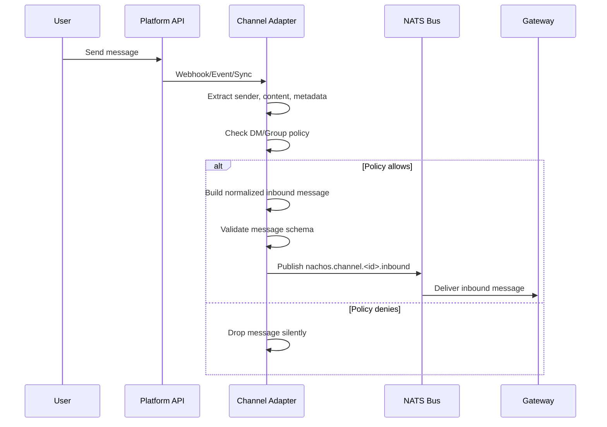
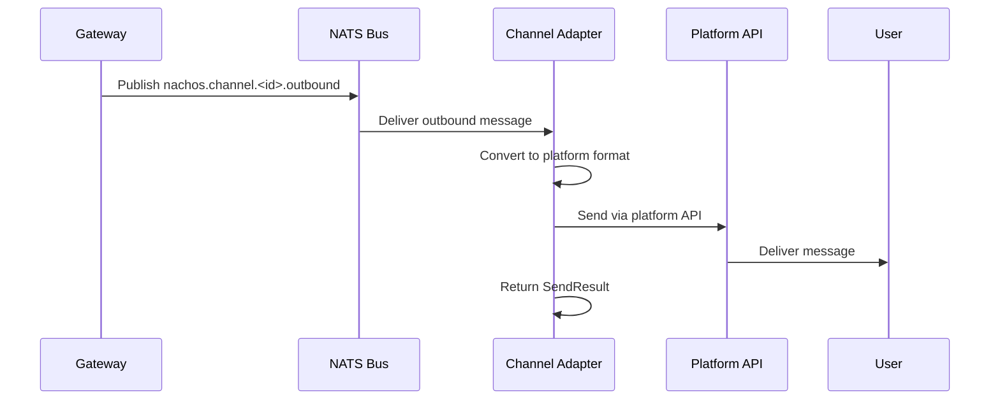
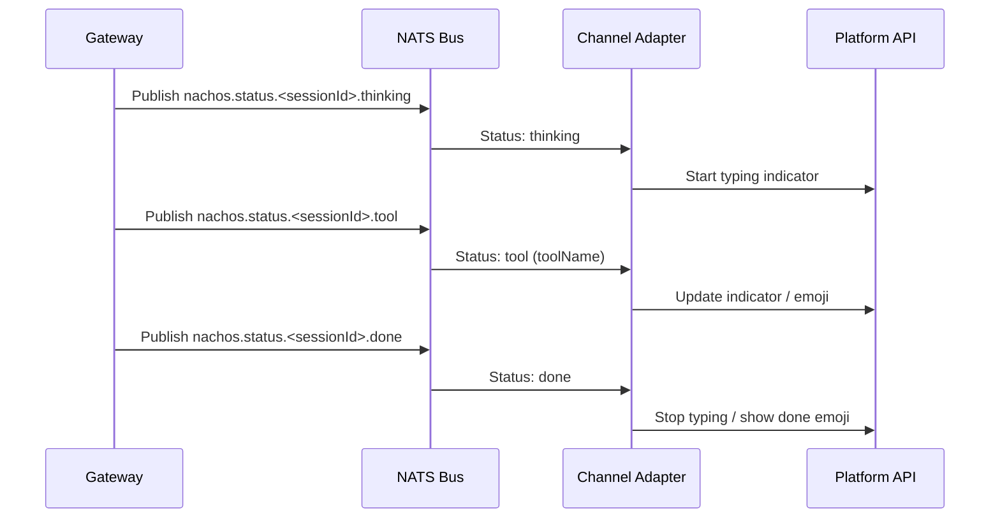
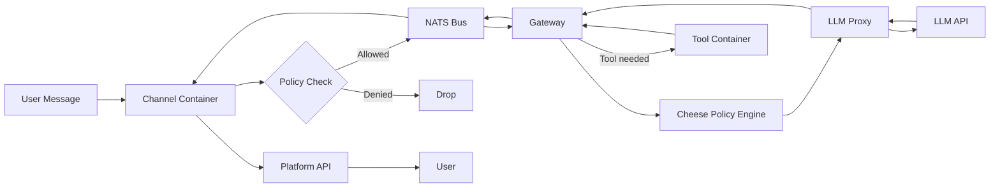

# Nachos Channel System and Configuration Specification

> Comprehensive specification covering the channel adapter system, configuration schema, CLI tooling, admin UI, and getting started guide for the Nachos AI assistant framework.

---

## Table of Contents

1. [Channel System Overview](#1-channel-system-overview)
2. [Channel Specifications](#2-channel-specifications)
3. [Channel Message Flow](#3-channel-message-flow)
4. [Configuration System](#4-configuration-system)
5. [CLI System](#5-cli-system)
6. [Admin UI](#6-admin-ui)
7. [Getting Started Guide Structure](#7-getting-started-guide-structure)

---

## 1. Channel System Overview

### What Channels Are

Channels are messaging platform adapters that connect Nachos to external communication platforms (Slack, Discord, Telegram, WhatsApp, Matrix). Each channel runs as an isolated Docker container, receives messages from its platform, normalizes them into a common inbound format, publishes them to the NATS message bus, and delivers outbound responses back to the platform.

### Channel Adapter Interface

Every channel adapter implements the `ChannelAdapter` interface defined in `@nachos/types`:

```typescript
interface ChannelAdapter {
  readonly channelId: string;    // e.g., "slack", "discord"
  readonly name: string;         // Human-readable name

  initialize(config: ChannelAdapterConfig): Promise<void>;
  start(): Promise<void>;
  stop(): Promise<void>;
  sendMessage(message: OutboundMessage): Promise<SendResult>;
  healthCheck(): Promise<HealthStatusType>;
}
```

The `ChannelAdapterConfig` provided to each adapter contains:

| Field | Type | Description |
|-------|------|-------------|
| `config` | `Record<string, unknown>` | Channel-specific configuration from `nachos.toml` |
| `secrets` | `Record<string, string>` | Secret values (tokens, keys) resolved from environment |
| `bus` | `ChannelBus` | NATS bus client for publishing/subscribing |
| `securityMode` | `'strict' \| 'standard' \| 'permissive'` | Active security mode |
| `dmPolicy` | `ChannelDMPolicy` | Default DM policy (user allowlist, pairing) |
| `groupPolicy` | `ChannelGroupPolicy` | Default group/server policy |

### How Channels Connect to the Bus

Channels communicate with the gateway through the NATS message bus using a standardized topic structure:

| Topic Pattern | Direction | Publisher | Subscriber |
|---------------|-----------|-----------|------------|
| `nachos.channel.<id>.inbound` | Platform to Gateway | Channel adapter | Gateway |
| `nachos.channel.<id>.outbound` | Gateway to Platform | Gateway | Channel adapter |
| `nachos.status.<sessionId>.thinking` | Status events | Gateway | Channel adapters |
| `nachos.status.<sessionId>.tool` | Status events | Gateway | Channel adapters |
| `nachos.status.<sessionId>.done` | Status events | Gateway | Channel adapters |
| `nachos.status.<sessionId>.error` | Status events | Gateway | Channel adapters |
| `nachos.audit.log` | Audit logging | Any component | Audit processors |

The `@nachos/channel-base` package provides `createChannelBus()` which wraps the raw NATS client, automatically tagging messages with their type (e.g., `channel.inbound`, `channel.outbound`) based on the topic pattern.

### Manifest System

Each channel (except Matrix, which has no manifest file) declares its capabilities via a `manifest.json`:

```json
{
  "name": "nachos-channel-<platform>",
  "version": "0.0.0",
  "type": "channel",
  "capabilities": {
    "network": {
      "egress": ["<platform-api-domain>"]
    },
    "secrets": ["<ENV_VAR_1>", "<ENV_VAR_2>"]
  },
  "provides": {
    "channel": "<platform-id>"
  }
}
```

The manifest controls:

- **Network egress**: Which external domains the container can reach (used for Docker network isolation)
- **Secrets**: Which environment variables the container requires (injected at startup)
- **Provides**: Declares what channel ID this adapter registers

Unknown capabilities cause startup failure (deny by default).

### Shared Base Utilities

The `@nachos/channel-base` package provides shared functionality used by all adapters:

- **`createChannelBus()`** -- Wraps the NATS client with topic-aware publish/subscribe
- **`createPairingStore()`** -- File-based store for tracking paired users (persisted to `state/pairing/<channel>.json`)
- **`parsePairingCommand()`** -- Parses "pair [token]" text commands for pairing flow
- **`resolveDmPolicy()`** -- Converts config DM settings into a `ChannelDMPolicy`
- **`resolveGroupPolicy()`** -- Converts server config into a `ChannelGroupPolicy`
- **`findServerConfig()`** -- Looks up server configuration by ID (supports both single `id` and array `ids`)

### Policy Enforcement

Every channel adapter enforces two types of access control before forwarding messages:

**DM Policy** (`ChannelDMPolicy`):
- `userAllowlist`: Array of user IDs permitted to DM the bot
- `pairing`: When true, users can send "pair [token]" to self-register

**Group Policy** (`ChannelGroupPolicy`):
- `mentionGating`: When true, the bot only responds to messages that @-mention it
- `channelIds`: Allowlist of channel/room IDs where the bot can operate
- `userAllowlist`: Users allowed to interact in group channels

Policy checks use `shouldAllowDm()` and `shouldAllowGroupMessage()` from `@nachos/utils`.

---

## 2. Channel Specifications

### 2.1 Slack

| Property | Value |
|----------|-------|
| **Platform** | Slack |
| **Status** | Fully implemented |
| **Adapter Class** | `SlackChannelAdapter` |
| **Package** | `@nachos/channel-slack` |
| **Source** | `packages/channels/slack/src/index.ts` |
| **Library** | `@slack/bolt` |
| **Connection Modes** | Socket Mode (default), HTTP Mode |

**Authentication:**

| Mode | Required Credentials |
|------|---------------------|
| Socket | `SLACK_APP_TOKEN`, `SLACK_BOT_TOKEN` |
| HTTP | `SLACK_BOT_TOKEN`, `SLACK_SIGNING_SECRET` |

**Environment Variables:**

| Variable | Required | Description |
|----------|----------|-------------|
| `SLACK_APP_TOKEN` | Socket mode | Slack app-level token (xapp-...) |
| `SLACK_BOT_TOKEN` | Always | Slack bot user OAuth token (xoxb-...) |
| `SLACK_SIGNING_SECRET` | HTTP mode | Signing secret for webhook verification |
| `SLACK_HTTP_PORT` | HTTP mode | Port for webhook server (default: 3000) |
| `NACHOS_PAIRING_TOKEN` | Optional | Token required for DM pairing |

**Configuration Options:**

```toml
[channels.slack]
enabled = true
mode = "socket"                           # "socket" | "http"
app_token = "${SLACK_APP_TOKEN}"
bot_token = "${SLACK_BOT_TOKEN}"
signing_secret = "${SLACK_SIGNING_SECRET}" # HTTP mode only
webhook_path = "/slack/events"             # HTTP mode only
typing_indicators = true                   # Status event subscription

[channels.slack.commands]
enabled = ["status", "help", "config.show", "session.reset", "context"]
admin_allowlist = ["U123456"]

[channels.slack.dm]
user_allowlist = ["U111", "U222"]
pairing = false

[[channels.slack.servers]]
ids = ["T123456"]
channel_ids = ["C111", "C222"]
user_allowlist = ["U123", "U456"]
mention_gating = true
```

**Supported Features:**

| Feature | Status | Notes |
|---------|--------|-------|
| Text messages (send/receive) | Supported | |
| File attachments (inbound) | Supported | Via `url_private` or `url_private_download` |
| File attachments (outbound) | Supported | Base64 upload or URL link |
| Threads | Supported | Via `thread_ts` |
| Slash commands (`/nachos`) | Supported | status, help, config show, session reset, context |
| DM policy enforcement | Supported | Allowlist + pairing |
| Group policy enforcement | Supported | Mention gating, channel/user allowlists |
| Typing indicators | Partial | Subscribed but Slack API does not support bot typing in regular channels |
| Reactions | Not supported | |
| Message editing | Not supported | |
| Bot message filtering | Supported | Drops all bot subtypes and bot_id messages |

**Known Limitations:**
- Slack API does not allow bots to send typing indicators in regular channels. Status events are subscribed for future assistant thread support.
- Bot messages are always filtered out (no `allow_bots` config like Discord).

---

### 2.2 Discord

| Property | Value |
|----------|-------|
| **Platform** | Discord |
| **Status** | Fully implemented |
| **Adapter Class** | `DiscordChannelAdapter` |
| **Package** | `@nachos/channel-discord` |
| **Source** | `packages/channels/discord/src/index.ts` |
| **Library** | `discord.js` |
| **Connection Mode** | WebSocket (Gateway API) |

**Authentication:**

| Credential | Required | Description |
|------------|----------|-------------|
| `DISCORD_BOT_TOKEN` | Yes | Discord bot token |

**Environment Variables:**

| Variable | Required | Description |
|----------|----------|-------------|
| `DISCORD_BOT_TOKEN` | Yes | Bot token from Discord Developer Portal |
| `NACHOS_PAIRING_TOKEN` | Optional | Token required for DM pairing |

**Configuration Options:**

```toml
[channels.discord]
enabled = true
token = "${DISCORD_BOT_TOKEN}"
allow_bots = false                        # Allow messages from other bots
bot_allowlist = ["bot_id_1"]              # If allow_bots=true, restrict to these IDs
typing_indicators = true                  # Show typing while processing

[channels.discord.status_emojis]
enabled = true                            # Emoji reactions showing processing state

[channels.discord.commands]
enabled = ["status", "help", "config.show", "session.reset", "context"]
admin_allowlist = ["1234567890"]

[channels.discord.dm]
user_allowlist = ["user_id_1", "user_id_2"]
pairing = true

[[channels.discord.servers]]
ids = ["guild_id_1"]
channel_ids = ["channel_1", "channel_2"]
user_allowlist = ["user_a", "user_b"]
mention_gating = true
```

**Supported Features:**

| Feature | Status | Notes |
|---------|--------|-------|
| Text messages (send/receive) | Supported | |
| File attachments (inbound) | Supported | Images and files with content type detection |
| File attachments (outbound) | Supported | Base64 buffer upload |
| Reply threading | Supported | Via `messageReference` |
| Slash commands (`/nachos`) | Supported | Registered globally via application commands |
| Status emoji reactions | Supported | Real-time processing feedback on user messages |
| Typing indicators | Supported | Refreshed every 8 seconds during processing |
| Stall detection | Supported | Soft stall (10s) and hard stall (30s) emoji warnings |
| DM policy enforcement | Supported | Allowlist + pairing |
| Group policy enforcement | Supported | Mention gating, channel/user allowlists |
| Bot-to-bot messaging | Supported | Configurable via `allow_bots` and `bot_allowlist` |
| Slash command authorization | Supported | Admin allowlist + Discord permissions (Administrator, ManageGuild) |
| Tool approval/deny commands | Supported | `/nachos approve`, `/nachos deny` |
| Reactions | Not supported | Incoming reaction events not processed |

**Status Emoji System:**

The Discord adapter provides real-time visual feedback via emoji reactions:

| Emoji | Meaning | Timing |
|-------|---------|--------|
| Brain | Thinking/reasoning | Debounced (700ms) |
| Hammer and Wrench | Generic tool execution | Debounced |
| Computer | Code-related tools (exec, read, write, bash) | Debounced |
| Globe | Web tools (search, fetch, browser) | Debounced |
| Check Mark | Completed successfully | Held 1.5s then removed |
| Cross Mark | Error occurred | Held 2.5s then removed |
| Hourglass | Soft stall warning | After 10s inactivity |
| Warning | Hard stall warning | After 30s inactivity |

**Known Limitations:**
- Self-reply loop prevention: bot always ignores its own messages even when `allow_bots` is true.
- Slash commands are registered globally (not per-guild).

---

### 2.3 Telegram

| Property | Value |
|----------|-------|
| **Platform** | Telegram |
| **Status** | Fully implemented |
| **Adapter Class** | `TelegramChannelAdapter` |
| **Package** | `@nachos/channel-telegram` |
| **Source** | `packages/channels/telegram/src/index.ts` |
| **Library** | `telegraf` |
| **Connection Mode** | Long polling |

**Authentication:**

| Credential | Required | Description |
|------------|----------|-------------|
| `TELEGRAM_BOT_TOKEN` | Yes | Bot token from BotFather |

**Environment Variables:**

| Variable | Required | Description |
|----------|----------|-------------|
| `TELEGRAM_BOT_TOKEN` | Yes | Token from @BotFather |
| `NACHOS_PAIRING_TOKEN` | Optional | Token required for DM pairing |

**Configuration Options:**

```toml
[channels.telegram]
enabled = true
token = "${TELEGRAM_BOT_TOKEN}"

[channels.telegram.dm]
user_allowlist = ["123456789"]
pairing = true

[[channels.telegram.servers]]
ids = ["group_chat_id"]
channel_ids = ["channel_id"]
user_allowlist = ["user_id"]
mention_gating = true
```

**Supported Features:**

| Feature | Status | Notes |
|---------|--------|-------|
| Text messages (send/receive) | Supported | |
| Photo messages (inbound) | Supported | Picks largest resolution |
| Document attachments (inbound) | Supported | With filename preservation |
| Video messages (inbound) | Supported | |
| Audio/voice messages (inbound) | Supported | |
| Sticker messages (inbound) | Supported | Treated as images |
| File attachments (outbound) | Supported | URL or base64 as photo/document |
| Reply threading | Supported | Via `reply_to_message_id` |
| Typing indicators | Supported | Refreshed every 4 seconds |
| Bot commands | Supported | `/reset`, `/context`, `/help` registered via `setMyCommands` |
| DM policy enforcement | Supported | Allowlist + pairing |
| Group policy enforcement | Supported | Mention gating via @username |
| Captions on media | Supported | Used as message text |
| MIME type detection | Supported | Per media type |

**Known Limitations:**
- No slash command system (uses Telegram bot commands instead).
- File downloads require bot token in URL path (handled internally).
- No inline keyboard or callback query support.

---

### 2.4 WhatsApp

| Property | Value |
|----------|-------|
| **Platform** | WhatsApp (Cloud API) |
| **Status** | Fully implemented |
| **Adapter Class** | `WhatsappChannelAdapter` |
| **Package** | `@nachos/channel-whatsapp` |
| **Source** | `packages/channels/whatsapp/src/index.ts` |
| **Library** | Native HTTP (no SDK) |
| **Connection Mode** | Webhook (HTTP server) |

**Authentication:**

| Credential | Required | Description |
|------------|----------|-------------|
| `WHATSAPP_TOKEN` | Yes | Permanent access token from Meta Developer Portal |
| `WHATSAPP_PHONE_NUMBER_ID` | Yes | Phone number ID for the WhatsApp Business account |
| `WHATSAPP_VERIFY_TOKEN` | Yes | Custom token for webhook verification handshake |
| `WHATSAPP_APP_SECRET` | Strict mode | App secret for webhook signature verification (HMAC-SHA256) |

**Environment Variables:**

| Variable | Required | Description |
|----------|----------|-------------|
| `WHATSAPP_TOKEN` | Yes | Meta access token |
| `WHATSAPP_PHONE_NUMBER_ID` | Yes | Business phone number ID |
| `WHATSAPP_VERIFY_TOKEN` | Yes | Webhook verification token |
| `WHATSAPP_APP_SECRET` | Strict mode | For webhook signature verification |
| `WHATSAPP_HTTP_PORT` | Optional | Webhook server port (default: 3002) |
| `SECURITY_MODE` | Optional | Overrides security mode check |
| `NACHOS_PAIRING_TOKEN` | Optional | Token required for DM pairing |

**Configuration Options:**

```toml
[channels.whatsapp]
enabled = true
token = "${WHATSAPP_TOKEN}"
phone_number_id = "${WHATSAPP_PHONE_NUMBER_ID}"
verify_token = "${WHATSAPP_VERIFY_TOKEN}"
app_secret = "${WHATSAPP_APP_SECRET}"
webhook_path = "/whatsapp/webhook"
api_version = "v20.0"

[channels.whatsapp.dm]
user_allowlist = ["15551234567"]
pairing = true
```

**Supported Features:**

| Feature | Status | Notes |
|---------|--------|-------|
| Text messages (send/receive) | Supported | |
| Image messages (inbound) | Supported | Downloaded and converted to data URI |
| Document attachments (inbound) | Supported | With filename |
| Video messages (inbound) | Supported | |
| Audio messages (inbound) | Supported | |
| Sticker messages (inbound) | Supported | |
| Media messages (outbound) | Supported | URL-based or uploaded via media endpoint |
| Read receipts (blue checkmarks) | Supported | Sent on first thinking event |
| Reply context | Supported | Via `context.message_id` |
| Webhook signature verification | Supported | HMAC-SHA256 with timing-safe comparison |
| Webhook verification handshake | Supported | GET hub.mode=subscribe challenge-response |
| DM policy enforcement | Supported | DM-only (WhatsApp is inherently DM-based) |
| Pairing flow | Supported | |
| Media upload | Supported | Multipart form-data upload to WhatsApp media endpoint |

**Known Limitations:**
- WhatsApp Cloud API does not support typing indicators. Read receipts serve as the user-visible processing signal.
- DM-only channel: no group/server policy support (WhatsApp Business API is 1:1).
- Media download limit: 25 MB per file.
- `app_secret` is required in strict security mode; without it, webhook signature verification is disabled.
- Media URLs from WhatsApp are temporary and require bearer token auth, so the adapter downloads and converts them to data URIs.

---

### 2.5 Matrix

| Property | Value |
|----------|-------|
| **Platform** | Matrix (decentralized) |
| **Status** | Fully implemented |
| **Adapter Class** | `MatrixChannelAdapter` |
| **Package** | `@nachos/channel-matrix` |
| **Source** | `packages/channels/matrix/src/index.ts` |
| **Library** | `matrix-js-sdk` |
| **Connection Mode** | Client-Server sync (incremental) |

**Authentication:**

| Credential | Required | Description |
|------------|----------|-------------|
| `MATRIX_HOMESERVER_URL` | Yes | Homeserver URL (e.g., `https://matrix.org`) |
| `MATRIX_ACCESS_TOKEN` | Yes | Bot account access token |
| `MATRIX_USER_ID` | Yes | Bot user ID (e.g., `@bot:matrix.org`) |

**Environment Variables:**

| Variable | Required | Description |
|----------|----------|-------------|
| `MATRIX_HOMESERVER_URL` | Yes | Matrix homeserver URL |
| `MATRIX_ACCESS_TOKEN` | Yes | Access token for the bot account |
| `MATRIX_USER_ID` | Yes | Full Matrix user ID |
| `NACHOS_PAIRING_TOKEN` | Optional | Token required for DM pairing |

**Configuration Options:**

```toml
[channels.matrix]
enabled = true
homeserver_url = "https://matrix.org"
access_token = "${MATRIX_ACCESS_TOKEN}"
user_id = "@bot:matrix.org"
device_id = "NACHOS_BOT"

[channels.matrix.dm]
user_allowlist = ["@alice:matrix.org"]
pairing = true

[[channels.matrix.servers]]
ids = ["!roomId123:matrix.org"]
channel_ids = ["!roomId123:matrix.org"]
user_allowlist = ["@alice:matrix.org"]
mention_gating = true
```

**Supported Features:**

| Feature | Status | Notes |
|---------|--------|-------|
| Text messages (send/receive) | Supported | m.text, m.notice, m.emote |
| Markdown/HTML formatting | Supported | Basic markdown-to-HTML conversion |
| Image messages (inbound) | Supported | mxc:// URLs converted to HTTP |
| File attachments (inbound) | Supported | m.file events with MXC URLs |
| Audio/video messages (inbound) | Supported | m.audio, m.video events |
| File attachments (outbound) | Supported | Uploaded to homeserver, sent as m.file/m.image |
| Typing indicators | Supported | Refreshed every 25 seconds |
| Auto-join on invite | Supported | Bot automatically joins rooms when invited |
| DM detection | Supported | Rooms with exactly 2 joined members |
| DM policy enforcement | Supported | Allowlist + pairing |
| Group policy enforcement | Supported | Mention gating, room/user allowlists |
| User display names | Supported | Room-level and global profile resolution |
| Health check | Supported | Based on sync state (SYNCING/PREPARED) |

**Known Limitations:**
- No manifest.json file (Matrix does not need egress restrictions since homeserver URL is configurable).
- DM detection is heuristic: rooms with exactly 2 joined members are treated as DMs.
- No E2E encryption support (Olm/Megolm) -- planned for future.
- No reaction support (`m.reaction` events) -- planned.
- No message editing support (`m.replace` events) -- planned.
- No thread support (MSC3440) -- planned.
- Markdown-to-HTML conversion is basic (bold, italic, code, strikethrough, line breaks).

---

## 3. Channel Message Flow

### 3.1 Inbound Message Flow



### 3.2 Outbound Message Flow



### 3.3 Status Event Flow (Typing Indicators and Emoji Reactions)



### 3.4 Complete Request-Response Flow



### 3.5 Inbound Message Schema

All channel adapters normalize messages to this schema before publishing:

```typescript
{
  channel: string;              // "slack", "discord", etc.
  channelMessageId: string;     // Platform-specific message ID
  sender: {
    id: string;                 // Platform user ID
    name?: string;              // Display name (optional)
    isAllowed: boolean;         // Policy check result
  };
  conversation: {
    id: string;                 // Channel/room/chat ID
    type: "dm" | "channel";     // Conversation type
  };
  content: {
    text: string;               // Message text
    attachments?: Array<{       // Media attachments
      type: string;             // "image", "file", "video", "audio"
      url: string;              // Download URL or data URI
      name?: string;            // Filename
      mimeType?: string;        // MIME type
      size?: number;            // File size in bytes
    }>;
  };
  metadata: Record<string, unknown>; // Platform-specific metadata
}
```

---

## 4. Configuration System

### 4.1 nachos.toml Structure

The entire Nachos stack is configured through a single TOML file. The complete schema is defined in `packages/shared/config/src/schema.ts` as the `NachosConfig` interface.

**Top-Level Sections:**

| Section | Required | Description |
|---------|----------|-------------|
| `[nachos]` | Yes | Project name and version |
| `[llm]` | Yes | LLM provider, model, and parameters |
| `[channels.*]` | No | Channel adapter configurations |
| `[tools.*]` | No | Tool configurations |
| `[security]` | Yes | Security mode, DLP, rate limits, audit |
| `[runtime]` | No | Runtime settings, state storage, context management |
| `[assistant]` | No | Assistant name and system prompt |
| `[skills]` | No | Skill-backed CLI tool configuration |
| `[admin]` | No | Admin UI settings |
| `[scheduler]` | No | Cron job scheduler |
| `[heartbeat]` | No | Periodic heartbeat messages |
| `[plugins]` | No | Plugin-specific configuration sections |

**`[nachos]` Section:**

```toml
[nachos]
name = "my-assistant"    # Project name (required, non-empty)
version = "1.0"          # Version string (required, non-empty)
```

**`[llm]` Section:**

```toml
[llm]
provider = "anthropic"                    # "anthropic" | "openai" | "ollama" | "bedrock" | "custom"
model = "claude-sonnet-4-20250514"
fallback_order = ["anthropic:claude-haiku"]
max_tokens = 4096                         # 1 - 1,000,000
temperature = 0.7                         # 0.0 - 2.0
base_url = "http://localhost:11434"       # For ollama/custom
region = "us-east-1"                      # For bedrock
context_window = 200000                   # Override auto-detected context window

# Multi-profile auth (optional)
[[llm.profiles]]
name = "anthropic-primary"
provider = "anthropic"
api_key_env = "ANTHROPIC_API_KEY"

profile_order = ["anthropic-primary"]

[llm.retry]
attempts = 3
min_delay_ms = 1000
max_delay_ms = 30000
jitter = 0.1

[llm.cooldowns]
initial_seconds = 60
multiplier = 2
max_seconds = 3600
billing_initial_hours = 1
billing_max_hours = 24
```

**`[security]` Section:**

```toml
[security]
mode = "standard"                         # "strict" | "standard" | "permissive"
i_understand_the_risks = true             # Required for permissive mode

[security.dlp]
enabled = true
action = "warn"                           # "block" | "warn" | "audit" | "allow" | "redact"
patterns = ["credit_card", "ssn", "api_key", "password"]

[security.approval]
approver_allowlist = ["U123", "U456"]

[security.rate_limits]
messages_per_minute = 30
tool_calls_per_minute = 15
llm_requests_per_minute = 30

[security.audit]
enabled = true
retention_days = 30                       # 1-365
log_inputs = true
log_outputs = true
log_tool_calls = true
provider = "sqlite"                       # "sqlite" | "file" | "webhook" | "custom" | "composite"
path = "./data/audit.db"
```

**`[runtime]` Section (key subsections):**

```toml
[runtime]
state_dir = "./state"
config_dir = "./config"
workspace_dir = "./workspace"
log_level = "info"                        # "debug" | "info" | "warn" | "error"
log_format = "pretty"                     # "pretty" | "json"
redis_url = "redis://localhost:6379"
gateway_streaming_passthrough = false
gateway_streaming_chunk_size = 1
gateway_streaming_min_interval_ms = 0

[runtime.resources]
memory = "512MB"
cpus = 0.5
pids_limit = 100

[runtime.context_management.sliding_window]
enabled = true
mode = "token-based"                      # "token-based" | "message-based" | "hybrid"

[runtime.context_management.commands]
enabled = true
reset_triggers = ["/new", "/reset"]
context_triggers = ["/context"]

[runtime.state.sessions]
provider = "sqlite"                       # "sqlite" | "postgres"

[runtime.state.semantic]
provider = "local"                        # "local" | "qdrant"

[runtime.subagents]
enabled = false
max_concurrent = 1

[runtime.sandbox]
mode = "off"                              # "off" | "non-main" | "all"
```

### 4.2 Environment Variable Overlay System

Configuration values in `nachos.toml` can reference environment variables using the `${VAR_NAME}` syntax:

```toml
token = "${DISCORD_BOT_TOKEN}"
```

The channel adapter resolves these at runtime:
1. Check the config value for `${ENV_NAME}` pattern
2. If matched, look up `process.env[ENV_NAME]`
3. Fall back to the `secrets` map provided via `ChannelAdapterConfig`

Secrets declared in `manifest.json` are injected into the container's environment by the Docker Compose generator.

### 4.3 Config Loading

The config loader (`packages/shared/config/src/loader.ts`) searches for `nachos.toml` in:

1. Current working directory (`./nachos.toml`)
2. Home directory (`~/.nachos/nachos.toml`)

A custom path can be specified via `--config <path>` CLI flag or `NACHOS_CONFIG_PATH` environment variable.

### 4.4 Config Validation

The validation system (`packages/shared/config/src/validation.ts`) performs:

- **Schema validation**: Detects unknown config keys using a recursive shape definition
- **Required field checks**: `[nachos]`, `[llm]`, and `[security]` sections are mandatory
- **Value validation**: Provider enums, numeric ranges, URL formats
- **Cross-field validation**: e.g., shell tool requires permissive mode, bedrock requires region
- **Channel validation**: Required tokens, mode-specific fields, DM/server config structure
- **Path warnings**: Relative paths flagged for Docker deployment issues

Returns a `ValidationResult` with `errors` (blocking) and `warnings` (informational).

### 4.5 Hot-Reload for Policies

The `HotReloadWatcher` class (`packages/shared/config/src/hotreload.ts`) monitors policy directories for changes:

- Watches `*.yaml`, `*.yml`, `*.json` files using `chokidar`
- Debounces file changes (default: 300ms)
- Fires callbacks with the file path and new content
- Used by the gateway to reload policy files without restart

```typescript
const watcher = createPolicyWatcher('./policies', (filePath, content) => {
  // Re-evaluate policies with new content
});
```

---

## 5. CLI System

### 5.1 Command Reference

The Nachos CLI is built with Commander.js and provides the following commands:

**Stack Management:**

| Command | Alias | Description | Key Options |
|---------|-------|-------------|-------------|
| `nachos init` | | Initialize a new Nachos project | `--defaults`, `--force` |
| `nachos up` | | Start the Nachos stack | `--build`, `--wait`, `--only <services>`, `--timeout <seconds>` |
| `nachos down` | `d` | Stop the Nachos stack | `--volumes`, `--force` |
| `nachos restart` | `r` | Restart the stack | `--build`, `--wait` |
| `nachos status` | `s` | Show stack status | `--json` |
| `nachos logs [service]` | `l` | View service logs | `-f`, `--tail <lines>`, `-t` |
| `nachos doctor` | | Run health checks | `--json` |
| `nachos debug` | | Show debug information | `--json` |
| `nachos validate` | | Run aggregate validation (config + policy + doctor) | `--json` |

**Module Management:**

| Command | Description | Key Options |
|---------|-------------|-------------|
| `nachos add channel <name>` | Add and configure a channel | `--enabled`, `--mode <mode>`, `--port <port>` |
| `nachos add tool <name>` | Add and configure a tool | `--enabled`, `--paths`, `--domains`, `--languages`, `--timeout`, `--memory` |
| `nachos add --interactive` | Interactive guided setup | |
| `nachos remove <type> <name>` | Remove a module | `--force`, `--dry-run` |
| `nachos list` | List configured modules | `--json` |

**Configuration:**

| Command | Description |
|---------|-------------|
| `nachos config validate` | Validate nachos.toml configuration |
| `nachos policy validate` | Validate policy YAML files |

**Authentication:**

| Command | Description | Key Options |
|---------|-------------|-------------|
| `nachos auth setup-token` | Configure Anthropic setup-token auth | `--provider`, `--profile`, `--env`, `--token`, `--append`, `--write-env` |

**Plugin Management:**

| Command | Description | Key Options |
|---------|-------------|-------------|
| `nachos plugin add <source>` | Register a plugin | `--source-type`, `--name`, `--enable`, `--dry-run` |
| `nachos plugin remove <name>` | Remove a plugin | `--force`, `--keep-config`, `--dry-run` |
| `nachos plugin list` | List all plugins | `--json` |

**Subagent Management:**

| Command | Description | Key Options |
|---------|-------------|-------------|
| `nachos subagents spawn <task>` | Spawn a subagent run | `--label`, `--profile`, `--model`, `--timeout` |
| `nachos subagents list` | List subagent runs | `--limit` |
| `nachos subagents info <runId>` | Show run details | |
| `nachos subagents stop <runId>` | Stop a queued run | |
| `nachos subagents log <runId>` | Show run log | `--limit` |
| `nachos subagents files list <runId>` | List workspace files | `--path`, `--recursive`, `--limit` |
| `nachos subagents files get <runId>` | Fetch a workspace file | `--path`, `--max-bytes` |

**Sandbox Management:**

| Command | Description | Key Options |
|---------|-------------|-------------|
| `nachos sandbox explain` | Explain sandbox configuration | |
| `nachos sandbox list` | List sandbox status | |
| `nachos sandbox recreate` | Recreate sandbox | `--force` |

**Memory Operations:**

| Command | Description |
|---------|-------------|
| `nachos memory query` | Query memory entries and facts |
| `nachos memory append-entry` | Append a memory entry |
| `nachos memory append-fact` | Append a memory fact |
| `nachos memory delete` | Delete a memory entry |

**User Profile Operations:**

| Command | Description |
|---------|-------------|
| `nachos user-profile get` | Fetch a user profile |
| `nachos user-profile set` | Set a user profile |
| `nachos user-profile delete` | Delete a user profile |

**Utilities:**

| Command | Description |
|---------|-------------|
| `nachos ui` | Open Admin UI in browser |
| `nachos open <service>` | Open a service endpoint (admin, webchat, gateway, nats, docs) |
| `nachos completion <shell>` | Generate shell completion (bash, zsh, fish, powershell) |

**Global Options:**

| Option | Description |
|--------|-------------|
| `--json` | Output results as JSON |
| `--verbose` | Enable verbose output |
| `-q, --quiet` | Suppress non-essential output |
| `-c, --config <path>` | Path to nachos.toml |
| `--no-input` | Disable interactive prompts |
| `--no-color` | Disable colored output |

### 5.2 Skill-Backed CLI Tools

Skill-backed tools are CLI executables loaded into the gateway process. The LLM reads their `SKILL.md` documentation and invokes them via subprocess execution.

| Tool | Directory | Description |
|------|-----------|-------------|
| `goplaces` | `skills/goplaces/` | Location/place lookup |
| `gifgrep` | `skills/gifgrep/` | GIF/media search |
| `summarize` | `skills/summarize/` | Content summarization |
| `gog` | `skills/gog/` | Workspace/project navigation |

Additional skill tools:

| Tool | Directory | Description |
|------|-----------|-------------|
| `agent-browser` | `skills/agent-browser/` | Browser automation agent |
| `composio-gcal` | `skills/composio-gcal/` | Google Calendar via Composio |
| `composio-gdocs` | `skills/composio-gdocs/` | Google Docs via Composio |
| `composio-gdrive` | `skills/composio-gdrive/` | Google Drive via Composio |
| `composio-gmail` | `skills/composio-gmail/` | Gmail via Composio |
| `composio-gmeet` | `skills/composio-gmeet/` | Google Meet via Composio |
| `composio-linkedin` | `skills/composio-linkedin/` | LinkedIn via Composio |
| `figma` | `skills/figma/` | Figma integration |
| `jira` | `skills/jira/` | Jira integration |

Skills are configured in `nachos.toml`:

```toml
[skills]
allow = ["goplaces", "gifgrep"]
deny = ["gog"]
hot_reload = true
debounce_ms = 500
```

---

## 6. Admin UI

### 6.1 Overview

The Admin UI is a web-based dashboard for monitoring and managing a running Nachos instance. It runs as a Hono API server serving a Vue SPA on port 8082 (configurable).

**Configuration:**

```toml
[admin]
enabled = true
port = 8082
```

### 6.2 API Endpoints

All API routes are prefixed with `/api/` and require authentication (except `/api/health`).

| Route Group | Prefix | Description |
|-------------|--------|-------------|
| Health | `GET /api/health` | Docker healthcheck endpoint (no auth) |
| Config | `/api/config` | View and manage configuration |
| Status | `/api/status` | Stack status and component health |
| Audit | `/api/audit` | Audit log viewing and querying |
| Sessions | `/api/sessions` | Session management and history |
| Skills | `/api/skills` | Skill listing and management |
| Services | `/api/services` | Service status and control |
| Logs | `/api/logs` | Log viewing and streaming |
| Chat | `/api/chat` | Admin chat interface |
| Webchat | `/api/webchat` | Webchat bridge |

### 6.3 Authentication

The Admin UI uses bearer token authentication:

- **Token source**: `NACHOS_ADMIN_TOKEN` environment variable
- **Fallback**: If not set, a random 32-byte hex token is generated at startup (logged with last 8 characters for operator reference)
- **Delivery**: Via `Authorization: Bearer <token>` header or `nachos_admin_token` cookie
- **Comparison**: Timing-safe comparison to prevent timing attacks
- **Scope**: All `/api/*` routes except `/api/health`

### 6.4 Security Headers

The Admin UI sets defense-in-depth HTTP headers:

| Header | Value |
|--------|-------|
| `X-Content-Type-Options` | `nosniff` |
| `X-Frame-Options` | `DENY` |
| `Content-Security-Policy` | `default-src 'self'; script-src 'self' 'unsafe-inline'; style-src 'self' 'unsafe-inline'` |
| `X-XSS-Protection` | `0` (disabled; CSP is preferred) |

### 6.5 CORS Policy

CORS is restricted to localhost origins (`localhost`, `127.0.0.1`) and private network IPs (`10.*`, `172.16-31.*`, `192.168.*`). Cross-origin requests from public domains are rejected.

---

## 7. Getting Started Guide Structure

### 7.1 Prerequisites

- **Docker**: Docker Engine and Docker Compose (v2) installed and running
- **Node.js**: v22+ (for local development only)
- **pnpm**: Package manager (for local development only)
- **LLM API Key**: At least one of:
  - `ANTHROPIC_API_KEY` or `ANTHROPIC_SETUP_TOKEN` (Anthropic/Claude)
  - `OPENAI_API_KEY` (OpenAI)
  - Ollama running locally (no key needed)
- **Platform Credentials** (for the channel you want to connect):
  - Slack: App Token + Bot Token (Socket Mode) or Bot Token + Signing Secret (HTTP Mode)
  - Discord: Bot Token from Developer Portal
  - Telegram: Bot Token from @BotFather
  - WhatsApp: Access Token + Phone Number ID + Verify Token from Meta Developer Portal
  - Matrix: Homeserver URL + Access Token + User ID

### 7.2 Installation Steps

1. Clone the repository
2. Install dependencies: `pnpm install`
3. Build packages: `pnpm build`
4. Install the CLI globally or use via `npx`

### 7.3 First Configuration

1. Run `nachos init` to generate `nachos.toml` with sensible defaults
2. Set your LLM provider and model in `[llm]`
3. Create a `.env` file with your API keys (never committed to git)
4. Choose a security mode (`strict`, `standard`, or `permissive`)

### 7.4 Starting the Stack

```bash
# Start everything
nachos up --wait

# Start with specific modules
nachos up --only gateway,bus,slack

# Check health
nachos doctor

# View logs
nachos logs gateway -f
```

### 7.5 Connecting a Channel

```bash
# Add a channel interactively
nachos add --interactive

# Or directly
nachos add channel discord

# Validate configuration
nachos config validate

# Restart to apply
nachos restart --wait
```

### 7.6 Sending Your First Message

1. **Webchat** (easiest): Open `http://localhost:8080` after enabling `[channels.webchat]`
2. **Discord**: Invite the bot to your server, add the server ID and channel IDs to `nachos.toml`, mention the bot
3. **Slack**: Install the app to your workspace, add workspace ID and channel IDs, mention the bot
4. **Telegram**: Start a DM with your bot, send "pair [token]" if pairing is enabled
5. **WhatsApp**: Send a message to the bot's phone number, pair if required
6. **Matrix**: Invite the bot to a room, it auto-joins and starts listening

### 7.7 Verifying the Setup

```bash
# Check all services are healthy
nachos status

# Open the admin dashboard
nachos ui

# Run full validation
nachos validate
```

---

## Appendix A: File Reference

| File | Purpose |
|------|---------|
| `packages/channels/base/src/index.ts` | Channel base utilities (bus, pairing, policy) |
| `packages/channels/base/src/pairing.ts` | File-based pairing store |
| `packages/channels/base/src/policy.ts` | DM and group policy resolution |
| `packages/channels/slack/src/index.ts` | Slack channel adapter |
| `packages/channels/slack/manifest.json` | Slack manifest (secrets, egress) |
| `packages/channels/discord/src/index.ts` | Discord channel adapter |
| `packages/channels/discord/src/status-reactions.ts` | Discord emoji status system |
| `packages/channels/discord/manifest.json` | Discord manifest |
| `packages/channels/telegram/src/index.ts` | Telegram channel adapter |
| `packages/channels/telegram/manifest.json` | Telegram manifest |
| `packages/channels/whatsapp/src/index.ts` | WhatsApp channel adapter |
| `packages/channels/whatsapp/manifest.json` | WhatsApp manifest |
| `packages/channels/matrix/src/index.ts` | Matrix channel adapter |
| `packages/channels/matrix/README.md` | Matrix adapter documentation |
| `packages/shared/types/src/channel.ts` | ChannelAdapter interface definition |
| `packages/shared/config/src/schema.ts` | Full NachosConfig TypeScript schema |
| `packages/shared/config/src/loader.ts` | TOML config loader |
| `packages/shared/config/src/validation.ts` | Config validation engine |
| `packages/shared/config/src/hotreload.ts` | Policy hot-reload watcher |
| `packages/core/bus/src/topics.ts` | NATS topic definitions |
| `packages/core/admin/src/server.ts` | Admin UI Hono server |
| `packages/core/admin/src/middleware/auth.ts` | Admin bearer token auth |
| `packages/cli/src/cli.ts` | CLI program definition (all commands) |
| `nachos.toml.example` | Example configuration file |

## Appendix B: Channel Feature Comparison Matrix

| Feature | Slack | Discord | Telegram | WhatsApp | Matrix |
|---------|-------|---------|----------|----------|--------|
| Text messages | Yes | Yes | Yes | Yes | Yes |
| Image inbound | Yes | Yes | Yes | Yes | Yes |
| File inbound | Yes | Yes | Yes | Yes | Yes |
| Video/audio inbound | No | No | Yes | Yes | Yes |
| Attachments outbound | Yes | Yes | Yes | Yes | Yes |
| Typing indicators | No* | Yes | Yes | No** | Yes |
| Status emoji reactions | No | Yes | No | No | No |
| Slash/bot commands | Yes | Yes | Yes | No | No |
| Thread/reply support | Yes | Yes | Yes | Yes | No |
| DM policy | Yes | Yes | Yes | Yes | Yes |
| Group policy | Yes | Yes | Yes | No*** | Yes |
| Pairing flow | Yes | Yes | Yes | Yes | Yes |
| Bot-to-bot support | No | Yes | No | No | No |
| Webhook signature verification | Yes | N/A | N/A | Yes | N/A |
| Auto-join on invite | N/A | N/A | N/A | N/A | Yes |
| Markdown/HTML | No | No | No | No | Yes |
| Read receipts | No | No | No | Yes | No |

\* Slack API limitation prevents bots from showing typing in regular channels.
\** WhatsApp Cloud API does not support typing indicators; read receipts are used instead.
\*** WhatsApp is inherently a DM-only platform via the Business API.
