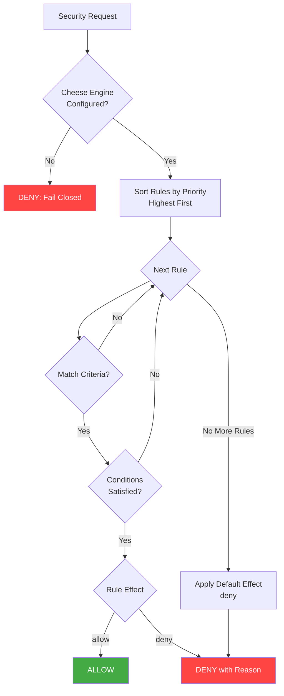
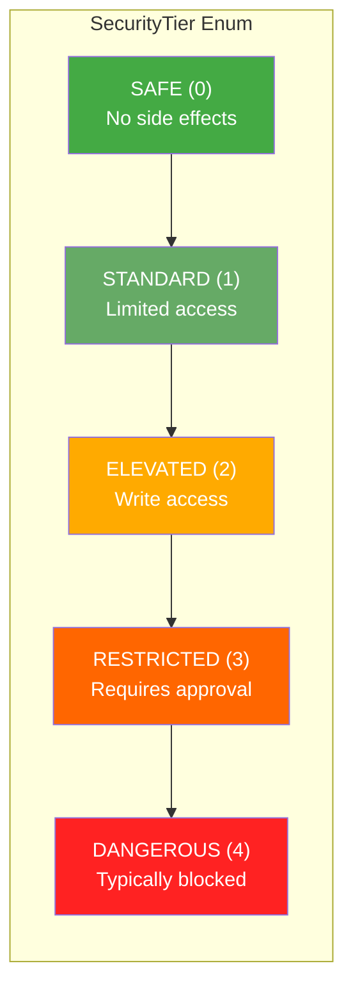
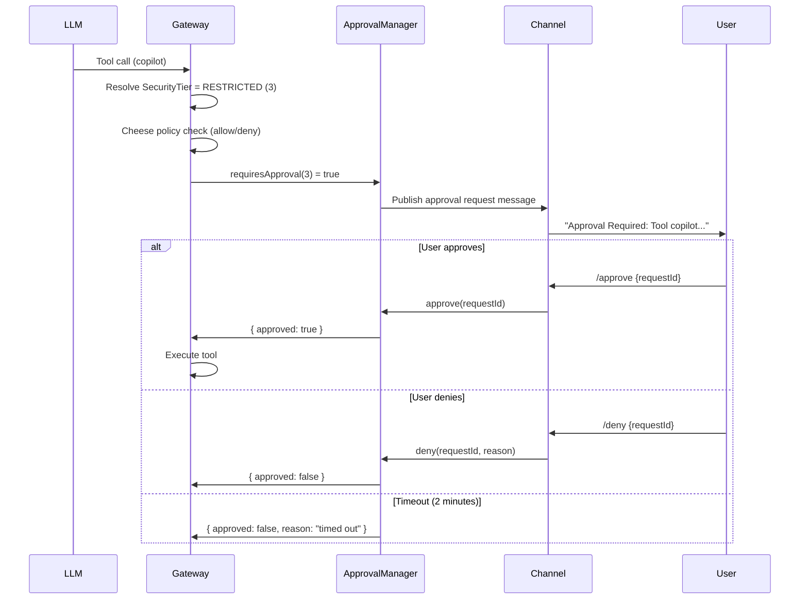
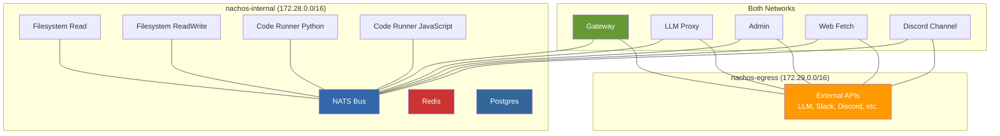
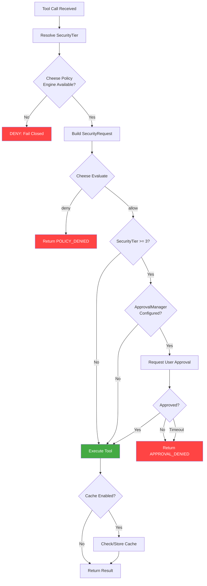

# Nachos Security Specification

> Comprehensive security specification for the Nachos AI assistant framework.
> This document covers the policy engine, container hardening, network isolation,
> data protection, authentication, authorization, and audit systems.

---

## Table of Contents

1. [Security Model Overview](#1-security-model-overview)
2. [Policy Engine (Cheese)](#2-policy-engine-cheese)
3. [Security Tiers](#3-security-tiers)
4. [Container Security](#4-container-security)
5. [Network Isolation](#5-network-isolation)
6. [Data Protection](#6-data-protection)
7. [Authentication and Authorization](#7-authentication-and-authorization)
8. [Security Configuration](#8-security-configuration)

---

## 1. Security Model Overview

Nachos implements a **defense-in-depth** security architecture with multiple independent
layers of protection. The core philosophy is **deny by default** -- every action, tool
invocation, network request, and message must be explicitly authorized through policy
rules. If no policy rule matches, the default effect is `deny`.

### 1.1 Three Security Modes

Nachos supports three mutually exclusive security modes, each loading a separate
policy document from the `policies/` directory.

| Mode | Policy File | DM Access | Tools | Filesystem | Network | Audit |
|------|------------|-----------|-------|------------|---------|-------|
| **Strict** | `strict.yaml` | Allowlist only | All disabled | Denied | Denied | Full |
| **Standard** | `standard.yaml` | Pairing-based | Common tools enabled | `/workspace` only | Allowlisted domains | Full |
| **Permissive** | `permissive.yaml` | All allowed | Most tools enabled | Broad (system dirs blocked) | Read allowed, write denied | Full |

**Strict mode** is designed for maximum lockdown. LLM calls are the only permitted
operation. All tools, filesystem access, and network egress are blocked. DMs require
explicit user allowlisting (`metadata.is_allowlisted`).

**Standard mode** provides a balanced posture for typical use. Tools are enabled per
security tier, filesystem access is confined to `/workspace`, web fetch is restricted
to an allowlisted domain set, and DMs require pairing (`metadata.is_paired`).

**Permissive mode** requires the operator to set `i_understand_the_risks = true` in
`nachos.toml`. It enables most tools, broadens filesystem access (while still blocking
`/etc`, `/sys`, `/proc`, `/dev`, `/root`), and allows network reads. Network write
operations remain blocked to prevent data exfiltration.

### 1.2 Defense-in-Depth Layers

```
Layer 1: Network Isolation (Docker networks, no external access by default)
Layer 2: Container Hardening (non-root, read-only FS, no-new-privileges, resource limits)
Layer 3: Policy Engine (Cheese -- YAML rules evaluated <1ms)
Layer 4: Security Tier + Approval (RESTRICTED tools require human approval)
Layer 5: SSRF Protection (domain allowlists, private IP blocking, DNS validation)
Layer 6: DLP Scanning (sensitive data detection and blocking)
Layer 7: Rate Limiting (sliding window per user per action)
Layer 8: Audit Logging (every security decision recorded with HMAC integrity)
```

### 1.3 Deny-by-Default Principle

The policy evaluator constructor defaults to `deny`:

```typescript
constructor(defaultEffect: PolicyEffect = 'deny')
```

If no policy rule matches a request, the evaluator returns:

```typescript
{
  allowed: false,
  effect: 'deny',
  reason: 'No policy rule matched - default deny applied'
}
```

The tool coordinator enforces fail-closed behavior. If the Cheese policy engine is
not configured (null/undefined), all tool calls are blocked:

```typescript
if (!this.cheese) {
  return { success: false, error: { code: 'POLICY_DENIED', message: '...' } };
}
```

---

## 2. Policy Engine (Cheese)

Cheese is the embedded policy engine that runs inside the Gateway process. It
provides sub-millisecond policy evaluation with hot-reload support.

### 2.1 Architecture

```
packages/core/gateway/src/cheese/
  index.ts            -- Cheese class (main entry point)
  types/index.ts      -- Type definitions
  policy/
    evaluator.ts      -- Priority-based rule evaluation
    loader.ts         -- YAML loading with hot-reload
    validator.ts      -- Schema validation
```

### 2.2 Policy Evaluation Flow



### 2.3 Rule Structure

Each policy rule has the following fields:

| Field | Type | Required | Description |
|-------|------|----------|-------------|
| `id` | `string` | Yes | Unique rule identifier |
| `description` | `string` | No | Human-readable description |
| `priority` | `number` | Yes | Evaluation order (higher = first) |
| `match` | `PolicyMatch` | Yes | Resource, action, and resourceId criteria |
| `conditions` | `PolicyCondition[]` | No | Additional conditions (AND logic) |
| `effect` | `'allow' \| 'deny'` | Yes | Outcome when rule matches |
| `reason` | `string` | No | Denial reason message |

**Match criteria** filter by resource type, action type, and resource ID:

- `resource`: `tool | channel | dm | filesystem | network | llm`
- `action`: `read | write | execute | send | receive | call`
- `resourceId`: Specific tool name, channel ID, etc.

**Conditions** support eight operators:

| Operator | Description |
|----------|-------------|
| `equals` | Exact match |
| `not_equals` | Negated match |
| `in` | Value in array |
| `not_in` | Value not in array |
| `contains` | Substring match |
| `matches` | Regex match (with ReDoS protection) |
| `starts_with` | Prefix match |
| `ends_with` | Suffix match |

### 2.4 ReDoS Protection

The `matches` operator includes two safeguards against Regular Expression Denial of
Service attacks:

1. **Pattern length limit**: Patterns exceeding 200 characters are rejected.
2. **Nested quantifier detection**: Patterns containing nested quantifiers
   (e.g., `(a+)+`, `(a*)+`, `(a{1,})*`) are rejected via the regex
   `/([+*}])\s*\)[\s]*[+*{]/`.

### 2.5 Policy Document Example

```yaml
version: "1.0"
metadata:
  name: "Standard Mode Security Policies"
  description: "Balanced security for typical use cases"
  mode: "standard"

rules:
  - id: "standard-llm-allow"
    description: "Allow LLM calls"
    priority: 1000
    match:
      resource: "llm"
      action: "call"
    effect: "allow"

  - id: "standard-tool-filesystem-read"
    description: "Allow filesystem read in workspace"
    priority: 750
    match:
      resource: "tool"
      resourceId: "filesystem_read"
    conditions:
      - field: "metadata.path"
        operator: "starts_with"
        value: "/workspace"
    effect: "allow"

  - id: "standard-tool-filesystem-read-deny-outside"
    description: "Deny filesystem read outside workspace"
    priority: 749
    match:
      resource: "tool"
      resourceId: "filesystem_read"
    effect: "deny"
    reason: "Filesystem read is restricted to /workspace directory"
```

### 2.6 Hot-Reload

The policy loader watches the `policies/` directory for file changes using
`fs.watch()`. Changes are debounced (100ms) before triggering a reload.

**Atomic reload safety**: If any policy document fails validation during a reload,
the entire reload is rejected and the previous rule set is retained. This prevents
partial or invalid policies from weakening security.

### 2.7 Policy Validation

The validator checks:

- Required fields: `version`, `rules` array
- Each rule has `id` (string), `priority` (number), `match` (object), `effect` (valid enum)
- No duplicate rule IDs within a document
- Resource types, action types, and condition operators are valid enum values
- Condition objects have `field`, `operator`, and `value`

---

## 3. Security Tiers

Every tool is assigned a security tier that determines the level of scrutiny and
approval required for execution.

### 3.1 Tier Definitions



### 3.2 Tool-to-Tier Mapping

The tool coordinator resolves security tiers via `resolveSecurityTier()`:

| Tier | Value | Tools | Approval Required |
|------|-------|-------|-------------------|
| **SAFE** | 0 | `filesystem_read`, any tool with `read`/`list`/`get` in name | No |
| **STANDARD** | 1 | `browser`, `code_runner_*`, `web_search`, `web_fetch`, `bitbucket`, `github` | No |
| **ELEVATED** | 2 | `filesystem_write`, `filesystem_edit`, `filesystem_patch`, `agent_exec`, `composio` | No (but write-restricted by policy in standard mode) |
| **RESTRICTED** | 3 | `copilot` | Yes (user approval via `/approve {id}`) |
| **DANGEROUS** | 4 | (None currently mapped) | Yes |

### 3.3 Approval Workflow

Tools with `SecurityTier >= 3` (RESTRICTED) trigger the approval flow:



The approval message presented to the user includes:
- Tool name and security tier
- Full parameters (JSON formatted)
- Request ID for `/approve` and `/deny` commands
- Timeout countdown (default: 120 seconds)

---

## 4. Container Security

All tool containers run with hardened security settings defined in the
`x-tool-security` YAML anchor in `docker-compose.dev.yml`.

### 4.1 Security Settings

```yaml
x-tool-security: &tool-security
  security_opt:
    - no-new-privileges:true
  user: "1001:1001"
  read_only: true
```

| Setting | Value | Purpose |
|---------|-------|---------|
| `user` | `1001:1001` | Non-root execution (UID:GID) |
| `read_only` | `true` | Root filesystem is read-only |
| `security_opt` | `no-new-privileges:true` | Prevents privilege escalation via setuid/setgid |

### 4.2 Resource Limits

Containers have explicit resource constraints to prevent resource exhaustion attacks:

| Container | Memory Limit | CPU Limit | PID Limit |
|-----------|-------------|-----------|-----------|
| **Gateway** | 2 GB | 2.0 | 200 |
| **LLM Proxy** | 1 GB | 1.0 | 100 |
| **Admin** | 512 MB | 1.0 | 100 |
| **Code Runner (Python)** | 512 MB | 1.0 | 100 |
| **Code Runner (JavaScript)** | 512 MB | 1.0 | 100 |
| **Tool containers** | (inherit defaults) | (inherit defaults) | (inherit defaults) |

### 4.3 tmpfs Mounts

Tool containers use tmpfs for temporary storage with security flags:

```yaml
tmpfs:
  - /tmp:noexec,nosuid,size=10m
```

| Flag | Purpose |
|------|---------|
| `noexec` | Prevents execution of binaries written to /tmp |
| `nosuid` | Prevents setuid/setgid bit from taking effect |
| `size=10m` | Limits tmpfs to 10 MB (100 MB for write-enabled tools) |

### 4.4 Read-Only Mounts

Configuration files are mounted read-only into containers:

```yaml
volumes:
  - ./nachos.toml:/app/nachos.toml:ro
```

The filesystem-read tool mounts its workspace as read-only:
```yaml
volumes:
  - /c/DEV:/workspace:ro
```

### 4.5 Logging Limits

All containers use JSON file logging with rotation:

```yaml
x-logging: &default-logging
  driver: "json-file"
  options:
    max-size: "10m"
    max-file: "3"
```

---

## 5. Network Isolation

Nachos uses two Docker networks to enforce network segmentation.

### 5.1 Network Architecture



### 5.2 Network Definitions

**`nachos-internal`** (subnet `172.28.0.0/16`):
- `internal: true` -- Docker does not create a gateway interface, preventing
  any traffic from reaching the host network or the internet.
- Used for inter-container communication only (NATS, Redis, Postgres).
- Tool containers that do not need external access join only this network.

**`nachos-egress`** (subnet `172.29.0.0/16`):
- Standard bridge network with internet access.
- Used by containers that must reach external APIs (LLM providers, channel APIs).
- Containers that need both internal communication and external access join both networks.

### 5.3 Container Network Assignments

| Container | nachos-internal | nachos-egress | Rationale |
|-----------|:-:|:-:|-----------|
| NATS Bus | Yes | No | Internal messaging only |
| Redis | Yes | No | State storage, no external access needed |
| Postgres | Yes | No | Database, no external access needed |
| Gateway | Yes | Yes | Needs NATS + LLM API access |
| LLM Proxy | Yes | Yes | Needs NATS + LLM provider APIs |
| Admin | Yes | Yes | Needs NATS + gateway health checks |
| Discord Channel | Yes | Yes | Needs NATS + Discord API |
| Filesystem Read | Yes | No | Local filesystem only |
| Filesystem ReadWrite | Yes | No | Local filesystem only |
| Code Runner (Python) | Yes | No | Sandboxed execution, no network |
| Code Runner (JS) | Yes | No | Sandboxed execution, no network |
| Web Fetch | Yes | Yes | Needs NATS + HTTP fetching |

### 5.4 NATS Security

The NATS message bus requires token authentication:

```yaml
command: ["-c", "/etc/nats/nats-server.conf", "--auth", "${NATS_TOKEN:?Required}"]
```

The `NATS_TOKEN` environment variable is required (Docker Compose will fail to start
without it). All containers that connect to NATS must provide this token. The bus is
not exposed on host ports (commented out by default).

### 5.5 Redis Security

Redis requires password authentication:

```yaml
command: ["redis-server", "--appendonly", "yes", "--requirepass", "${REDIS_PASSWORD:?Required}"]
```

Redis is only accessible on the internal network. Host port binding is disabled
by default.

---

## 6. Data Protection

### 6.1 DLP (Data Loss Prevention) Scanning

The DLP security layer (`packages/core/gateway/src/security/dlp.ts`) scans messages
for sensitive data patterns using the `@nacho-labs/nachos-dlp` library.

#### 6.1.1 Configuration

```toml
[security.dlp]
enabled = true
action = "warn"              # "block" | "warn" | "audit" | "allow" | "redact"
patterns = [
    "credit_card",
    "ssn",
    "api_key",
    "password"
]
```

#### 6.1.2 DLP Actions

| Action | Behavior |
|--------|----------|
| `block` | Message is rejected entirely. The default for the programmatic config. |
| `warn` / `alert` | Message is allowed but an alert is generated and logged. |
| `audit` | Message is allowed; finding is recorded in the audit log. |
| `allow` | Message is allowed with no action (findings still returned). |
| `redact` | Sensitive data is replaced with redaction markers; message is allowed. |

#### 6.1.3 Severity Levels

DLP findings are classified by severity: `critical`, `high`, `medium`, `low`, `info`.
The default programmatic configuration only checks `critical` and `high` severity
patterns with a minimum confidence threshold of `0.6`.

#### 6.1.4 Secure Channels

Channels can be registered as "secure" (e.g., admin channels that legitimately
contain secrets). Secure channels use a reduced DLP ruleset that only enforces
`critical` and `high` severity patterns, skipping PII and lower-severity detections.

#### 6.1.5 Fast-Path Prefilter

An optional fast-path prefilter can skip the full DLP scan when no trigger keywords
or patterns match. This reduces latency for messages that are unlikely to contain
sensitive data.

### 6.2 SSRF Protection

The SSRF protection module (`packages/core/gateway/src/tools/ssrf-protection.ts`)
validates URLs before any outbound HTTP request.

#### 6.2.1 Protections

1. **Protocol restriction**: Only `http:` and `https:` protocols are allowed.
2. **Domain allowlisting**: URLs must match the configured domain allowlist.
   Subdomain matching is supported (e.g., `github.com` allows `api.github.com`).
3. **Private IP blocking**: Blocks RFC1918 addresses, link-local, loopback, and
   IPv6 equivalents including IPv4-mapped IPv6 addresses (`::ffff:127.x.x.x`).
4. **DNS resolution validation**: Hostnames are resolved and all resulting IPs
   are checked against private IP ranges to prevent DNS rebinding attacks.

#### 6.2.2 Blocked IP Ranges

| Range | Description |
|-------|-------------|
| `10.0.0.0/8` | Class A private |
| `172.16.0.0/12` | Class B private |
| `192.168.0.0/16` | Class C private |
| `169.254.0.0/16` | Link-local |
| `127.0.0.0/8` | Loopback |
| `0.0.0.0/8` | Unspecified |
| `fc00::/7` | IPv6 unique local |
| `fe80::/10` | IPv6 link-local |
| `::1` | IPv6 loopback |
| `::` | IPv6 unspecified |
| `::ffff:*` | IPv4-mapped IPv6 (private ranges) |

The webhook audit provider also validates its target URL against the same private
IP ranges to prevent SSRF via audit webhook configuration.

### 6.3 Audit Logging

Every security-relevant event is recorded in the audit system.

#### 6.3.1 Audit Event Schema

| Field | Type | Description |
|-------|------|-------------|
| `id` | `string` | Unique audit entry identifier |
| `timestamp` | `string` | ISO 8601 timestamp |
| `instanceId` | `string` | Gateway instance identifier |
| `userId` | `string` | User who performed the action |
| `sessionId` | `string` | Related session identifier |
| `channel` | `string` | Channel identifier |
| `eventType` | `enum` | Event category (see below) |
| `action` | `string` | Action that was performed |
| `resource` | `string?` | Resource identifier |
| `outcome` | `enum` | `allowed`, `denied`, `blocked`, `error` |
| `reason` | `string?` | Reason for the outcome |
| `securityMode` | `enum` | Security mode at time of event |
| `policyMatched` | `string?` | Policy rule ID that matched |
| `details` | `object?` | Additional structured details |

#### 6.3.2 Event Types

| Event Type | Description |
|------------|-------------|
| `policy_check` | Cheese policy evaluation result |
| `dlp_scan` | DLP scan completed |
| `dlp_block` | DLP blocked a message |
| `rate_limit` | Rate limit check |
| `session_create` | New session created |
| `session_end` | Session ended |
| `tool_execute` | Tool execution |
| `llm_request` | LLM API call |
| `channel_command` | Channel command executed |
| `config_update` | Configuration change |
| `config_reload` | Configuration reloaded |
| `error` | Error event |

#### 6.3.3 Audit Providers

| Provider | Storage | Queryable | Use Case |
|----------|---------|-----------|----------|
| **SQLite** (default) | `state/audit.db` | Yes | Single-instance deployments |
| **File** | `state/audit.log` | No | Simple log files with rotation |
| **Webhook** | HTTP POST | No | External SIEM integration |
| **Custom** | User-provided module | Depends | Custom integrations |
| **Composite** | Multiple providers | Depends | Fan-out to multiple backends |

#### 6.3.4 Audit Integrity

Both the file and SQLite providers support HMAC-SHA256 signing of audit entries
using the `NACHOS_AUDIT_HMAC_SECRET` environment variable. When set, each audit
entry is signed and the HMAC is stored alongside the entry (as `_hmac`). This
provides tamper detection for audit logs.

If the HMAC secret is not configured, a warning is logged on the first unsigned
entry.

#### 6.3.5 File Audit Rotation

The file audit provider supports log rotation:

| Setting | Default | Description |
|---------|---------|-------------|
| `rotateSize` | 10 MB | Rotate when file exceeds this size |
| `maxFiles` | 5 | Maximum number of rotated files to keep |
| `batchSize` | 50 | Flush buffer when this many entries accumulate |

#### 6.3.6 SQLite Audit Storage

The SQLite provider uses WAL mode for concurrent read/write performance. The
schema includes indexes on `timestamp`, `user_id`, and `session_id` for
efficient querying. Batch inserts use transactions for atomicity.

#### 6.3.7 Webhook Audit Provider

The webhook provider posts audit events in batches to a configured URL. It includes:
- SSRF protection (blocks private/internal addresses)
- Retry logic with exponential backoff (3 attempts, 1s/2s/4s delays)
- Configurable HTTP headers for authentication

---

## 7. Authentication and Authorization

### 7.1 Rate Limiting

The rate limiter (`packages/core/gateway/src/security/rate-limiter.ts`) uses a
sliding window algorithm to limit actions per user per minute.

#### 7.1.1 Default Limits by Security Mode

| Action | Strict | Standard | Permissive |
|--------|--------|----------|------------|
| Messages per minute | 20 | 30 | 120 |
| Tool calls per minute | 5 | 15 | 60 |
| LLM requests per minute | 20 | 30 | 120 |

#### 7.1.2 Storage Backends

- **Memory** (default): In-process `Map<string, number[]>` with periodic cleanup.
  Suitable for single-instance deployments.
- **Redis**: Uses sorted sets (`ZADD`/`ZRANGEBYSCORE`/`ZCARD`) for distributed
  rate limiting across multiple gateway instances. Automatically falls back to
  memory if Redis is unavailable.

#### 7.1.3 Rate Limit Response

```typescript
interface RateLimitCheckResult {
  allowed: boolean;
  remaining: number;         // Remaining calls in current window
  resetAt: number;           // Unix timestamp when window resets
  total: number;             // Total allowed calls per window
  retryAfterSeconds?: number; // Seconds until retry is possible
  source: 'memory' | 'redis';
}
```

#### 7.1.4 Tool-Specific Rate Limiting

Individual tool integrations (GitHub, Bitbucket) have their own rate limiter
(`packages/core/gateway/src/tools/tool-rate-limiter.ts`) with configurable
window and max-calls per user. Default: 30 calls per 60-second window.

### 7.2 DM Access Control

DM access is controlled per security mode through policy rules:

| Mode | DM Policy | Mechanism |
|------|-----------|-----------|
| **Strict** | Allowlist only | `metadata.is_allowlisted` must be `true` |
| **Standard** | Pairing-based | `metadata.is_paired` must be `true` |
| **Permissive** | All allowed | No restrictions on DM send/receive |

User allowlists are configured per channel in `nachos.toml`:

```toml
[channels.discord.dm]
user_allowlist = ["223806022588956673"]
```

### 7.3 Channel and Server Access Control

Each channel adapter supports:

- **Server/guild restrictions**: `ids`, `channel_ids` limit which servers and
  channels the bot responds in.
- **User allowlists**: `user_allowlist` restricts which users can interact.
- **Mention gating**: `mention_gating` requires users to @mention the bot.
- **Admin allowlists**: `admin_allowlist` restricts who can use admin commands.
- **Bot allowlists**: Discord supports `allow_bots` and `bot_allowlist` for
  controlled bot-to-bot interaction.

### 7.4 Approval Allowlists

The approval system for restricted tools supports an approver allowlist:

```toml
[security.approval]
approver_allowlist = ["223806022588956673"]
```

### 7.5 Tool Policy Enforcement Flow



### 7.6 Admin API Authentication

The admin UI uses a token-based authentication scheme via the `NACHOS_ADMIN_TOKEN`
environment variable. The admin container has read-only access to gateway state
and Docker socket access (with documented security warnings).

---

## 8. Security Configuration

### 8.1 nachos.toml Security Section

The complete security configuration block in `nachos.toml`:

```toml
[security]
mode = "standard"                        # "strict" | "standard" | "permissive"
# i_understand_the_risks = true          # Required for permissive mode

[security.dlp]
enabled = true
action = "block"                         # "block" | "warn" | "audit" | "allow" | "redact"
patterns = ["credit_card", "ssn", "api_key", "password"]

[security.approval]
approver_allowlist = ["user_id_1"]       # Users who can approve restricted tool calls

[security.rate_limits]
messages_per_minute = 30
tool_calls_per_minute = 15
llm_requests_per_minute = 30

[security.audit]
enabled = true
retention_days = 30
log_inputs = true                        # Log user messages (redacted by DLP)
log_outputs = true                       # Log assistant responses
log_tool_calls = true                    # Log all tool invocations
provider = "sqlite"                      # "sqlite" | "file" | "webhook" | "custom" | "composite"
path = "./state/audit.db"               # Storage path for sqlite/file providers
# url = "https://siem.example.com/audit" # For webhook provider
# headers = { Authorization = "Bearer ..." }
batch_size = 100
flush_interval_ms = 5000
```

### 8.2 SecurityConfig TypeScript Schema

```typescript
interface SecurityConfig {
  mode: 'strict' | 'standard' | 'permissive';
  i_understand_the_risks?: boolean;
  dlp?: DLPConfig;
  rate_limits?: RateLimitsConfig;
  audit?: AuditConfig;
  approval?: ApprovalConfig;
}
```

### 8.3 Policy File Structure

Policy files are YAML documents in the `policies/` directory:

```
policies/
  strict.yaml      -- Rules active when mode = "strict"
  standard.yaml    -- Rules active when mode = "standard"
  permissive.yaml  -- Rules active when mode = "permissive"
```

Each file has:
- `version`: Schema version (currently `"1.0"`)
- `metadata.mode`: Which security mode loads this file
- `rules[]`: Array of policy rules sorted by priority

The loader filters documents by `metadata.mode`, loading only rules that match
the current security mode. Documents without a mode are loaded in all modes
(universal rules).

### 8.4 Environment Variable Handling

Secrets are never stored in configuration files. All sensitive values use
environment variable references:

| Variable | Purpose | Required |
|----------|---------|----------|
| `NATS_TOKEN` | NATS bus authentication | Yes |
| `REDIS_PASSWORD` | Redis authentication | Yes |
| `ANTHROPIC_API_KEY` | Anthropic API key | If using Anthropic |
| `OPENAI_API_KEY` | OpenAI API key | If using OpenAI |
| `DISCORD_BOT_TOKEN` | Discord bot token | If using Discord |
| `SLACK_BOT_TOKEN` | Slack bot token | If using Slack |
| `SLACK_APP_TOKEN` | Slack app token (socket mode) | If using Slack socket mode |
| `SLACK_SIGNING_SECRET` | Slack request signing | If using Slack HTTP mode |
| `TELEGRAM_BOT_TOKEN` | Telegram bot token | If using Telegram |
| `WHATSAPP_TOKEN` | WhatsApp API token | If using WhatsApp |
| `WHATSAPP_APP_SECRET` | WhatsApp signature verification | If using WhatsApp |
| `NACHOS_ADMIN_TOKEN` | Admin UI authentication | Recommended |
| `NACHOS_AUDIT_HMAC_SECRET` | Audit log HMAC signing | Recommended |
| `NACHOS_PAIRING_TOKEN` | DM pairing token | If using pairing |

Docker Compose enforces required variables with the `${VAR:?Required}` syntax,
preventing startup without critical secrets.

### 8.5 Resource Limits Configuration

Resource limits can be configured in `nachos.toml`:

```toml
[runtime.resources]
memory = "2g"
cpus = 2.0
pids_limit = 200
```

These map to Docker Compose resource constraints applied to the gateway container.

### 8.6 Sandbox Configuration

Runtime tool sandboxing is configurable:

```typescript
interface RuntimeToolSandboxConfig {
  mode?: 'off' | 'non-main' | 'all';
  scope?: 'session' | 'agent' | 'shared';
  workspace_access?: 'none' | 'ro' | 'rw';
  extra_binds?: string[];
  env?: Record<string, string>;
  setup_command?: string;
  network?: 'none' | 'egress' | 'full';
}
```

---

## Appendix A: Priority Ranges by Security Mode

Policy rules use numeric priorities. Higher values are evaluated first. The
following ranges are used across all three policy files:

| Priority Range | Category |
|---------------|----------|
| 1000 | LLM access |
| 900-901 | DM access control |
| 850 | Channel messages |
| 820-825 | Tool groups and web fetch domain allowlists |
| 790-800 | Standard-tier tools (browser, GitHub, Bitbucket, web search) |
| 750-760 | Filesystem read access |
| 720-749 | Filesystem write/edit/patch access |
| 690-700 | Code runners (Python, JavaScript) |
| 670-680 | Copilot, Composio |
| 655-660 | Shell tool, Agent exec |
| 599-600 | Network access |

## Appendix B: Security Checklist

- [ ] `NATS_TOKEN` is set to a strong random value (e.g., `openssl rand -hex 32`)
- [ ] `REDIS_PASSWORD` is set to a strong random value
- [ ] `NACHOS_AUDIT_HMAC_SECRET` is set for audit log integrity
- [ ] `.env` file is in `.gitignore` and `.dockerignore`
- [ ] Security mode is set appropriately (`strict` for production)
- [ ] DLP is enabled with appropriate action (`block` for production)
- [ ] Audit logging is enabled with retention policy
- [ ] Approver allowlist contains authorized user IDs
- [ ] Channel user allowlists are configured
- [ ] Tool domain allowlists are reviewed
- [ ] Docker socket mount is removed or proxied in production
- [ ] NATS and Redis ports are not exposed to the host
- [ ] `i_understand_the_risks` is only set for development environments
