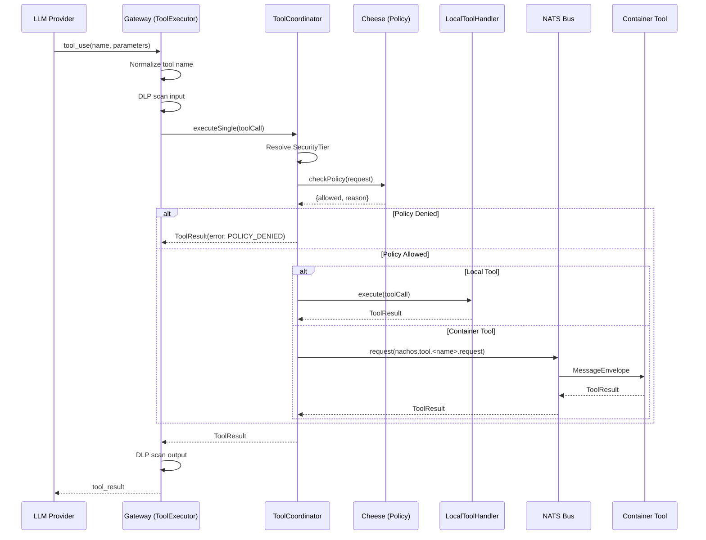
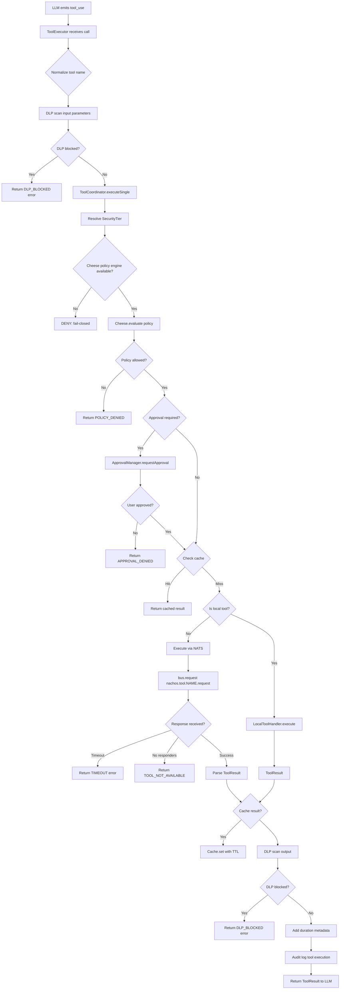
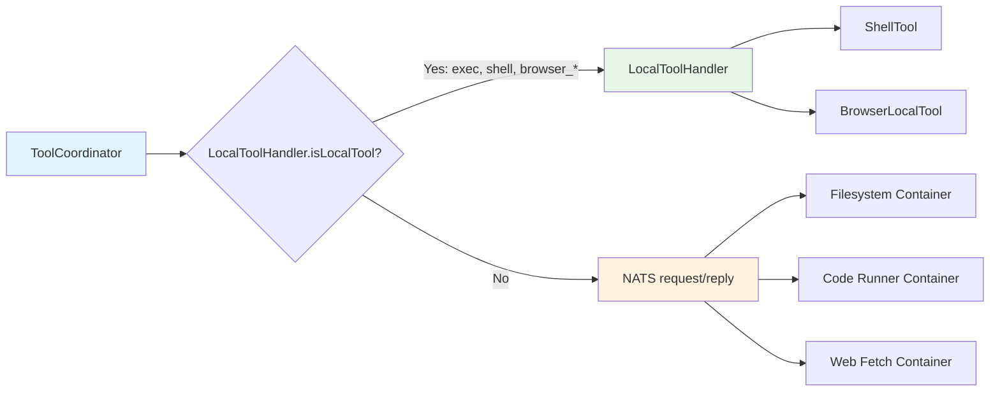
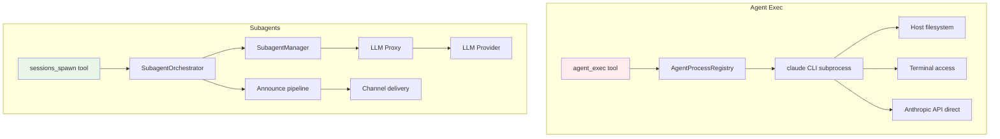

# Nachos Tool System Specification

> Version 1.0 | Generated 2026-03-14

---

## Table of Contents

1. [Tool System Overview](#1-tool-system-overview)
2. [Tool Specifications](#2-tool-specifications)
3. [Tool Execution Pipeline](#3-tool-execution-pipeline)
4. [Tool Coordinator](#4-tool-coordinator)
5. [Subagents vs Agent Exec](#5-subagents-vs-agent-exec)

---

## 1. Tool System Overview

Nachos tools fall into two architectural categories:

| Category | Runs In | Communication | Examples |
|----------|---------|---------------|---------|
| **Container-based** | Isolated Docker container | NATS request/reply | Filesystem, Code Runner |
| **Gateway-local** | Gateway process | Direct function call | Shell/Exec, Browser, Memory, Web Fetch, GitHub, Cron |

### 1.1 Tool Registration and Dispatch Flow



### 1.2 Tool Result Format

Every tool returns a `ToolResult` with this structure:

```typescript
interface ToolResult {
  success: boolean;
  content: ContentBlock[];   // Array of {type: "text", text: string} or {type: "image", data: string, mimeType: string}
  error?: {
    code: string;            // Machine-readable error code
    message: string;         // Human-readable error message
    details?: unknown;       // Additional context
  };
  metadata?: {
    duration: number;        // Execution time in ms
    cached?: boolean;        // Whether result came from cache
    warnings?: string[];     // Non-fatal warnings
  };
}
```

### 1.3 Security Tiers

Each tool is assigned a `SecurityTier` that controls policy enforcement and approval requirements:

| Tier | Name | Value | Description | Examples |
|------|------|-------|-------------|---------|
| 0 | SAFE | `SecurityTier.SAFE` | Read-only, no side effects | filesystem_read, memory_search |
| 1 | STANDARD | `SecurityTier.STANDARD` | Standard operations, sandboxed | code_runner, browser |
| 2 | ELEVATED | `SecurityTier.ELEVATED` | Write operations, requires policy | filesystem_write, filesystem_edit, agent_exec |
| 3 | RESTRICTED | `SecurityTier.RESTRICTED` | Requires explicit approval | code_runner_python (container), copilot |

---

## 2. Tool Specifications

### 2.1 Filesystem Tools (Container-Based)

The filesystem toolset runs in isolated Docker containers on the `nachos-internal` network. Communication occurs via NATS request/reply on `nachos.tool.filesystem_<mode>.request`.

The container supports multiple modes via the `TOOL_MODE` environment variable: `read`, `write`, `edit`, `patch`, `readwrite`, or `config`.

#### 2.1.1 filesystem_read

| Field | Value |
|-------|-------|
| **Purpose** | Read files, list directories, get file metadata |
| **Runs in** | Container (`TOOL_MODE=read`) |
| **Security Tier** | SAFE (0) |
| **NATS Topic** | `nachos.tool.filesystem_read.request` |

**Parameters:**

| Name | Type | Required | Description |
|------|------|----------|-------------|
| `action` | `"read" \| "list" \| "stat"` | Yes | Operation to perform |
| `path` | `string` | Yes | File or directory path |
| `encoding` | `"utf-8" \| "ascii" \| "base64" \| "hex" \| "binary"` | No | File encoding (default: `"utf-8"`) |

**Security:**
- Path validation via `PathValidator` -- restricts to configured `ALLOWED_PATHS` (default: `./workspace`)
- Directory traversal blocked (`../` patterns rejected)

**Return format:**
- `read`: File contents as text
- `list`: JSON object with `path`, `entries[]` (name, type, path), `count`
- `stat`: JSON object with `path`, `type`, `size`, `created`, `modified`, `accessed`, `mode`

**Example:**
```json
{
  "action": "read",
  "path": "/workspace/src/index.ts"
}
```

---

#### 2.1.2 filesystem_write

| Field | Value |
|-------|-------|
| **Purpose** | Write, create, delete files; create directories |
| **Runs in** | Container (`TOOL_MODE=write` or `readwrite`) |
| **Security Tier** | ELEVATED (2) |
| **NATS Topic** | `nachos.tool.filesystem_write.request` |

**Parameters:**

| Name | Type | Required | Description |
|------|------|----------|-------------|
| `action` | `"write" \| "create" \| "delete" \| "mkdir"` | Yes | Operation to perform |
| `path` | `string` | Yes | File or directory path |
| `content` | `string` | For write/create | File content |
| `encoding` | `string` | No | Encoding (default: `"utf-8"`) |
| `recursive` | `boolean` | No | Create parent dirs for mkdir (default: `false`) |

**Resource Limits:**
- Max file size: 10MB (configurable via `max_file_size` env var)
- Path restricted to `ALLOWED_PATHS`

**Behavior:**
- `write`: Overwrites existing file (fails if file does not exist)
- `create`: Creates new file (fails if file already exists, auto-creates parent directories)
- `delete`: Removes a file (not directories)
- `mkdir`: Creates directory, optionally recursive

---

#### 2.1.3 filesystem_edit

| Field | Value |
|-------|-------|
| **Purpose** | Line-based file editing (replace, insert, delete lines) |
| **Runs in** | Container (`TOOL_MODE=edit` or `readwrite`) |
| **Security Tier** | ELEVATED (2) |
| **NATS Topic** | `nachos.tool.filesystem_edit.request` |

**Parameters:**

| Name | Type | Required | Description |
|------|------|----------|-------------|
| `action` | `"replace" \| "insert" \| "delete"` | Yes | Edit action |
| `path` | `string` | Yes | File path |
| `line` | `number` | Yes | Line number (1-based) |
| `content` | `string` | For replace/insert | New line content |
| `count` | `number` | No | Lines to delete (default: 1) |

**Return format:** JSON with `success`, `path`, `action`, `line`, `linesAffected`, `totalLines`.

---

#### 2.1.4 filesystem_patch

| Field | Value |
|-------|-------|
| **Purpose** | Apply unified diff patches to files |
| **Runs in** | Container (`TOOL_MODE=patch` or `readwrite`) |
| **Security Tier** | ELEVATED (2) |
| **NATS Topic** | `nachos.tool.filesystem_patch.request` |

**Parameters:**

| Name | Type | Required | Description |
|------|------|----------|-------------|
| `path` | `string` | Yes | File to patch |
| `patch` | `string` | Yes | Unified diff content |
| `reverse` | `boolean` | No | Apply in reverse (default: `false`) |
| `dryRun` | `boolean` | No | Test without applying (default: `false`) |

**Behavior:**
- Parses standard `@@ -oldStart,oldCount +newStart,newCount @@` hunk headers
- Validates context lines match before applying
- Dry run returns a preview of the first 10 lines

---

### 2.2 Code Runner (Container-Based)

Runs code in sandboxed Docker containers with no network access. The `LANGUAGE` env var selects the executor.

#### 2.2.1 code_runner_python

| Field | Value |
|-------|-------|
| **Purpose** | Execute Python code in a sandbox |
| **Runs in** | Container (`LANGUAGE=python`) |
| **Security Tier** | RESTRICTED (3) |
| **NATS Topic** | `nachos.tool.code_runner_python.request` |

**Parameters:**

| Name | Type | Required | Description |
|------|------|----------|-------------|
| `code` | `string` | Yes | Python code to execute |
| `timeout` | `number` | No | Timeout in seconds (1-30, default: 30) |
| `workdir` | `string` | No | Working directory, must be within `/tmp` |

**Resource Limits:**
- Timeout: 30s max (configurable)
- Output buffer: ~10KB before truncation, killed at ~20KB
- Memory: Optional `ulimit -v` enforcement via config
- Network: None (container has no egress)
- Workspace: `/workspace` directory mounted read-only for data access

**Environment:**
```
PATH=/usr/local/bin:/usr/bin:/bin
PYTHONDONTWRITEBYTECODE=1
PYTHONUNBUFFERED=1
WORKSPACE=/workspace
```

---

#### 2.2.2 code_runner_javascript

| Field | Value |
|-------|-------|
| **Purpose** | Execute JavaScript/Node.js code in a sandbox |
| **Runs in** | Container (`LANGUAGE=javascript`) |
| **Security Tier** | STANDARD (1) -- resolved by coordinator |
| **NATS Topic** | `nachos.tool.code_runner_javascript.request` |

**Parameters:** Same as Python executor (code, timeout, workdir).

---

### 2.3 Shell/Exec (Gateway-Local)

The shell tool runs CLI commands directly in the gateway process using `child_process.spawn()` with `shell: false` for injection safety.

| Field | Value |
|-------|-------|
| **Purpose** | Execute allowlisted CLI binaries |
| **Runs in** | Gateway process |
| **Security Tier** | Varies by tool group |
| **Tool Names** | `exec`, `shell` |

**Parameters:**

| Name | Type | Required | Description |
|------|------|----------|-------------|
| `command` | `string` | Yes | Command string |
| `cwd` | `string` | No | Working directory |
| `env` | `Record<string, string>` | No | Additional env vars |
| `timeout` | `number` | No | Timeout in ms |

**Resource Limits:**
- Max output: 100KB (stdout and stderr independently)
- Default timeout: 30s
- Max timeout: 300s (5 min)
- Audit log: JSON-line entries to `/var/log/nachos/shell-audit.log`

**Security Controls:**
- Binary allowlist -- only pre-approved binaries can execute
- Command substitution blocked (backticks, `$()`, `${}`, process substitution)
- Subcommand validation for `git`, `docker`, `ip`
- Readonly enforcement -- write-capable flags blocked on readonly tools (e.g., `sed -i`)
- Security mode gating -- write operations (git push, rm, mkdir) only in `permissive` mode
- SIGTERM then SIGKILL after 5s on timeout

**Allowed Tool Groups:**

| Group | Binaries | Mode |
|-------|----------|------|
| **Skill tools** | goplaces, gifgrep, summarize, gog | all |
| **File inspection** | ls, cat, head, tail, file, stat, wc, find | all (readonly) |
| **Text processing** | grep, sed, awk, cut, sort, uniq, tr, diff | all (readonly) |
| **Process inspection** | ps, pgrep, top, htop | all (readonly) |
| **Network info** | netstat, ss, lsof, ip (addr/route/link only) | all (readonly) |
| **Network debug** | ping, curl, wget, dig, nslookup | all (readonly) |
| **System info** | uname, hostname, whoami, pwd, date, uptime, free, df, du | all (readonly) |
| **Data processing** | jq, yq, json | all (readonly) |
| **Git** | git (status, log, diff, show, branch, remote, config, rev-parse, describe) | all (readonly); full write in permissive |
| **Docker inspect** | docker (ps, logs, inspect, images, stats, version, info) | all (readonly); write ops in permissive |
| **Archive** | tar, unzip, gunzip, bunzip2 | all (readonly) |
| **Build/dev** | npm, npx, pnpm, yarn, node, python3, pip, pip3, make, tsc, vitest, eslint, prettier | all (5min timeout) |
| **File manipulation** | mkdir, cp, mv, rm, touch, chmod, ln, tee | permissive only |

---

### 2.4 Web Fetch (Gateway-Local)

| Field | Value |
|-------|-------|
| **Purpose** | Fetch and extract content from web pages |
| **Runs in** | Gateway process |
| **Security Tier** | SAFE (resolved as read tool) |
| **Tool Name** | `web_fetch_native` |

**Parameters:**

| Name | Type | Required | Description |
|------|------|----------|-------------|
| `url` | `string` | Yes | URL to fetch (http/https only) |
| `extract_mode` | `"markdown" \| "text"` | No | Content extraction mode (default: `"markdown"`) |
| `max_chars` | `number` | No | Max characters to return (default: 50,000) |

**Resource Limits:**
- Timeout: 10s (configurable)
- Max redirects: 5
- Rate limit: 10 calls/minute per user
- Output truncation at `max_chars`

**Security:**
- SSRF protection: blocks private/local IPs (127.x, 10.x, 172.16-31.x, 192.168.x, fe80::, etc.)
- DNS rebinding protection via `SSRFProtection.validateURL()` on initial URL and each redirect hop
- Optional domain allowlist via config
- Only HTML and plain text content types accepted

**Configuration (`nachos.toml`):**
```toml
[tools.web_fetch]
timeout_ms = 10000
max_chars = 50000
domain_allowlist = []  # empty = all domains allowed
```

---

### 2.5 Web Search (Gateway-Local)

| Field | Value |
|-------|-------|
| **Purpose** | Search the web using Brave Search API |
| **Runs in** | Gateway process |
| **Security Tier** | SAFE (resolved as read tool) |
| **Tool Name** | `web_search` |

**Parameters:**

| Name | Type | Required | Description |
|------|------|----------|-------------|
| `query` | `string` | Yes | Search query |
| `count` | `number` | No | Results count (1-20, default: 10) |
| `country` | `string` | No | Two-letter country code |
| `search_lang` | `string` | No | Language code |
| `freshness` | `string` | No | Time filter: `"pd"`, `"pw"`, `"pm"`, `"py"`, or date range |
| `safe_search` | `"off" \| "moderate" \| "strict"` | No | Safe search level (default: `"moderate"`) |

**Resource Limits:**
- Rate limit: 20 calls/minute per user
- Output truncation: 50KB

**Configuration:**
```toml
[tools.web_search]
api_key = "${BRAVE_SEARCH_API_KEY}"  # Required
default_country = "US"
safe_search = "moderate"
max_results = 10
```

---

### 2.6 Browser (Gateway-Local)

| Field | Value |
|-------|-------|
| **Purpose** | Browser automation via Playwright MCP |
| **Runs in** | Gateway process (lazy-initialized Chromium) |
| **Security Tier** | STANDARD (1) |
| **Tool Names** | `browser_navigate`, `browser_snapshot`, `browser_click`, `browser_type`, `browser_fill`, `browser_select_option`, `browser_hover`, `browser_drag`, `browser_press_key`, `browser_screenshot`, `browser_evaluate`, `browser_upload_file`, `browser_handle_dialog`, `browser_wait`, `browser_close`, `browser_resize`, `browser_go_back`, `browser_go_forward`, `browser_tab_new`, `browser_tab_close`, `browser_tab_list`, `browser_console_messages`, `browser_network_requests`, `browser_pdf_save`, `browser_install` |

**Architecture:**
- Uses `@playwright/mcp` `createConnection()` for programmatic MCP server
- Chromium starts lazily on first browser tool call
- SSRF protection on navigation tools (`browser_navigate`, `browser_tab_new`)

**Configuration:**
- `BROWSER_HEADLESS`: Set to `"false"` for headed mode (default: headless)
- `PLAYWRIGHT_CHROMIUM_EXECUTABLE_PATH` / `CHROME_BIN`: Custom Chromium path
- `BROWSER_ALLOWED_DOMAINS`: Comma-separated domain allowlist

**Chromium Launch Args:**
```
--no-sandbox --disable-setuid-sandbox --disable-dev-shm-usage --disable-gpu
```

---

### 2.7 Agent Exec (Gateway-Local)

| Field | Value |
|-------|-------|
| **Purpose** | Launch Claude Code CLI as autonomous coding subprocess |
| **Runs in** | Gateway process (spawns `claude` CLI) |
| **Security Tier** | ELEVATED (2) |
| **Tool Name** | `agent_exec` |

**Parameters:**

| Name | Type | Required | Description |
|------|------|----------|-------------|
| `action` | `"spawn" \| "status" \| "output" \| "cancel" \| "list"` | Yes | Action to perform |
| `task` | `string` | For spawn | Prompt for the agent |
| `cwd` | `string` | No | Working directory |
| `timeout` | `number` | No | Timeout in seconds (default: 300, max: 1800) |
| `agentId` | `string` | For status/output/cancel | Agent process ID |
| `tail` | `number` | For output | Return last N lines only |

**Resource Limits:**
- Max concurrent agents: 2 (configurable)
- Default timeout: 5 minutes
- Max timeout: 30 minutes
- Output buffer: 500KB (ring buffer -- keeps most recent)
- Auto-cleanup: Completed processes removed after 1 hour

**Process Lifecycle:**
1. Spawns `claude -p <task> --output-format stream-json --max-turns 50`
2. Passes only `ANTHROPIC_API_KEY`, `PATH`, `HOME`, `USERPROFILE` env vars
3. SIGTERM on timeout/cancel, SIGKILL after 5s if still alive
4. Status transitions: `running` -> `completed` | `failed` | `cancelled` | `timeout`

**Configuration (`nachos.toml`):**
```toml
[tools.agent_exec]
enabled = true
max_concurrent = 2
default_timeout = 300  # seconds
max_timeout = 1800     # seconds
max_output_buffer = 524288  # bytes
```

---

### 2.8 Memory Tools (Gateway-Local)

All memory tools run in the gateway process and interact with the `StateLayer`.

#### 2.8.1 memory_search

| Field | Value |
|-------|-------|
| **Purpose** | Search stored memories by text, tags, kinds |
| **Security Tier** | SAFE (0) |
| **Tool Name** | `memory_search` |

**Parameters:**

| Name | Type | Required | Description |
|------|------|----------|-------------|
| `query` | `string` | Yes | Search text |
| `kinds` | `string[]` | No | Filter: `"summary"`, `"preference"`, `"fact"`, `"decision"`, `"task"`, `"issue"` |
| `tags` | `string[]` | No | Filter by tags |
| `limit` | `number` | No | Max results (default: 10) |
| `semantic` | `boolean` | No | Use semantic search (default: false) |
| `minSimilarity` | `number` | No | Minimum similarity for semantic search (0-1, default: 0.7) |

#### 2.8.2 memory_get

| Field | Value |
|-------|-------|
| **Purpose** | Read specific memory files |
| **Security Tier** | SAFE (0) |
| **Tool Name** | `memory_get` |

**Parameters:**

| Name | Type | Required | Description |
|------|------|----------|-------------|
| `path` | `string` | Yes | Memory file path (e.g., `"MEMORY.md"`, `"memory/2026-01-15.md"`) |
| `from` | `number` | No | Start line (1-indexed) |
| `lines` | `number` | No | Number of lines to read |

**Allowed paths:** `MEMORY.md`, `memory/`, `AGENTS.md`, `SOUL.md`, `USER.md`, `TOOLS.md`, `IDENTITY.md`

#### 2.8.3 memory_write

| Field | Value |
|-------|-------|
| **Purpose** | Save a memory entry for future recall |
| **Security Tier** | ELEVATED (2) -- classified as write |
| **Tool Name** | `memory_write` |

**Parameters:**

| Name | Type | Required | Description |
|------|------|----------|-------------|
| `content` | `string` | Yes | Memory content |
| `kind` | `string` | Yes | Type: `"summary"`, `"preference"`, `"fact"`, `"decision"`, `"task"`, `"issue"` |
| `tags` | `string[]` | No | Tags for categorization |

#### 2.8.4 memory_delete

| Field | Value |
|-------|-------|
| **Purpose** | Delete a specific memory entry |
| **Security Tier** | ELEVATED (2) |
| **Tool Name** | `memory_delete` |

**Parameters:**

| Name | Type | Required | Description |
|------|------|----------|-------------|
| `id` | `string` | Yes | Entry ID from `memory_search` |

**Rate Limiting:** All memory tools share a 10 calls/minute/session rate limit enforced by the ToolExecutor.

---

### 2.9 Snapshot Tools (Gateway-Local)

#### 2.9.1 snapshot_list

| Field | Value |
|-------|-------|
| **Purpose** | List available context snapshots for the session |
| **Security Tier** | SAFE (0) |
| **Tool Name** | `snapshot_list` |

**Parameters:**

| Name | Type | Required | Description |
|------|------|----------|-------------|
| `limit` | `number` | No | Max snapshots to return (default: 10) |

#### 2.9.2 snapshot_restore

| Field | Value |
|-------|-------|
| **Purpose** | Restore session messages from a snapshot |
| **Security Tier** | ELEVATED (2) -- modifies session state |
| **Tool Name** | `snapshot_restore` |

**Parameters:**

| Name | Type | Required | Description |
|------|------|----------|-------------|
| `snapshot_id` | `string` | No | Snapshot ID (default: latest) |

---

### 2.10 Session Tools (Gateway-Local)

#### 2.10.1 sessions_spawn

| Field | Value |
|-------|-------|
| **Purpose** | Spawn a subagent to run a task asynchronously |
| **Security Tier** | N/A (policy-checked separately) |
| **Tool Name** | `sessions_spawn` |

**Parameters:**

| Name | Type | Required | Description |
|------|------|----------|-------------|
| `task` | `string` | Yes | Task instruction for the subagent |
| `label` | `string` | No | Run label |
| `profile` | `string` | No | Subagent tool profile name |
| `agentId` | `string` | No | Agent ID override |
| `model` | `string` | No | LLM model override |
| `thinking` | `string` | No | Thinking hint |
| `stream` | `boolean` | No | Enable streaming for partial results |
| `runTimeoutSeconds` | `number` | No | Timeout in seconds (min: 1) |
| `cleanup` | `"delete" \| "keep"` | No | Post-completion session cleanup |

#### 2.10.2 sessions_orchestrate

| Field | Value |
|-------|-------|
| **Purpose** | Run multi-step workflows with dependency resolution |
| **Security Tier** | N/A (policy-checked per step) |
| **Tool Name** | `sessions_orchestrate` |

**Parameters:**

| Name | Type | Required | Description |
|------|------|----------|-------------|
| `steps` | `WorkflowStep[]` | Yes | Array of steps (min: 1) |

Each step:

| Name | Type | Required | Description |
|------|------|----------|-------------|
| `id` | `string` | Yes | Unique step identifier |
| `task` | `string` | Yes | Task instruction |
| `dependsOn` | `string[]` | No | Step IDs this step depends on |
| `model` | `string` | No | Model override |
| `modelHint` | `"fast" \| "balanced" \| "thorough"` | No | Model selection hint |
| `stream` | `boolean` | No | Enable streaming |

---

### 2.11 Subagent Tools (Gateway-Local)

#### 2.11.1 subagents

| Field | Value |
|-------|-------|
| **Purpose** | Inspect, control, and read workspace files from subagent runs |
| **Security Tier** | SAFE (0) for reads |
| **Tool Name** | `subagents` |

**Parameters:**

| Name | Type | Required | Description |
|------|------|----------|-------------|
| `action` | `string` | Yes | One of: `"list"`, `"info"`, `"log"`, `"stop"`, `"steer"`, `"files_list"`, `"files_get"`, `"workflow_list"`, `"workflow_info"` |
| `runId` | `string` | For info/log/stop/steer/files_* | Subagent run ID |
| `workflowId` | `string` | For workflow_info | Workflow ID |
| `message` | `string` | For steer | Message to inject |
| `path` | `string` | For files_get | Workspace relative path |
| `recursive` | `boolean` | For files_list | List recursively |
| `maxBytes` | `number` | For files_get | Max bytes to read |
| `limit` | `number` | No | Result limit |

#### 2.11.2 subagent_progress

| Field | Value |
|-------|-------|
| **Purpose** | Report progress from within a running subagent |
| **Security Tier** | N/A (only available inside subagent sessions) |
| **Tool Name** | `subagent_progress` |

**Parameters:**

| Name | Type | Required | Description |
|------|------|----------|-------------|
| `status` | `string` | Yes | Progress status message |
| `percentage` | `number` | No | Progress 0-100 |
| `metadata` | `Record<string, unknown>` | No | Additional data |

---

### 2.12 Cron Tools (Gateway-Local)

All cron tools interact with the `Scheduler` service. Jobs are scoped per-user with ownership validation.

#### 2.12.1 nachos_cron_add

| Field | Value |
|-------|-------|
| **Purpose** | Create a scheduled job |
| **Tool Name** | `nachos_cron_add` |

**Parameters:**

| Name | Type | Required | Description |
|------|------|----------|-------------|
| `name` | `string` | Yes | Job name |
| `description` | `string` | No | Job description |
| `scheduleType` | `"at" \| "every" \| "cron"` | Yes | Schedule type |
| `scheduleValue` | `string` | Yes | ISO timestamp, ms interval, or cron expression |
| `timezone` | `string` | No | Timezone (default: UTC) |
| `actionType` | `"systemEvent" \| "agentTurn"` | Yes | Action type |
| `actionPrompt` | `string` | Yes | Prompt/text for the action |
| `deliveryChannel` | `string` | No | Channel for result delivery |
| `deliveryAnnounce` | `boolean` | No | Announce execution (default: false) |

#### 2.12.2 nachos_cron_list

**Parameters:** `enabled` (boolean, optional), `limit` (number, default: 50)

#### 2.12.3 nachos_cron_remove

**Parameters:** `jobId` (string, required)

#### 2.12.4 nachos_cron_update

**Parameters:** `jobId` (required), plus optional overrides for `name`, `description`, `scheduleValue`, `timezone`, `actionPrompt`, `enabled`, `deliveryChannel`, `deliveryAnnounce`.

#### 2.12.5 nachos_cron_run

**Parameters:** `jobId` (string, required) -- manually triggers a job.

---

### 2.13 Bootstrap Tools (Gateway-Local)

#### 2.13.1 bootstrap

| Field | Value |
|-------|-------|
| **Purpose** | Get/set/delete identity bootstrap configuration |
| **Tool Name** | `bootstrap` |

**Parameters:**

| Name | Type | Required | Description |
|------|------|----------|-------------|
| `action` | `"get" \| "set" \| "delete"` | Yes | Bootstrap action |
| `content` | `Record<string, string>` | For set | Bootstrap content blocks by name |
| `identityCompleted` | `boolean` | No | Mark identity as completed |

#### 2.13.2 user_profile

| Field | Value |
|-------|-------|
| **Purpose** | Get/set/delete user profile information |
| **Tool Name** | `user_profile` |

**Parameters:**

| Name | Type | Required | Description |
|------|------|----------|-------------|
| `action` | `"get" \| "set" \| "delete"` | Yes | Profile action |
| `profile` | `string` | For set | Profile content |

---

### 2.14 GitHub Tools (Gateway-Local)

| Field | Value |
|-------|-------|
| **Purpose** | Interact with GitHub via `gh` CLI |
| **Runs in** | Gateway process (executes `gh` binary) |
| **Security Tier** | Varies by action |
| **Tool Name** | `github` |

**Parameters:**

| Name | Type | Required | Description |
|------|------|----------|-------------|
| `action` | `string` | Yes | One of: `issue_list`, `issue_view`, `issue_create`, `issue_comment`, `pr_list`, `pr_view`, `pr_create`, `pr_diff`, `pr_checks`, `pr_merge`, `run_list`, `run_view`, `repo_view`, `search`, `api` |
| `repo` | `string` | No | Repository in `owner/repo` format |
| `number` | `number` | For issue/PR actions | Issue or PR number |
| `title` | `string` | For create | Title |
| `body` | `string` | No | Body text |
| `labels` | `string[]` | No | Labels |
| `state` | `"open" \| "closed" \| "all"` | No | State filter |
| `base` / `head` | `string` | For pr_create | Branches |
| `method` | `"merge" \| "squash" \| "rebase"` | For pr_merge | Merge method |
| `endpoint` | `string` | For api | REST API endpoint |
| `http_method` | `string` | For api | HTTP method |
| `limit` | `number` | No | Max results (default: 30) |

**Resource Limits:**
- Rate limit: 30 calls/minute per user
- Output truncation: 50KB
- `gh` process timeout: 30s
- Buffer: 10MB

**Security:**
- Repository allowlist via `repo_allowlist` config
- Token passed via env var name specified in `token_env`

**Configuration:**
```toml
[tools.github]
enabled = true
default_repo = "owner/repo"
token_env = "GITHUB_TOKEN"
repo_allowlist = ["owner/repo1", "owner/repo2"]
```

---

### 2.15 Bitbucket Tools (Gateway-Local)

| Field | Value |
|-------|-------|
| **Purpose** | Interact with Bitbucket via REST API v2.0 |
| **Runs in** | Gateway process |
| **Security Tier** | Varies by action |
| **Tool Name** | `bitbucket` |

**Parameters:**

| Name | Type | Required | Description |
|------|------|----------|-------------|
| `action` | `string` | Yes | One of: `repo_list`, `repo_view`, `pr_list`, `pr_view`, `pr_create`, `pr_diff`, `pr_merge`, `pr_approve`, `pr_comment`, `issue_list`, `issue_view`, `issue_create`, `issue_comment`, `pipeline_list`, `pipeline_view`, `search` |
| `workspace` | `string` | No | Bitbucket workspace |
| `repo_slug` | `string` | For most actions | Repository slug |
| `pr_id` | `number` | For PR actions | Pull request ID |
| `issue_id` | `number` | For issue actions | Issue ID |
| `pipeline_uuid` | `string` | For pipeline actions | Pipeline UUID |
| `title` | `string` | For create | Title |
| `source_branch` / `destination_branch` | `string` | For pr_create | Branches |
| `merge_strategy` | `"merge_commit" \| "squash" \| "fast_forward"` | For pr_merge | Strategy |
| `limit` | `number` | No | Max results (default: 25) |

**Resource Limits:**
- Rate limit: 30 calls/minute per user
- Output truncation: 50KB
- Supports pagination via API `next` links

**Authentication:**
- App password: `BITBUCKET_USERNAME` + `BITBUCKET_APP_PASSWORD` (Basic auth)
- OAuth: `BITBUCKET_TOKEN` (Bearer auth)

**Configuration:**
```toml
[tools.bitbucket]
enabled = true
default_workspace = "my-workspace"
auth_type = "app_password"
username_env = "BITBUCKET_USERNAME"
password_env = "BITBUCKET_APP_PASSWORD"
workspace_allowlist = ["my-workspace"]
```

---

## 3. Tool Execution Pipeline

The complete lifecycle of a tool call, from LLM request to response:



### 3.1 DLP Scanning

Both tool inputs and outputs are scanned by the `DLPSecurityLayer`:

- **Input scan**: Parameters checked for sensitive data patterns (API keys, tokens, credentials)
- **Output scan**: Results checked before returning to LLM context
- **Blocked results**: Tool call returns `DLP_BLOCKED` error code; original content is not exposed

### 3.2 Audit Trail

Every tool execution generates an audit event with:
- Tool name and group
- Security tier and mode
- User/session identifiers
- Duration and success/failure
- Policy rule matched (if any)

---

## 4. Tool Coordinator

The `ToolCoordinator` (`coordinator.ts`) is the central dispatch layer between the ToolExecutor and actual tool execution.

### 4.1 Routing: Local vs NATS



**NATS Topic Convention:** `nachos.tool.<toolId>.request`

### 4.2 Parallel Execution

The coordinator automatically determines if tool calls can run in parallel:

1. **Duplicate tools**: If the same tool appears twice in a batch, execute sequentially
2. **Write-then-read**: If a write tool is followed by a read tool on the same resource (same `path` or `url`), execute sequentially
3. **Otherwise**: Execute in parallel via `Promise.all`

Force parallel execution with `ExecutionOptions.forceParallel = true`.

### 4.3 Error Handling

| Error Code | Cause |
|-----------|-------|
| `MISSING_SESSION` | Tool call has no `sessionId` |
| `POLICY_DENIED` | Cheese policy engine denied the call |
| `APPROVAL_DENIED` | User rejected the approval request |
| `TIMEOUT` | Tool did not respond within timeout |
| `TOOL_NOT_AVAILABLE` | No NATS responders for the tool topic |
| `INVALID_TOOL_RESPONSE` | Response was not a valid ToolResult envelope |
| `EXECUTION_ERROR` | Uncaught exception during execution |

### 4.4 Timeouts

| Scope | Default | Max |
|-------|---------|-----|
| Coordinator default | 30s | -- |
| Local tool execution | 30s | -- |
| Remote (NATS) tool execution | 60s | -- |
| Shell tool | 30s | 300s (5 min) |
| Shell build tools | 300s | 300s |
| Agent exec | 300s | 1800s (30 min) |
| Code runner | 30s | 30s |
| Web fetch | 10s | -- |

### 4.5 Caching

When enabled, the `ToolCache` stores successful results keyed by tool call signature:

- Default TTL: 5 minutes (configurable per-call via `cacheTTL`)
- Bypass with `ExecutionOptions.bypassCache = true`
- Only successful results are cached

---

## 5. Subagents vs Agent Exec

Both systems spawn autonomous AI processes, but serve different use cases.



### 5.1 Comparison

| Aspect | Subagents (`sessions_spawn`) | Agent Exec (`agent_exec`) |
|--------|------------------------------|--------------------------|
| **Process model** | LLM API call through Nachos pipeline | `claude` CLI subprocess |
| **Tool access** | Nachos tool definitions (sandboxed) | Full Claude Code capabilities |
| **File access** | Isolated workspace directory per run | Host filesystem (cwd) |
| **Network** | Controlled via Nachos policy | Inherited from host |
| **Security tier** | Policy-controlled per tool | ELEVATED (2), permissive mode required |
| **Concurrency limit** | Configurable (default: 1 running, 100 queued) | 2 max concurrent |
| **Per-user limit** | 10 concurrent (configurable) | Shared with global limit |
| **Timeout** | Configurable per-run | 5min default, 30min max |
| **Output delivery** | Announce to channel via pipeline | Manual poll via status/output actions |
| **Streaming** | Optional via NATS stream chunks | `stream-json` output format |
| **Workflows** | Multi-step DAG via `sessions_orchestrate` | Single task only |
| **Progress reporting** | `subagent_progress` tool within subagent | Poll via `status` action |
| **Steering** | Inject messages via `subagents.steer` | Not supported |
| **Result persistence** | Session messages stored in StateLayer | Stdout/stderr in memory (500KB ring buffer) |
| **Model selection** | Auto-select, aliases, hints (`fast`/`balanced`/`thorough`) | Uses default Claude model |
| **Cleanup** | Optional session deletion or keep | Auto-cleanup after 1 hour |
| **Use case** | Structured async work with result delivery | Full autonomy coding tasks |

### 5.2 When to Use Each

**Use Subagents when:**
- The task should use Nachos tools and policies
- Results need to be announced back to a channel
- You need workflow orchestration with dependencies
- You want progress tracking and steering
- Security sandboxing is important

**Use Agent Exec when:**
- The task requires full filesystem and terminal access
- Claude Code's built-in capabilities (file editing, search, etc.) are needed
- The task is a self-contained coding or refactoring job
- You need the `claude` CLI's native tool suite
- You are in permissive security mode

### 5.3 Subagent Orchestrator Limits

| Limit | Default | Purpose |
|-------|---------|---------|
| `maxConcurrent` | 1 | Running subagents at once |
| `maxQueueSize` | 100 | Pending queue size |
| `maxPerUser` | 10 | Per-user concurrent runs |
| `maxStreamChunks` | 1000 | Stream chunk accumulation limit |
| `maxProgressUpdates` | 100 | Progress update limit per run |

---

## Appendix A: Security Tier Resolution

The `ToolCoordinator.resolveSecurityTier()` method assigns tiers based on tool name patterns:

```
copilot                           -> RESTRICTED (3)
code_runner / code-runner         -> STANDARD (1)
agent_exec                        -> ELEVATED (2)
filesystem_write/edit/patch       -> ELEVATED (2)
browser*                          -> STANDARD (1)
*read* / *list* / *get*           -> SAFE (0)
everything else                   -> undefined (no override)
```

## Appendix B: Tool Name Normalization

The `normalizeToolName()` utility handles variations:
- Converts hyphens to underscores
- Lowercases the tool name
- Maps aliases to canonical names

## Appendix C: File Reference

| File | Purpose |
|------|---------|
| `packages/core/gateway/src/tools/tool-executor.ts` | Tool definition building, DLP scanning, dispatch |
| `packages/core/gateway/src/tools/coordinator.ts` | Policy check, parallel/sequential execution, NATS dispatch |
| `packages/core/gateway/src/tools/local-tool-handler.ts` | Routes to ShellTool or BrowserLocalTool |
| `packages/core/gateway/src/tools/shell-tool.ts` | CLI binary execution with allowlisting |
| `packages/core/gateway/src/tools/browser-local.ts` | Playwright MCP browser automation |
| `packages/core/gateway/src/tools/agent-exec-tool.ts` | Claude CLI subprocess tool schema + handler |
| `packages/core/gateway/src/tools/agent-process-registry.ts` | Subprocess lifecycle management |
| `packages/core/gateway/src/tools/memory-tools.ts` | Memory search/get/write/delete |
| `packages/core/gateway/src/tools/snapshot-tools.ts` | Context snapshot list/restore |
| `packages/core/gateway/src/tools/web-fetch-tools.ts` | HTTP page fetching with SSRF protection |
| `packages/core/gateway/src/tools/web-search-tools.ts` | Brave Search API integration |
| `packages/core/gateway/src/tools/github-tools.ts` | GitHub CLI wrapper |
| `packages/core/gateway/src/tools/bitbucket-tools.ts` | Bitbucket REST API wrapper |
| `packages/core/gateway/src/tools/cron-tools.ts` | Scheduled job management |
| `packages/core/gateway/src/tools/ssrf-protection.ts` | URL validation and DNS rebinding protection |
| `packages/core/gateway/src/tools/approval-manager.ts` | User approval flow for restricted tools |
| `packages/core/gateway/src/tools/cache.ts` | Tool result caching |
| `packages/core/gateway/src/tools/tool-rate-limiter.ts` | Shared rate limiting utility |
| `packages/core/gateway/src/subagents/subagent-orchestrator.ts` | Subagent queuing, execution, announce |
| `packages/core/gateway/src/subagents/subagent-manager.ts` | LLM request execution for subagents |
| `packages/core/gateway/src/subagents/types.ts` | Subagent type definitions |
| `packages/core/gateway/src/subagents/dependency-graph.ts` | Workflow DAG validation and batch planning |
| `packages/tools/filesystem/src/` | Container-based filesystem tool implementations |
| `packages/tools/code-runner/src/` | Container-based code execution |
| `packages/shared/types/src/schemas.ts` | TypeBox schemas for tool parameters |
